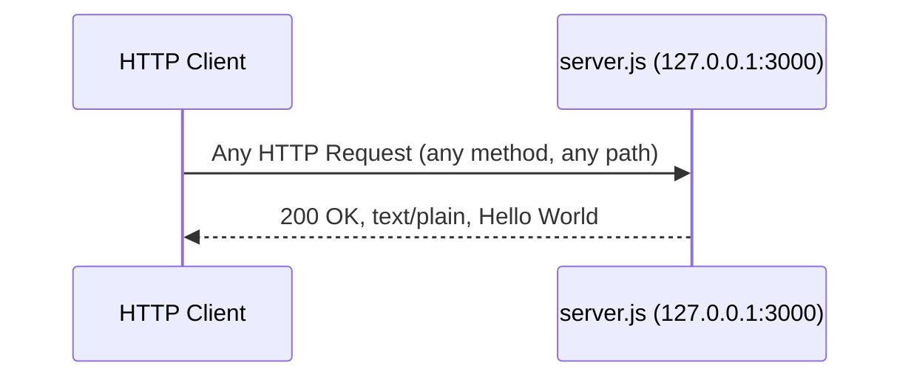
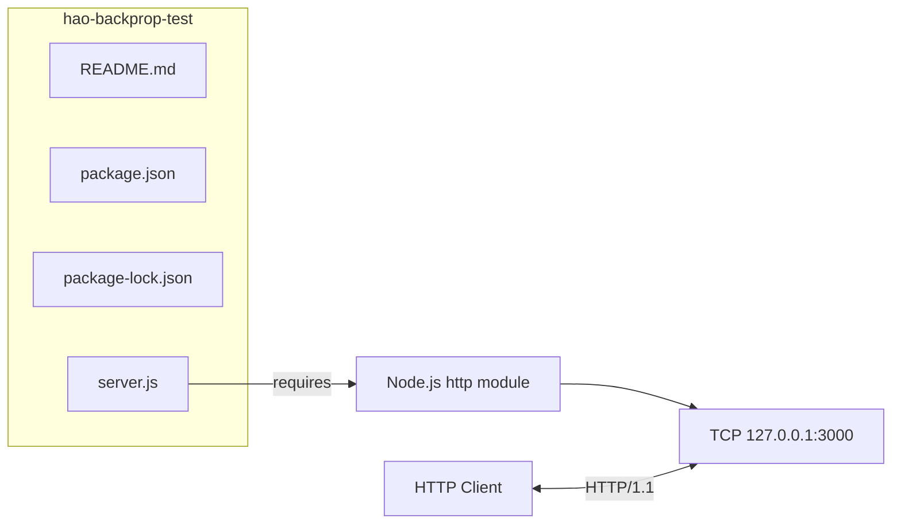

# hello_world (hao-backprop-test)


## Table of Contents

- [Overview](#overview)
- [Prerequisites](#prerequisites)
- [Installation](#installation)
- [Usage](#usage)
  - [Starting the Server](#starting-the-server)
  - [Verifying the Server](#verifying-the-server)
- [API Documentation](#api-documentation)
  - [Endpoint Specification](#endpoint-specification)
  - [Request/Response Examples](#requestresponse-examples)
- [Project Structure](#project-structure)
- [Architecture Diagrams](#architecture-diagrams)
- [Deployment Guide](#deployment-guide)
  - [Local Development](#local-development)
  - [Process Management](#process-management)
  - [Network Considerations](#network-considerations)
- [Known Issues](#known-issues)
- [Contributing](#contributing)
- [License](#license)

## Overview

**hello_world** (repository name: `hao-backprop-test`) is a minimal Node.js HTTP server created as a test fixture for backprop integration. The server listens on the loopback interface and responds to every incoming HTTP request with a plain-text `Hello, World!` message.

Key characteristics:

- **Zero external dependencies** — relies solely on the Node.js built-in `http` module
- **Single-file runtime** — all server logic resides in `server.js` (11 lines of runtime code, 47 lines total with documentation)
- **Deterministic responses** — returns an identical `200 OK` response for every request regardless of HTTP method or path

## Prerequisites

- **Node.js** v15.0.0 or later (the `package-lock.json` uses lockfileVersion 3, which requires Node.js v15+ / npm v7+)
- **npm** comes bundled with Node.js — no separate installation is needed

Download and install Node.js from [https://nodejs.org](https://nodejs.org).

Verify your installation:

```bash
node --version
npm --version
```

## Installation

1. Clone the repository:

```bash
git clone <repository-url>
cd hao-backprop-test
```

2. Install dependencies:

```bash
npm install
```

> **Note:** This project has zero external dependencies. Running `npm install` is effectively a no-op but is included as a standard practice to ensure the project is initialized correctly.

## Usage

### Starting the Server

Launch the server with the following command:

```bash
node server.js
```

Expected output on stdout:

```
Server running at http://127.0.0.1:3000/
```

The server binds to `127.0.0.1` on port `3000` and begins accepting HTTP connections immediately.

### Verifying the Server

Open a new terminal window and send a request to the server:

```bash
curl http://127.0.0.1:3000/
```

Expected output:

```
Hello, World!
```

## API Documentation

### Endpoint Specification

The server exposes a single, universal endpoint that responds identically to all requests:

| Method | Path | Status Code | Content-Type | Response Body |
|--------|------|-------------|--------------|---------------|
| ANY    | ANY  | 200         | `text/plain` | `Hello, World!\n` |

The request handler ignores both the HTTP method and the request path. Every valid HTTP request receives the same deterministic response.

### Request/Response Examples

**Basic GET request:**

```bash
curl http://127.0.0.1:3000/
```

```
Hello, World!
```

**Request with response headers (verbose output):**

```bash
curl -i http://127.0.0.1:3000/
```

```
HTTP/1.1 200 OK
Content-Type: text/plain
Date: <current-date>
Connection: keep-alive
Keep-Alive: timeout=5
Content-Length: 14

Hello, World!
```

**Request to an arbitrary path (demonstrates universal routing):**

```bash
curl http://127.0.0.1:3000/any/path/here
```

```
Hello, World!
```

## Project Structure

| File | Description |
|------|-------------|
| `server.js` | HTTP server runtime — contains all server logic (11 lines of runtime code, 47 lines total with documentation) |
| `README.md` | Project documentation (this file) |
| `package.json` | npm package manifest — defines project metadata and scripts |
| `package-lock.json` | Dependency lock file — confirms an empty dependency graph |

## Architecture Diagrams

### Request/Response Flow



### Project Architecture



## Deployment Guide

### Local Development

Start the server with a single command:

```bash
node server.js
```

To stop the server, press `Ctrl+C` in the terminal where it is running.

### Process Management

To run the server in the background:

```bash
node server.js &
```

To stop a backgrounded server:

```bash
kill %1
```

For persistent process management in longer-running environments, consider using [pm2](https://pm2.keymetrics.io/):

```bash
npx pm2 start server.js --name hello-world
npx pm2 stop hello-world
```

### Network Considerations

The server binds exclusively to the loopback interface (`127.0.0.1`). This means:

- **Local access only** — the server accepts connections from the local machine and is not accessible from other devices on the network
- **No external exposure** — binding to `127.0.0.1` instead of `0.0.0.0` prevents any network-level access
- **Port 3000 is hardcoded** — the port cannot be changed without modifying `server.js` directly

> **Important:** This server is designed as a **local test fixture**, not a production service. It lacks TLS, request routing, error handling, logging infrastructure, and other features required for production deployment.

## Known Issues

The following discrepancies exist in the current codebase:

| # | Issue | Details |
|---|-------|---------|
| 1 | **Entry point mismatch** | `package.json` declares `"main": "index.js"` but the actual server code resides in `server.js`. The file `index.js` does not exist in the repository. |
| 2 | **Naming discrepancy** | The repository is named `hao-backprop-test` while the npm package name in `package.json` is `hello_world`. |
| 3 | **Description variance** | The original README described this as a "test project for backprop integration" while `package.json` states `"Hello world in Node.js"`. |

These inconsistencies are documented intentionally and are not considered blocking issues for the project's purpose as a test fixture.

## Contributing

This project was originally created with the directive: **"Do not touch!"** — reflecting its intended role as a stable, unchanging integration test fixture. Modifications should be avoided unless explicitly authorized to preserve the reliability of dependent integration tests.

If changes are necessary, ensure that:

1. The server continues to respond with `Hello, World!\n` on all requests
2. The server binds to `127.0.0.1:3000`
3. No external dependencies are introduced

## License

This project is licensed under the **MIT** license, as declared in `package.json`.
