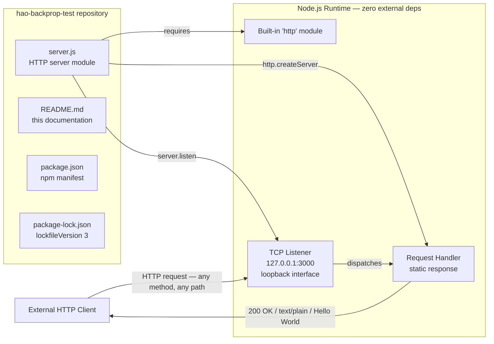
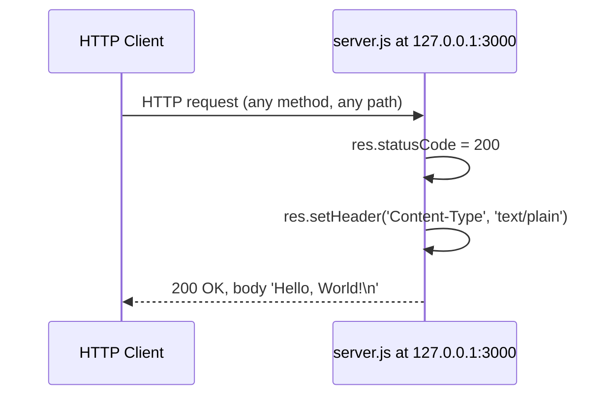

# hao-backprop-test

*A minimal Node.js HTTP server used as a deterministic test fixture for Backprop integration testing.*

## Table of Contents

- [Project Overview](#project-overview)
- [Architecture Diagram](#architecture-diagram)
- [Prerequisites](#prerequisites)
- [Installation](#installation)
- [Configuration](#configuration)
- [Running the Server](#running-the-server)
- [API Reference](#api-reference)
- [Inline Code Explanation](#inline-code-explanation)
- [Deployment Guide](#deployment-guide)
- [Verification](#verification)
- [Troubleshooting](#troubleshooting)
- [Project Structure](#project-structure)
- [Known Inconsistencies](#known-inconsistencies)
- [Author](#author)
- [License](#license)

## Project Overview

`hao-backprop-test` is a single-file Node.js HTTP server whose runtime lives entirely in `server.js`. The module's only purpose is to serve as a deterministic test fixture for Backprop integration testing — a stable, predictable HTTP endpoint that integrators can target without worrying about server-side state, branching logic, or authentication.

The server returns a **static response** for every inbound request. Regardless of HTTP method, URL path, headers, or body, the request handler defined in `server.js` (the `createServer` callback at `server.js:88–92`) emits HTTP `200 OK` with `Content-Type: text/plain` and the body `Hello, World!\n`. This deterministic behavior is what makes the module suitable as a test fixture: any consumer integrating against it can rely on identical responses for every request.

The project is intentionally **zero-external-dependency**. Only Node.js's built-in `http` module is used (`server.js:29`), and `package-lock.json` confirms an empty `packages` graph (`lockfileVersion: 3` with only the root package present and no external entries). No `npm install` step is required to fetch third-party packages because none are declared in `package.json`.

The HTTP server binds to the **loopback interface** (`hostname = '127.0.0.1'` at `server.js:41`) on TCP port `3000` (`port = 3000` at `server.js:51`). Loopback binding restricts incoming connections to the local machine, which is appropriate for a local test fixture and aligns with the project's role.

The repository is intentionally minimal: four files total (`server.js`, `README.md`, `package.json`, `package-lock.json`), no subdirectories, no build pipeline, and no test harness. This README documents everything a consumer needs to install, run, verify, and understand the project; the JSDoc inside `server.js` documents the same constructs at the source-code level for IDE tooling.

## Architecture Diagram

The diagram below shows how the four repository files relate to the Node.js runtime, the built-in `http` module, the loopback TCP listener, and an external HTTP client. The architecture has no external dependencies — only Node.js's standard library is used — and the listener is bound to `127.0.0.1`, so connections are restricted to the local machine.



## Prerequisites

To run `server.js` you need the following on your local machine:

- **Node.js runtime.** Any Node.js version that ships the built-in `http` module is sufficient (this includes every released Node.js version). For new installations, the recommended versions are **Node.js 24.x** (Active LTS) or **Node.js 22.x** (Maintenance LTS).
- **npm package manager.** npm is bundled with every Node.js installation. Because `package-lock.json` declares `lockfileVersion: 3`, **npm 7 or newer** is required to read or rewrite the lockfile cleanly. (Older npm versions can still execute `node server.js` because the lockfile is not consulted at runtime.)
- **Operating system.** Any operating system supported by Node.js — Windows, macOS, or Linux. The project uses no native modules, so no platform-specific build tools are required.

Verify your installation before continuing:

```bash
node --version
npm --version
```

Both commands should print version strings. If either fails, install Node.js from <https://nodejs.org/> (which bundles npm) and re-run the checks.

## Installation

The project is checked into a single Git repository at the root level. To install:

1. Clone the repository:

   ```bash
   git clone <repository-url>
   ```

2. Change into the project directory:

   ```bash
   cd hao-backprop-test
   ```

3. Install dependencies:

   ```bash
   npm install
   ```

> **Note — `npm install` is effectively a no-op for this project.** `package.json` declares neither `dependencies` nor `devDependencies`, and `package-lock.json` confirms an empty `packages` graph (only the root package is present). The command still completes successfully and is documented here for completeness; it neither downloads any third-party packages nor mutates `node_modules` in a meaningful way.

## Configuration

There is no external configuration system. Both runtime configuration values are **hardcoded** in `server.js`:

| Configuration | Value | Source |
| --- | --- | --- |
| Hostname (bind address) | `'127.0.0.1'` | `server.js:41` (`const hostname = '127.0.0.1';`) |
| TCP port | `3000` | `server.js:51` (`const port = 3000;`) |

Because configuration is hardcoded, **changing either value requires editing the source file directly**. The project has:

- No environment-variable support (no `process.env.PORT` lookups, no `dotenv` integration).
- No `.env` file or `.env.example` template.
- No `config/` directory or external configuration framework.
- No CLI flags consumed via `process.argv`.

For example, to bind to all network interfaces on TCP port `8080` instead of the loopback interface on `3000`, edit `server.js`:

```javascript
const hostname = '0.0.0.0';
const port = 8080;
```

After saving the file, restart the process (`Ctrl+C` then `node server.js`) for the new values to take effect. The change is purely source-level; no build step is required.

## Running the Server

Start the server from the project root with:

```bash
node server.js
```

When the TCP socket binds successfully, the server's ready callback (the third argument to `server.listen` at `server.js:113–115`) fires once and prints exactly one line to stdout:

```text
Server running at http://127.0.0.1:3000/
```

That string is produced by the `console.log` template literal at `server.js:114`, which substitutes the `hostname` and `port` constants into the template. Once the line appears, the server is ready to accept HTTP requests.

The server runs in the **foreground**: the `node` process blocks on the active TCP listener and does not return control to the shell until the process is terminated. To stop the server, press **`Ctrl+C`** in the terminal where it is running.

> **Other launch commands do not work.** The following commands are commonly tried but are not viable in this project:
>
> - `npm start` — fails with `npm error Missing script: "start"` because `package.json` declares no `start` script. Use `node server.js` directly.
> - `npm test` — intentionally fails. The `scripts.test` entry in `package.json` is the npm-default placeholder `echo "Error: no test specified" && exit 1`, which exits with status `1`. There is no test infrastructure.
> - `require('hello_world')` (programmatic import) — fails because `package.json`'s `main` field references `index.js`, but no file named `index.js` exists in the repository. This is documented as Known Inconsistency [KI-002](#known-inconsistencies).

## API Reference

The server exposes a single HTTP endpoint with a fully **static response**. The handler does not branch on `req.method` or `req.url`, so the same response is returned for every request.

### Behavioral Invariants

1. **Methods accepted:** ALL HTTP methods (`GET`, `POST`, `PUT`, `DELETE`, `PATCH`, `OPTIONS`, `HEAD`, etc.). The request handler at `server.js:88–92` does not inspect `req.method`.
2. **Paths accepted:** ALL paths. The request handler does not inspect `req.url`.
3. **Response status:** Always `200 OK`. Set at `server.js:89` (`res.statusCode = 200;`).
4. **Response headers:** Always `Content-Type: text/plain`. Set at `server.js:90` (`res.setHeader('Content-Type', 'text/plain');`).
5. **Response body:** Always exactly `Hello, World!\n` (with a trailing newline). Written at `server.js:91` (`res.end('Hello, World!\n');`).

### Response Contract Table

| Field | Value | Source |
| --- | --- | --- |
| Status Code | `200` | `server.js:89` (`res.statusCode = 200;`) |
| `Content-Type` Header | `text/plain` | `server.js:90` (`res.setHeader('Content-Type', 'text/plain');`) |
| Response Body | `Hello, World!\n` | `server.js:91` (`res.end('Hello, World!\n');`) |
| Methods | Any | Handler does not branch on `req.method` |
| Paths | Any | Handler does not branch on `req.url` |

### Example Request

```http
GET / HTTP/1.1
Host: 127.0.0.1:3000
```

### Example Response

```http
HTTP/1.1 200 OK
Content-Type: text/plain

Hello, World!
```

(The blank line between headers and body is part of the HTTP wire format. The body itself is `Hello, World!` followed by a single newline character.)

### Request/Response Sequence Diagram

The diagram below shows the deterministic message flow for a single request. Because the request handler does not branch on input, the same flow occurs for every request.



## Inline Code Explanation

This section is a narrative walkthrough of `server.js`. It complements the JSDoc comment blocks inside the source file: the JSDoc serves IDE tooling and machine-readable documentation generators, while this section explains the same code in human-readable prose. Every executable line of `server.js` is covered.

### Module Import

```javascript
const http = require('http');
```

This line (at `server.js:29`) imports Node.js's **built-in `http` module** via CommonJS `require`. The `http` module ships with every Node.js distribution and provides the `http.Server`, `http.IncomingMessage`, and `http.ServerResponse` classes that the rest of the file uses. Because `http` is a built-in (Node.js core) module, no `npm install` step is required to make it available — there is no third-party package to download.

The CommonJS form (`require`) is used because `package.json` does not declare `"type": "module"`, so Node.js treats `.js` files as CommonJS by default.

### Configuration Constants

```javascript
const hostname = '127.0.0.1';
const port = 3000;
```

These two lines (at `server.js:41` and `server.js:51`) declare the **hardcoded configuration values** consumed by `server.listen` further down.

- `hostname = '127.0.0.1'` — The IP address of the **loopback interface**. Binding to `127.0.0.1` restricts incoming TCP connections to processes on the same machine; remote hosts cannot reach the server. This is appropriate for a local test fixture. To accept connections from any network interface, change the value to `'0.0.0.0'`.
- `port = 3000` — A common, unprivileged TCP port for development servers. Ports `≥ 1024` do not require elevated OS privileges to bind, so the server can be launched by any user. To listen on a different port, edit this line.

Both values are `const`-bound, so they cannot be reassigned at runtime. Change them by editing the source file and restarting the process.

### Server Creation and Request Handler

```javascript
const server = http.createServer((req, res) => {
  res.statusCode = 200;
  res.setHeader('Content-Type', 'text/plain');
  res.end('Hello, World!\n');
});
```

This block (at `server.js:88–92`) calls `http.createServer` and binds the resulting `http.Server` instance to the `const server` identifier. The argument passed to `createServer` is the **request handler**: an arrow-function callback that Node.js invokes once per inbound HTTP request.

The handler accepts two parameters provided by the `http` module:

- `req` — an `http.IncomingMessage` describing the inbound request (method, URL, headers, body stream). The handler does not read this object; it returns the same response regardless of input.
- `res` — an `http.ServerResponse` used to construct and send the outbound response.

The handler body has three statements:

- `res.statusCode = 200;` (`server.js:89`) — sets the HTTP response status to `200 OK`. This assignment must occur before headers are flushed.
- `res.setHeader('Content-Type', 'text/plain');` (`server.js:90`) — declares the MIME type of the response body so clients render it as plain text rather than as binary or HTML.
- `res.end('Hello, World!\n');` (`server.js:91`) — writes the response body and signals end-of-stream. After `end` is called, no further writes to `res` are allowed and the response is dispatched to the client.

The note here is structural: because the handler does not inspect `req`, the response is **deterministic** — every request, regardless of method, path, headers, or body, receives the same `200 OK` / `text/plain` / `Hello, World!\n` reply. This is the defining property of the static-response contract documented in the [API Reference](#api-reference).

### Server Startup

```javascript
server.listen(port, hostname, () => {
  console.log(`Server running at http://${hostname}:${port}/`);
});
```

This block (at `server.js:113–115`) starts the TCP listener and registers a **ready callback**.

- `server.listen(port, hostname, ...)` — instructs the `http.Server` to bind to TCP port `3000` on the loopback interface (`127.0.0.1`) and begin accepting connections. Until this call, the server is constructed but not active.
- The third argument is the **ready callback**, an arrow function that Node.js invokes exactly once: when the TCP socket has successfully bound and the server is ready to accept requests. If the bind fails (for example because port `3000` is already in use, raising `EADDRINUSE`), the ready callback never fires.
- The body of the ready callback contains a single statement, ``console.log(`Server running at http://${hostname}:${port}/`);`` (at `server.js:114`). This template literal interpolates `hostname` and `port` into the URL string and prints exactly one line to stdout: `Server running at http://127.0.0.1:3000/`. This is the only diagnostic output the module emits under normal operation.

After the ready callback returns, the Node.js event loop continues running and dispatches incoming HTTP requests to the request handler. The process remains alive until it is terminated externally (for example, via `Ctrl+C`).

## Deployment Guide

### Local Deployment

The only supported deployment mode is **local foreground execution**:

```bash
node server.js
```

Expected stdout:

```text
Server running at http://127.0.0.1:3000/
```

Process lifecycle characteristics:

- The `node server.js` process runs in the foreground. The shell does not return until the process exits.
- The process remains alive as long as the HTTP server's TCP listener is open. Node.js keeps the event loop active because of the open listener.
- The server is reachable at `http://127.0.0.1:3000/` from the same machine (loopback interface).

**Graceful shutdown:** Press **`Ctrl+C`** (which sends `SIGINT`) in the terminal where the server is running. `server.js` does **not** register custom `SIGINT` or `SIGTERM` handlers — there is no `process.on('SIGINT', ...)` or equivalent in the source — so the Node.js runtime's default signal handling applies. The default behavior is immediate process termination. In-flight requests are not drained.

### Production Deployment Considerations (Out of Scope)

This project is a **deterministic test fixture**, not a production service. The repository intentionally lacks the infrastructure required for a production-grade deployment. The following are **NOT present** and would need to be added by a separate engineering effort to deploy this code in production:

- **No `Dockerfile` or container image.** The project ships only the four files listed in [Project Structure](#project-structure); there is no containerization configuration.
- **No CI/CD pipeline.** There is no `.github/workflows/`, no `Jenkinsfile`, no `.gitlab-ci.yml`, and no other automation configuration.
- **No process manager configuration.** No PM2 ecosystem file, no systemd unit, no Docker restart policy, no Kubernetes manifest, and no equivalent supervisor configuration.
- **No environment-variable configuration.** Runtime values are hardcoded; see [Configuration](#configuration).
- **No graceful shutdown handlers.** There is no custom `SIGINT`/`SIGTERM` logic to drain in-flight requests, close keep-alive sockets, or perform cleanup. A shutdown signal terminates the process immediately.
- **No structured logging.** The only log output is the single `console.log` line at `server.js:114`. There is no log level, no JSON formatting, no log routing, and no integration with a log aggregator.
- **No HTTPS / TLS termination.** The server listens on plain HTTP. There is no `https.createServer`, no TLS certificate handling, and no integration with a TLS terminator.
- **No health-check endpoint.** Because the request handler returns the same response for every path, there is no dedicated `/healthz` or `/ready` route distinguishable from the static response.
- **No reverse proxy configuration.** No Nginx, Caddy, ALB, or other reverse-proxy artifacts are included.

The absence of each item above is **intentional** for a test fixture. Documenting the absence here is a deliberate act of [Out-of-Scope Disclosure](#known-inconsistencies) so that consumers do not assume capabilities the project does not provide.

## Verification

Verifying that the server is running correctly takes two terminals:

1. **Start the server** in the first terminal:

   ```bash
   node server.js
   ```

2. **Confirm the startup log line.** Expect exactly:

   ```text
   Server running at http://127.0.0.1:3000/
   ```

3. **In a second terminal, send a request** with `curl`:

   ```bash
   curl http://127.0.0.1:3000/
   ```

4. **Verify the response body** prints to your second terminal:

   ```text
   Hello, World!
   ```

5. **Optionally inspect the response status and headers** with `curl -i`:

   ```bash
   curl -i http://127.0.0.1:3000/
   ```

   The response should contain the status line `HTTP/1.1 200 OK` and the header `Content-Type: text/plain`.

### Demonstrating the Static-Response Property

Because the request handler does not branch on method or path, every request receives the same response. To demonstrate this, send a `POST` to a non-root path with a request body:

```bash
curl -X POST http://127.0.0.1:3000/anything -d 'foo=bar'
```

The response body is identical:

```text
Hello, World!
```

Try other methods and paths (`PUT`, `DELETE`, `/some/deep/path`, etc.) and you will continue to see the same response. This is the defining behavior of the [API Reference](#api-reference) contract.

## Troubleshooting

| Symptom | Cause | Resolution |
| --- | --- | --- |
| `Error: listen EADDRINUSE: address already in use 127.0.0.1:3000` | Another process is already bound to TCP port `3000`. | Identify and stop the holder: `lsof -i :3000` (macOS / Linux) or `netstat -ano \| findstr :3000` (Windows), then terminate that process. Alternatively, change `const port = 3000;` in `server.js` to a free port and restart. |
| `npm ERR! Missing script: "start"` after running `npm start` | `package.json` declares no `start` script. | Use `node server.js` directly. |
| `npm test` exits with status `1` and prints `Error: no test specified` | `scripts.test` in `package.json` is the npm-default placeholder `echo "Error: no test specified" && exit 1`. There is no test infrastructure. | This is intentional. To run the server, use `node server.js`. See Known Inconsistency [KI-002](#known-inconsistencies). |
| `Cannot find module 'hello_world'` when running `require('hello_world')` | `package.json`'s `main` field references `index.js`, but no `index.js` file exists in the repository. | This is documented as Known Inconsistency [KI-002](#known-inconsistencies). The project is not designed for programmatic import; run it as a standalone script via `node server.js`. |
| `require('http')` fails or `http` module is missing | Extremely unlikely — the `http` module is part of every Node.js distribution. | Verify your Node.js installation with `node --version`. Reinstall Node.js if the result is empty or shows a corrupted version. |
| `Error: listen EACCES: permission denied` | Binding requires elevated privileges. Not applicable for the default port `3000` (any unprivileged port `≥ 1024` is fine), but ports `< 1024` (e.g., `80`, `443`) require root / Administrator privileges on most operating systems. | If you have edited `server.js` to use a port `< 1024`, either run with elevated privileges (not recommended) or use a port `≥ 1024`. |

## Project Structure

The repository is flat: four files, no subdirectories.

```text
hao-backprop-test/
├── README.md          (this file)
├── server.js          (HTTP server runtime)
├── package.json       (npm package manifest)
└── package-lock.json  (dependency lockfile, lockfileVersion 3)
```

| File | Role |
| --- | --- |
| `server.js` | Single-file HTTP server runtime; binds to `127.0.0.1:3000` and returns the static response `Hello, World!\n` for every request. |
| `README.md` | This documentation file. |
| `package.json` | npm package manifest declaring identity (`name: hello_world`, `version: 1.0.0`), `author: hxu`, `license: MIT`, the placeholder `scripts.test` entry, and the `main: index.js` field (see [KI-002](#known-inconsistencies)). Declares zero `dependencies` and zero `devDependencies`. |
| `package-lock.json` | npm dependency lockfile (`lockfileVersion: 3`) confirming the empty dependency graph. The `packages` map contains only the root package; no external entries are present. |

## Known Inconsistencies

The following discrepancies between repository identity, package metadata, and runtime behavior are documented but intentionally **NOT corrected**, in keeping with the project's role as a stable test fixture. Surfacing them here ensures that consumers are not surprised when, for example, `npm start` fails or `require('hello_world')` does not resolve.

| ID | Description | Source | Impact |
| --- | --- | --- | --- |
| **KI-001** | Package name vs. repository name mismatch: `package.json` declares `name: "hello_world"` while the repository identity (and the title of this README) is `hao-backprop-test`. | `package.json` (`name` field) vs. `README.md` H1 | Cosmetic. Downstream consumers must use the correct name in each context — `hello_world` for npm-related operations, `hao-backprop-test` for repository-level references. |
| **KI-002** | Broken entry point: `package.json` declares `main: "index.js"`, but no file named `index.js` exists in the repository. | `package.json` (`main` field) | `require('hello_world')` will fail with `Cannot find module`. `npm start` has no script to run. The runtime entry point is `server.js`; launch the server with `node server.js`. |
| **KI-003** | Description variance: `package.json`'s `description` field reads `"Hello world in Node.js"` while this README and the project's stated purpose describe it as a test project for Backprop integration. | `package.json` (`description`) vs. `README.md` | Cosmetic. The README's framing is the authoritative project purpose; `package.json`'s description has not been updated to reflect the project's role as a test fixture. |

## Author

**hxu** (per the `author` field in `package.json`).

## License

MIT (per the `license` field in `package.json`).

No standalone `LICENSE` file is present in the repository; the license is declared via `package.json` only.
