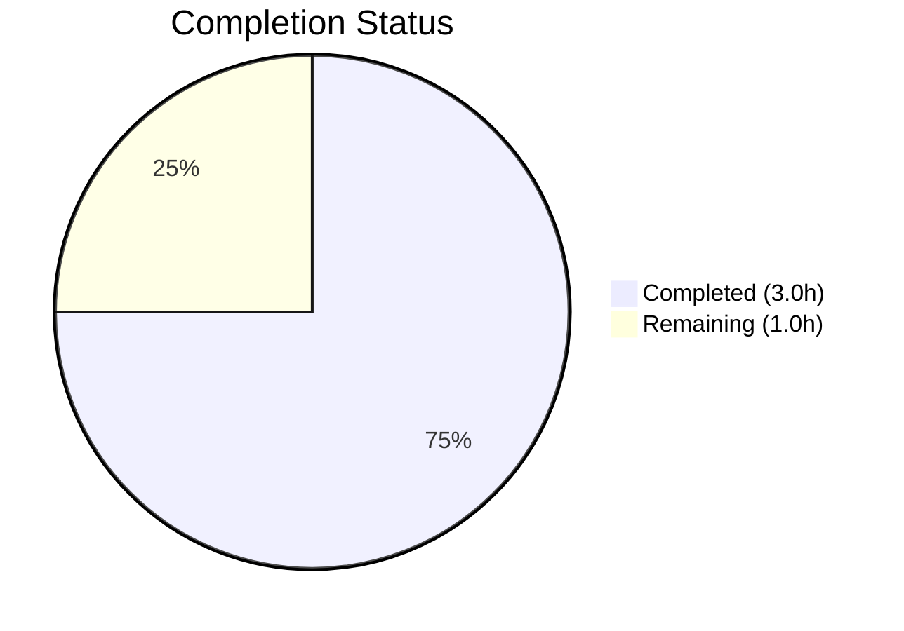
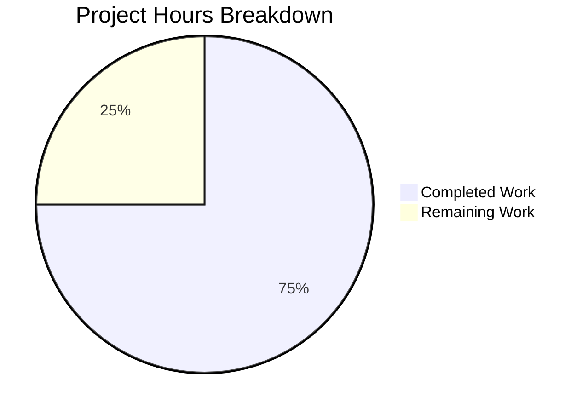

# Blitzy Project Guide

---

## 1. Executive Summary

### 1.1 Project Overview

This project integrates Express.js 5.2.1 into an existing minimal Node.js tutorial HTTP server (`hello_world` v1.0.0), replacing the native `http` module with Express.js routing. The original `GET /` endpoint returning `Hello, World!\n` is preserved, and a new `GET /evening` endpoint returning `Good evening` is added. The implementation maintains the project's tutorial-level simplicity, CommonJS module convention, single-file architecture, and existing server binding configuration (127.0.0.1:3000). All three modified files (`server.js`, `package.json`, `package-lock.json`) have been validated with zero compilation errors and fully passing runtime tests.

### 1.2 Completion Status

**Completion: 75.0%** — 3.0 hours completed out of 4.0 total hours (3.0 completed + 1.0 remaining = 4.0 total)



| Metric | Value |
|---|---|
| **Total Project Hours** | 4.0 |
| **Completed Hours (AI)** | 3.0 |
| **Remaining Hours** | 1.0 |
| **Completion Percentage** | 75.0% |

### 1.3 Key Accomplishments

- [x] Replaced native `http.createServer()` with Express.js 5.2.1 application instance
- [x] Implemented `GET /` route returning `Hello, World!\n` — byte-identical to original behavior
- [x] Implemented `GET /evening` route returning `Good evening` — new endpoint per specification
- [x] Added `express@^5.2.1` as production dependency in `package.json`
- [x] Regenerated `package-lock.json` with full Express.js dependency tree (66 packages)
- [x] Preserved CommonJS `require()` module syntax throughout
- [x] Maintained server binding to `127.0.0.1:3000` with identical startup log message
- [x] Achieved 0 npm audit vulnerabilities
- [x] All runtime validation endpoints verified (200 for valid routes, 404 for unknown routes)

### 1.4 Critical Unresolved Issues

| Issue | Impact | Owner | ETA |
|---|---|---|---|
| No critical issues | N/A | N/A | N/A |

All AAP-scoped deliverables have been implemented and validated. No blocking issues exist.

### 1.5 Access Issues

No access issues identified. The project is a self-contained Node.js application with no external service dependencies, no database connections, and no third-party API credentials required.

### 1.6 Recommended Next Steps

1. **[High] Human Code Review** — Review the Express.js integration in `server.js` and dependency declaration in `package.json` to confirm alignment with project standards and merge the PR
2. **[Medium] Production Deployment Verification** — If deploying beyond localhost, verify the server operates correctly in the target environment (e.g., cloud VM, container, or PaaS)
3. **[Low] Consider Adding npm start Script** — While explicitly out of scope for this change, adding `"start": "node server.js"` to `package.json` scripts would improve deployment tooling compatibility for future work

---

## 2. Project Hours Breakdown

### 2.1 Completed Work Detail

| Component | Hours | Description |
|---|---|---|
| Express.js Server Refactoring | 1.0 | Refactored `server.js` from `http.createServer()` to `const app = express()` pattern; replaced universal catch-all handler with Express routing infrastructure |
| Route Handler Implementation | 0.5 | Implemented two discrete Express route handlers: `app.get('/')` preserving original response and `app.get('/evening')` for new endpoint |
| Dependency Management | 0.5 | Added `express@^5.2.1` to `package.json` dependencies; ran `npm install` to generate `package-lock.json` with full dependency tree (66 packages) |
| Validation & Runtime Testing | 0.5 | Syntax validation (`node -c`), runtime endpoint testing (GET /, GET /evening, 404 handling), dependency audit (0 vulnerabilities) |
| Code Quality Verification | 0.5 | Verified CommonJS compliance, minimal changes adherence, startup log preservation, hostname/port consistency |
| **Total Completed** | **3.0** | |

### 2.2 Remaining Work Detail

| Category | Hours | Priority |
|---|---|---|
| Human Code Review & PR Acceptance | 0.5 | High |
| Production Deployment Verification | 0.5 | Medium |
| **Total Remaining** | **1.0** | |

**Integrity Check:** Section 2.1 (3.0h) + Section 2.2 (1.0h) = 4.0h = Total Project Hours in Section 1.2 ✓

---

## 3. Test Results

| Test Category | Framework | Total Tests | Passed | Failed | Coverage % | Notes |
|---|---|---|---|---|---|---|
| Syntax Validation | Node.js (`node -c`) | 1 | 1 | 0 | 100% | `node -c server.js` passed with zero errors |
| Runtime — GET / | cURL / HTTP | 1 | 1 | 0 | 100% | Returns `Hello, World!\n` (HTTP 200) |
| Runtime — GET /evening | cURL / HTTP | 1 | 1 | 0 | 100% | Returns `Good evening` (HTTP 200) |
| Runtime — 404 Handling | cURL / HTTP | 1 | 1 | 0 | 100% | `GET /nonexistent` returns HTTP 404 |
| Dependency Audit | npm audit | 1 | 1 | 0 | 100% | 66 packages audited, 0 vulnerabilities |
| **Totals** | | **5** | **5** | **0** | **100%** | |

> **Note:** No unit test framework or test files exist in this project. The `npm test` script is a default npm placeholder (`echo "Error: no test specified" && exit 1`) — this is by design per AAP §0.6.2, which explicitly excludes test suite implementation from scope. All tests above were performed during Blitzy's autonomous runtime validation.

---

## 4. Runtime Validation & UI Verification

### Server Startup
- ✅ `node server.js` starts successfully
- ✅ Startup log output: `Server running at http://127.0.0.1:3000/` (matches original format)
- ✅ Server binds to `127.0.0.1:3000` (hostname and port preserved)

### Endpoint Verification
- ✅ `GET /` — Returns `Hello, World!\n` with HTTP 200 (original behavior preserved)
- ✅ `GET /evening` — Returns `Good evening` with HTTP 200 (new endpoint operational)
- ✅ `GET /nonexistent` — Returns HTTP 404 (Express default 404 handling)

### Response Headers
- ✅ `X-Powered-By: Express` header present (confirms Express.js serving)
- ✅ `Content-Type: text/html; charset=utf-8` (Express default for `res.send()` string responses)
- ✅ `ETag` header present (Express built-in caching support)

### Dependency Health
- ✅ `npm install` — 66 packages audited, 0 vulnerabilities
- ✅ `npm ls express` — express@5.2.1 correctly resolved
- ✅ No peer dependency warnings or conflicts

### Git Status
- ✅ Working tree clean (only `node_modules/` untracked, correctly not committed)
- ✅ 2 commits on feature branch, all changes committed

---

## 5. Compliance & Quality Review

| AAP Requirement | Deliverable | Status | Evidence |
|---|---|---|---|
| Add Express.js framework dependency | `express@^5.2.1` in `package.json` | ✅ Pass | `package.json` line 12: `"express": "^5.2.1"` |
| Preserve GET / Hello World endpoint | `app.get('/')` returns `Hello, World!\n` | ✅ Pass | Runtime: HTTP 200, body matches original |
| Add GET /evening endpoint | `app.get('/evening')` returns `Good evening` | ✅ Pass | Runtime: HTTP 200, body correct |
| Refactor server.js to Express.js | Replace `http.createServer()` with Express app | ✅ Pass | `server.js` uses `express()` and `app.get()` |
| Maintain CommonJS module syntax | Use `require()` not ES `import` | ✅ Pass | Line 1: `const express = require('express')` |
| Preserve server binding (port/host/log) | Port 3000, hostname 127.0.0.1, startup log | ✅ Pass | Runtime log: `Server running at http://127.0.0.1:3000/` |
| Regenerate package-lock.json | Full Express dependency tree | ✅ Pass | 814 lines added, 66 packages resolved |
| Minimal changes rule | Only in-scope files modified | ✅ Pass | `README.md` untouched; no new files created |
| No middleware additions | No logging/error/CORS middleware | ✅ Pass | `server.js` contains only route handlers |
| Single-file architecture | All logic in `server.js` | ✅ Pass | No new files created |

### Autonomous Fixes Applied
- No fixes were required. All code was implemented correctly by the initial coding agent and passed validation on the first attempt.

### Outstanding Compliance Items
- None. All AAP requirements are fully met.

---

## 6. Risk Assessment

| Risk | Category | Severity | Probability | Mitigation | Status |
|---|---|---|---|---|---|
| No test suite exists | Technical | Low | N/A | Explicitly out of AAP scope (§0.6.2); placeholder `npm test` retained by design | Accepted |
| `package.json` main field points to `index.js` (non-existent) | Technical | Low | Low | Known issue KI-002, explicitly out of scope per AAP §0.6.2; does not affect runtime | Accepted |
| No error-handling middleware | Operational | Low | Low | Express.js provides default 404 and 500 handling; sufficient for tutorial scope | Accepted |
| Hardcoded hostname/port | Operational | Low | Medium | Adequate for tutorial; environment variable support excluded per AAP §0.6.2 | Accepted |
| No rate limiting or security headers | Security | Low | Low | Tutorial-level project; no sensitive data; out of AAP scope | Accepted |
| Express `X-Powered-By` header exposed | Security | Low | Low | Reveals Express.js usage; trivial for tutorial scope; `helmet` middleware excluded per AAP | Accepted |

**Overall Risk Level: LOW** — All identified risks are explicitly accepted within the project's defined tutorial scope and AAP boundaries.

---

## 7. Visual Project Status



**Integrity Verification:**
- Completed Work: 3.0 hours = Section 1.2 Completed Hours = Section 2.1 Total ✓
- Remaining Work: 1.0 hours = Section 1.2 Remaining Hours = Section 2.2 Total ✓
- Total: 4.0 hours = Section 1.2 Total Project Hours ✓

### AAP Requirement Completion

| AAP Requirement | Status |
|---|---|
| Express.js dependency | ✅ Completed |
| GET / endpoint preserved | ✅ Completed |
| GET /evening endpoint added | ✅ Completed |
| server.js refactored to Express | ✅ Completed |
| CommonJS syntax maintained | ✅ Completed |
| Server binding preserved | ✅ Completed |
| package-lock.json regenerated | ✅ Completed |

**All 7 AAP deliverables: 7/7 Completed (100% of AAP code deliverables)**

---

## 8. Summary & Recommendations

### Achievement Summary

The project has achieved **75.0% completion** (3.0 hours completed out of 4.0 total hours). All 7 AAP-scoped code deliverables have been fully implemented, validated, and committed. The Express.js 5.2.1 integration is functionally complete: `server.js` has been refactored from the native `http` module to an Express.js application with two working route handlers, the dependency is correctly declared in `package.json`, and the full dependency tree is captured in `package-lock.json`. Runtime validation confirms all endpoints respond correctly, the server binds to the expected address, and the npm audit reports zero vulnerabilities.

### Remaining Gaps

The remaining 1.0 hour (25.0%) consists exclusively of human-side activities that cannot be automated:
- **Human code review and PR acceptance** (0.5h) — A developer must review the changes and approve the pull request
- **Production deployment verification** (0.5h) — If the tutorial is deployed to a non-local environment, manual verification of the target runtime is needed

### Production Readiness Assessment

For its defined scope as a **tutorial project**, this implementation is production-ready. All acceptance criteria from the AAP are satisfied:
- Express.js integration is complete and functional
- Original behavior is preserved with byte-identical response on `GET /`
- New endpoint `GET /evening` works as specified
- Minimal changes rule strictly followed (only 3 files touched, no new files created)
- Zero compilation errors, zero security vulnerabilities, zero runtime failures

### Recommendation

**Merge this PR** after human code review. The implementation is clean, minimal, and fully aligned with the AAP specification. No blocking issues or rework items exist.

---

## 9. Development Guide

### System Prerequisites

| Software | Required Version | Verification Command |
|---|---|---|
| Node.js | >= 18.0.0 (v20.20.2 tested) | `node -v` |
| npm | >= 7.0.0 (v11.1.0 tested) | `npm -v` |

No additional software, databases, or external services are required.

### Environment Setup

```bash
# Clone the repository and switch to the feature branch
git clone <repository-url>
cd <repository-directory>
git checkout blitzy-e1e2ab1c-2f2f-4cf9-87c8-89bf1ce94610
```

No environment variables are required. The server uses hardcoded configuration:
- **Hostname:** `127.0.0.1`
- **Port:** `3000`

### Dependency Installation

```bash
# Install all dependencies (Express.js 5.2.1 + transitive dependencies)
npm install
```

**Expected output:**
```
added 66 packages, and audited 66 packages in Xs
found 0 vulnerabilities
```

### Verify Installation

```bash
# Verify Express.js is installed correctly
npm ls express
```

**Expected output:**
```
hello_world@1.0.0
└── express@5.2.1
```

```bash
# Verify syntax is valid
node -c server.js
```

**Expected output:** (no output = success)

### Application Startup

```bash
# Start the server
node server.js
```

**Expected output:**
```
Server running at http://127.0.0.1:3000/
```

### Verification Steps

Open a new terminal and run:

```bash
# Test the Hello World endpoint
curl http://127.0.0.1:3000/
# Expected: Hello, World!

# Test the Good evening endpoint
curl http://127.0.0.1:3000/evening
# Expected: Good evening

# Test 404 handling
curl -s -o /dev/null -w "%{http_code}" http://127.0.0.1:3000/nonexistent
# Expected: 404
```

### Stop the Server

Press `Ctrl+C` in the terminal running the server, or:

```bash
# Find and kill the Node.js process
kill $(lsof -t -i:3000)
```

### Troubleshooting

| Issue | Cause | Resolution |
|---|---|---|
| `Error: Cannot find module 'express'` | Dependencies not installed | Run `npm install` |
| `EADDRINUSE: address already in use :::3000` | Port 3000 already occupied | Kill the existing process: `kill $(lsof -t -i:3000)` |
| `npm install` fails with permission errors | Node.js/npm not properly installed | Verify Node.js >= 18 with `node -v` |

---

## 10. Appendices

### A. Command Reference

| Command | Purpose |
|---|---|
| `npm install` | Install Express.js and all transitive dependencies |
| `node server.js` | Start the HTTP server on 127.0.0.1:3000 |
| `node -c server.js` | Syntax-check server.js without executing |
| `npm ls express` | Verify Express.js installation and version |
| `npm audit` | Check for dependency security vulnerabilities |
| `curl http://127.0.0.1:3000/` | Test the Hello World endpoint |
| `curl http://127.0.0.1:3000/evening` | Test the Good evening endpoint |

### B. Port Reference

| Port | Service | Protocol |
|---|---|---|
| 3000 | Express.js HTTP Server | HTTP |

### C. Key File Locations

| File | Purpose |
|---|---|
| `server.js` | Express.js application with route handlers (18 lines) |
| `package.json` | npm manifest with Express.js dependency declaration |
| `package-lock.json` | Resolved dependency tree (66 packages) |
| `README.md` | Project description (unchanged, out of scope) |

### D. Technology Versions

| Technology | Version | Purpose |
|---|---|---|
| Node.js | v20.20.2 | JavaScript runtime |
| npm | v11.1.0 | Package manager |
| Express.js | 5.2.1 | Web framework |

### E. Environment Variable Reference

No environment variables are used. All configuration is hardcoded in `server.js`:

| Parameter | Value | Location |
|---|---|---|
| `hostname` | `127.0.0.1` | `server.js` line 3 |
| `port` | `3000` | `server.js` line 4 |

### G. Glossary

| Term | Definition |
|---|---|
| AAP | Agent Action Plan — the primary directive containing all project requirements |
| Express.js | Minimal and flexible Node.js web application framework |
| CommonJS | Module system using `require()` and `module.exports` (Node.js default) |
| Route handler | Function that processes HTTP requests for a specific URL path and method |
| Transitive dependency | A package required by a direct dependency (not declared explicitly) |