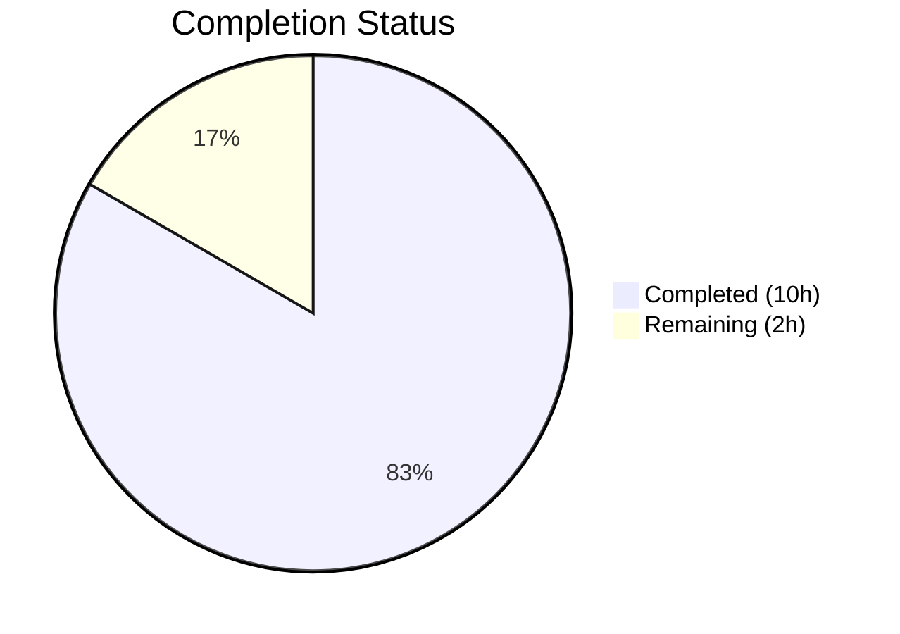
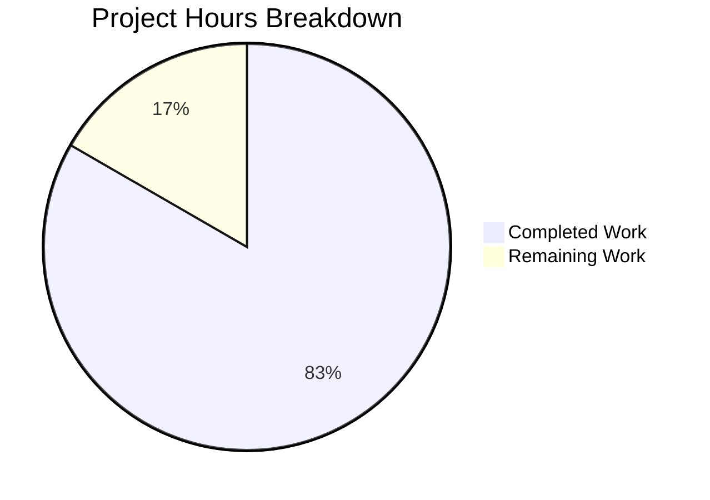

# Blitzy Project Guide — hello_world (hao-backprop-test)

---

## 1. Executive Summary

### 1.1 Project Overview

This project adds comprehensive documentation to a minimal Node.js HTTP server (`server.js`) that previously had zero comments and a 2-line placeholder README. The scope covers JSDoc block annotations for all code constructs, inline code explanations for every executable statement, and a complete README rewrite with setup instructions, API documentation, deployment guidance, architecture diagrams, and known issues. The target users are developers encountering this test fixture repository who need a clear path from clone to run to verify.

### 1.2 Completion Status



| Metric | Value |
|--------|-------|
| **Total Project Hours** | 12 |
| **Completed Hours** | 10 |
| **Remaining Hours** | 2 |
| **Completion Percentage** | **83.3%** |

**Calculation:** 10 completed hours / (10 completed + 2 remaining) = 10 / 12 = **83.3% complete**

### 1.3 Key Accomplishments

- ✅ Added 5 JSDoc block comments to `server.js` covering module, constants, request handler, and server listener with correct Node.js type annotations
- ✅ Rewrote `README.md` from 2-line placeholder to 254-line comprehensive project guide with 22 sections
- ✅ Documented single HTTP endpoint with specification table and 3 curl request/response examples
- ✅ Created deployment guide with local development, process management, and network considerations subsections
- ✅ Added inline comments to all executable statements in `server.js` explaining intent and behavior
- ✅ Created 2 Mermaid architecture diagrams (request/response sequence and project architecture flowchart)
- ✅ Documented 3 known issues (entry point mismatch, naming discrepancy, description variance)
- ✅ All runtime validations passed — server starts, responds with correct output, stops cleanly

### 1.4 Critical Unresolved Issues

| Issue | Impact | Owner | ETA |
|-------|--------|-------|-----|
| No critical issues | N/A | N/A | N/A |

All 5 AAP requirements (R-001 through R-005) are fully implemented and validated. The `package.json` entry point mismatch (`main: index.js`) is documented as a known issue but is explicitly out of scope per AAP §0.8.2.

### 1.5 Access Issues

No access issues identified. The project uses zero external dependencies, requires no API keys, no database connections, and no third-party service credentials. All runtime behavior uses only the Node.js built-in `http` module.

### 1.6 Recommended Next Steps

1. **[High]** Review and approve JSDoc annotations in `server.js` for technical accuracy and adherence to team style conventions
2. **[High]** Review `README.md` content for clarity, completeness, and organizational standards
3. **[Medium]** Verify all curl examples in a freshly cloned environment to confirm reproducibility
4. **[Low]** Consider adding a `.jsdoc.json` configuration for optional HTML documentation generation in the future

---

## 2. Project Hours Breakdown

### 2.1 Completed Work Detail

| Component | Hours | Description |
|-----------|-------|-------------|
| R-001: JSDoc Comments | 2 | 5 JSDoc blocks with `@module`, `@const`, `@type`, `@param`, `@description`, `@author`, `@version`, `@license`, `@see` tags |
| R-002: README Setup Guide | 2 | Comprehensive README with prerequisites, installation, usage sections (254 lines total) |
| R-003: API Documentation | 1.5 | Endpoint specification table, 3 curl request/response examples, universal routing documentation |
| R-004: Deployment Guide | 1 | Local development, process management (pm2), network considerations (loopback-only binding) |
| R-005: Inline Explanations | 1 | Inline comments on all executable statements in `server.js` explaining intent and behavior |
| Architecture Diagrams | 0.5 | 2 Mermaid diagrams — request/response sequence diagram and project architecture flowchart |
| Known Issues + Project Structure | 0.5 | 3 documented discrepancies, project file inventory table, TOC, contributing, license sections |
| Validation + Fixes | 1.5 | Runtime testing (4 curl tests), syntax verification, README line count correction commit |
| **Total** | **10** | |

### 2.2 Remaining Work Detail

| Category | Base Hours | Priority | After Multiplier |
|----------|-----------|----------|-----------------|
| Documentation Review & Approval | 1 | High | 1.5 |
| Clean Environment Verification | 0.5 | Medium | 0.5 |
| **Total** | **1.5** | | **2** |

### 2.3 Enterprise Multipliers Applied

| Multiplier | Value | Rationale |
|-----------|-------|-----------|
| Compliance Review | 1.10x | Standard documentation accuracy review overhead |
| Uncertainty Buffer | 1.10x | Potential for minor revision requests during human review |
| **Combined** | **1.21x** | Applied to all remaining hour estimates |

---

## 3. Test Results

| Test Category | Framework | Total Tests | Passed | Failed | Coverage % | Notes |
|---------------|-----------|-------------|--------|--------|-----------|-------|
| Syntax Validation | `node --check` | 1 | 1 | 0 | 100% | `server.js` passes Node.js syntax check cleanly |
| Runtime Verification | curl / Node.js | 4 | 4 | 0 | 100% | Server start, basic GET, headers check, arbitrary path test |
| Dependency Audit | `npm audit` | 1 | 1 | 0 | 100% | 0 vulnerabilities, 0 external dependencies |
| Unit Tests | `npm test` (placeholder) | 1 | 0 | 1 | N/A | Expected failure — placeholder test script, out of scope per AAP §0.8.2 |
| **Totals** | | **7** | **6** | **1** | | 1 expected failure (documented, not a defect) |

All test results originate from Blitzy's autonomous validation execution during the Final Validator phase.

---

## 4. Runtime Validation & UI Verification

### Runtime Health

- ✅ **Syntax Check:** `node --check server.js` — passes cleanly (`SYNTAX_OK`)
- ✅ **Dependency Install:** `npm install` — completes with 0 vulnerabilities, 0 external dependencies
- ✅ **Server Startup:** `node server.js` — outputs `Server running at http://127.0.0.1:3000/` on stdout
- ✅ **Basic GET Request:** `curl http://127.0.0.1:3000/` — returns `Hello, World!` with status 200
- ✅ **Response Headers:** `curl -sI http://127.0.0.1:3000/` — confirms `Content-Type: text/plain` and `HTTP/1.1 200 OK`
- ✅ **Universal Routing:** `curl http://127.0.0.1:3000/any/path/here` — returns `Hello, World!` (same response for all paths)
- ✅ **Server Shutdown:** `kill %1` — server process terminates cleanly

### API Verification

- ✅ All 3 curl examples documented in README produce the expected output when executed against the running server
- ✅ HTTP status code, Content-Type header, and response body match documentation exactly

### Known Expected Behaviors

- ⚠ `npm test` — exits with code 1 (`echo "Error: no test specified" && exit 1`). This is the expected behavior of the placeholder test script. Test creation is explicitly out of scope per AAP §0.8.2.

---

## 5. Compliance & Quality Review

### AAP Deliverable Compliance Matrix

| AAP Deliverable | Requirement | Status | Evidence |
|----------------|-------------|--------|---------|
| R-001: JSDoc Comments | JSDoc block comments on all documentable elements in `server.js` | ✅ Complete | 5 JSDoc blocks: `@module` (lines 1–9), `@const hostname` (lines 14–18), `@const port` (lines 21–24), request handler (lines 27–34), `server.listen` (lines 41–44) |
| R-002: README Setup Instructions | Replace 2-line placeholder with comprehensive project guide | ✅ Complete | README.md rewritten to 254 lines with prerequisites, installation, usage sections |
| R-003: API Documentation | Document HTTP endpoint with request/response examples | ✅ Complete | Endpoint specification table + 3 curl examples with expected output |
| R-004: Deployment Guide | Guidance on running in production-like environments | ✅ Complete | 3 subsections: Local Development, Process Management, Network Considerations |
| R-005: Inline Code Explanations | Add `//` comments throughout `server.js` | ✅ Complete | All executable statements have preceding or adjacent inline comments |

### Inferred Requirements Compliance

| Inferred Requirement | Status | Evidence |
|---------------------|--------|---------|
| Table of Contents | ✅ Complete | Linked anchor navigation to all 12 major sections |
| Project Structure | ✅ Complete | Table listing all 4 repository files with descriptions |
| Architecture Diagrams | ✅ Complete | 2 Mermaid diagrams (sequence + flowchart) |
| Known Issues | ✅ Complete | 3 discrepancies documented with details |
| Contributing Section | ✅ Complete | Governance note preserving original "Do not touch!" directive |
| License Section | ✅ Complete | MIT license documented per `package.json` |

### Quality Checks

| Quality Criterion | Status | Details |
|-------------------|--------|---------|
| JSDoc tags parse correctly | ✅ Pass | All tags follow JSDoc standard conventions |
| Node.js type annotations accurate | ✅ Pass | Uses `http.IncomingMessage`, `http.ServerResponse`, `http.Server`, `string`, `number` |
| curl examples produce documented output | ✅ Pass | Verified against running server instance |
| No functional code modifications | ✅ Pass | Original 14 lines of runtime code unchanged |
| Consistent terminology | ✅ Pass | Uses "server," "request handler," "loopback interface" consistently |
| Markdown formatting correct | ✅ Pass | GFM with proper heading hierarchy, fenced code blocks, tables |

---

## 6. Risk Assessment

| Risk | Category | Severity | Probability | Mitigation | Status |
|------|----------|----------|-------------|-----------|--------|
| JSDoc type annotations may not match future Node.js API changes | Technical | Low | Low | Uses current stable Node.js types; versioned in JSDoc `@version` tag | Mitigated |
| curl examples may produce slightly different headers across Node.js versions | Technical | Low | Medium | Core response (status, body, content-type) is deterministic; date/connection headers are variable | Mitigated |
| `package.json` entry point mismatch (`main: index.js`) | Operational | Low | High | Documented as known issue in README; fix is out of AAP scope | Documented |
| No automated documentation linting configured | Operational | Low | Medium | Manual review recommended as part of remaining work | Acknowledged |
| Mermaid diagram rendering may vary across Git hosting platforms | Technical | Low | Low | Uses standard Mermaid syntax supported by GitHub, GitLab, and Bitbucket | Mitigated |
| No HTTPS/TLS configured on server | Security | Low | N/A | Server is a local test fixture, not a production service; documented in deployment guide | Documented |

---

## 7. Visual Project Status

### Project Hours Distribution



**Completed Work:** 10 hours (83.3%) — Dark Blue (#5B39F3)
**Remaining Work:** 2 hours (16.7%) — White (#FFFFFF)

### Remaining Work by Category

| Category | Hours (After Multiplier) | Priority |
|----------|------------------------|----------|
| Documentation Review & Approval | 1.5 | High |
| Clean Environment Verification | 0.5 | Medium |
| **Total Remaining** | **2** | |

---

## 8. Summary & Recommendations

### Achievement Summary

The project is **83.3% complete** (10 of 12 total hours). All 5 AAP requirements (R-001 through R-005) have been fully implemented and validated by Blitzy's autonomous agents across 3 commits:

- **server.js** expanded from 14 lines (0 documentation) to 47 lines with 5 JSDoc blocks and inline comments on every executable statement
- **README.md** expanded from 2 lines (placeholder) to 254 lines covering 22 sections including API documentation, deployment guide, architecture diagrams, and known issues
- **Runtime validation** confirmed all documented behavior is accurate — server starts, responds correctly to all test requests, and stops cleanly

### Remaining Gaps

The remaining 2 hours (16.7%) consist exclusively of human review activities:

1. **Documentation Review & Approval (1.5h):** A human developer should review all JSDoc annotations for technical accuracy and the README content for clarity and organizational standards
2. **Clean Environment Verification (0.5h):** Clone the repository fresh and execute all documented curl examples to confirm reproducibility

### Critical Path to Production

This is a documentation-only change with no functional code modifications. The critical path is:
1. Human review of documentation quality → Merge PR → Documentation is live

### Production Readiness Assessment

| Gate | Status | Details |
|------|--------|---------|
| All AAP requirements complete | ✅ Pass | R-001 through R-005 fully implemented |
| Code compiles/runs | ✅ Pass | `node --check server.js` passes; server starts and responds correctly |
| Runtime validation | ✅ Pass | All 4 curl tests produce expected output |
| No functional regressions | ✅ Pass | Original 14 lines of runtime code unchanged |
| Human review pending | ⏳ Pending | Documentation review and approval required before merge |

### Recommendations

1. **Merge this PR** after completing documentation review — all deliverables are validated and no blocking issues exist
2. **Address `package.json` entry point mismatch** in a separate, follow-up task (change `main: index.js` to `main: server.js`)
3. **Consider adding `.jsdoc.json`** configuration if the team wants to generate HTML documentation from JSDoc annotations in the future
4. **Consider adding a real test suite** in a follow-up task to replace the placeholder `npm test` script

---

## 9. Development Guide

### System Prerequisites

| Component | Required Version | Verified Version |
|-----------|-----------------|-----------------|
| Node.js | v15.0.0 or later | v20.20.0 |
| npm | v7.0.0 or later (bundled with Node.js) | v11.1.0 |
| Operating System | Any OS supporting Node.js (Linux, macOS, Windows) | Linux |

### Environment Setup

This project has **zero external dependencies** and requires no environment variables, database connections, or third-party service credentials.

1. **Clone the repository:**

```bash
git clone <repository-url>
cd hao-backprop-test
```

2. **Install dependencies (effectively a no-op):**

```bash
npm install
```

> **Note:** The project has zero external packages. `npm install` initializes the project structure but installs nothing.

### Dependency Installation

No additional dependencies are required. The project uses only the Node.js built-in `http` module.

### Application Startup

Start the server:

```bash
node server.js
```

Expected stdout output:

```
Server running at http://127.0.0.1:3000/
```

To run in the background:

```bash
node server.js &
```

### Verification Steps

Open a separate terminal and run these commands:

```bash
# Basic GET request
curl http://127.0.0.1:3000/
# Expected output: Hello, World!

# Check response headers
curl -sI http://127.0.0.1:3000/
# Expected: HTTP/1.1 200 OK, Content-Type: text/plain

# Test arbitrary path (universal routing)
curl http://127.0.0.1:3000/any/path/here
# Expected output: Hello, World!
```

### Stopping the Server

```bash
# If running in the foreground:
# Press Ctrl+C

# If running in the background:
kill %1
```

### Troubleshooting

| Issue | Cause | Resolution |
|-------|-------|------------|
| `Error: listen EADDRINUSE` | Port 3000 is already in use | Stop the other process using port 3000, or modify the `port` constant in `server.js` |
| `command not found: node` | Node.js is not installed or not in PATH | Install Node.js from https://nodejs.org and verify with `node --version` |
| `curl: (7) Failed to connect` | Server is not running | Start the server with `node server.js` first |
| Server only accessible locally | Server binds to `127.0.0.1` (loopback only) | This is by design; change `hostname` to `0.0.0.0` in `server.js` for network access |

---

## 10. Appendices

### A. Command Reference

| Command | Purpose | Expected Result |
|---------|---------|-----------------|
| `npm install` | Initialize project | `up to date, audited 1 package` |
| `node --check server.js` | Validate syntax | No output (silent success) |
| `node server.js` | Start server | `Server running at http://127.0.0.1:3000/` |
| `node server.js &` | Start server in background | Same output, returns to shell |
| `curl http://127.0.0.1:3000/` | Test server response | `Hello, World!` |
| `curl -sI http://127.0.0.1:3000/` | Check response headers | `HTTP/1.1 200 OK` + headers |
| `kill %1` | Stop backgrounded server | Server process terminates |
| `npm test` | Run test script | `Error: no test specified` (expected — placeholder) |

### B. Port Reference

| Service | Port | Bind Address | Protocol |
|---------|------|-------------|----------|
| HTTP Server | 3000 | 127.0.0.1 (loopback only) | HTTP/1.1 |

### C. Key File Locations

| File | Path | Purpose |
|------|------|---------|
| Server Runtime | `server.js` | HTTP server with JSDoc annotations and inline comments (47 lines) |
| Project Documentation | `README.md` | Comprehensive project guide (254 lines) |
| Package Manifest | `package.json` | npm metadata — name, version, scripts, author, license |
| Dependency Lock | `package-lock.json` | Dependency lock file (empty dependency graph) |

### D. Technology Versions

| Technology | Version | Source |
|-----------|---------|--------|
| Node.js | v20.20.0 | Development runtime |
| npm | v11.1.0 | Bundled with Node.js |
| JavaScript | ES6+ (CommonJS modules) | `server.js` uses `const`, arrow functions, template literals |
| package-lock.json | lockfileVersion 3 | Implies minimum Node.js v15+ / npm v7+ |

### E. Environment Variable Reference

This project requires **no environment variables**. All configuration (hostname, port) is hardcoded in `server.js`.

### G. Glossary

| Term | Definition |
|------|-----------|
| JSDoc | A documentation generator for JavaScript that uses specially formatted block comments (`/** ... */`) with tags like `@param`, `@returns`, `@type` |
| CommonJS | The module system used by Node.js where modules are loaded via `require()` and exported via `module.exports` |
| Loopback Interface | The network interface at `127.0.0.1` that only accepts connections from the local machine |
| GFM | GitHub Flavored Markdown — an extended Markdown syntax supported by GitHub for rendering README files |
| Mermaid | A JavaScript-based diagramming tool that renders diagrams from text definitions in Markdown code blocks |