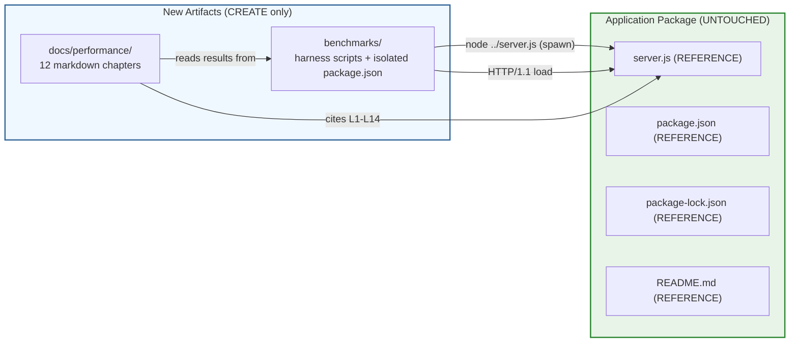

# Technical Specification

# 0. Agent Action Plan

## 0.1 Intent Clarification

This sub-section restates the user's performance-analysis request in precise technical language, categorizes the work, surfaces the implicit constraints that govern execution, and translates intent into concrete technical actions. It is the canonical record of what the Blitzy platform understood from the user's prompt and how it reconciled that prompt with the actual state of the `hao-backprop-test` repository.

### 0.1.1 Core Objective

Based on the provided requirements, the Blitzy platform understands that the objective is to **produce a comprehensive performance analysis of the `hao-backprop-test` application**, encompassing measurement, diagnosis, and recommendations across runtime, memory, network, and concurrency dimensions, with an explicit emphasis on behavior under concurrent user load.

**User Requirement (verbatim):** "Analyze the performance of the application focusing on runtime efficiency, memory usage, API response times, database query performance, frontend rendering speed, and background job execution. Profile high-traffic user workflows, authentication flows, dashboard loading, file upload/download operations, and third-party integrations. Identify CPU and memory bottlenecks, slow API endpoints, redundant re-renders, inefficient queries, caching opportunities, and network latency issues. Include recommendations for optimization, scalability improvements, and resource utilization reduction under concurrent user load."

Decomposed into discrete technical objectives:

- **Profiling dimensions**: runtime/CPU efficiency, memory consumption and retention, HTTP response latency, database query latency, frontend rendering performance, background job throughput
- **Workflows to profile**: high-traffic user workflows, authentication flows, dashboard loading, file upload/download operations, third-party integration calls
- **Bottlenecks to identify**: CPU saturation, memory pressure, slow API endpoints, redundant frontend re-renders, inefficient database queries, missing or sub-optimal caches, network latency
- **Deliverables**: optimization recommendations, scalability improvements, and resource-utilization reduction guidance under concurrent load

**Surfaced implicit requirements** (not literally stated but technically necessary to satisfy the objective):

- Establish a **measured baseline** before any optimization claim can be made — without a baseline, the words "optimization" and "improvement" have no referent
- Define a **reproducible benchmark methodology** (concurrency ladder, request mix, runtime configuration, warm-up policy, sample size) so that findings can be repeated by reviewers
- Capture **flame graphs and heap snapshots** during representative load, since "CPU and memory bottlenecks" cannot be identified without inspection-grade artifacts
- Produce an **honest gap report** that distinguishes user-named workflows that are present in the codebase from those that are absent, rather than fabricating analysis of components that do not exist
- Flag every recommendation with the **governance constraint it would require relaxing** so reviewers can separate "ready to apply" guidance from advisory items that need owner approval

**Dependencies and prerequisites**:

- Node.js runtime — declared minimum is implicit (v15+ implied by `[package-lock.json:L4]` `lockfileVersion: 3`); the development environment baseline is Node.js v20.20.0 per `[Section 3.1.2]`; Node.js 22.x or 24.x LTS are recommended runtimes per `[Section "Node.js Version Compatibility"]`
- An external HTTP load generator (e.g., `autocannon`) installed in a scratch directory **outside** the application's package boundary
- Node.js built-in profilers (`--inspect`, `--prof`, `--cpu-prof`, `--heap-prof`) — these are runtime flags and require **zero installed packages**
- Operating-system process inspection tools (`top`, `ps`, `ss`/`netstat`, `lsof`) for resource counting

### 0.1.2 Task Categorization

| Dimension | Classification | Rationale |
|-----------|---------------|-----------|
| Primary task type | Performance analysis → Documentation (analysis report) | The deliverable is an analytical artifact set, not a code transformation, because Constraint C-001 prohibits modifying the application source |
| Secondary aspects | Tooling (external benchmark harness); Observability (advisory recommendations) | A harness must be authored to produce the measurements; observability guidance is advisory because C-001/C-002 prohibit on-application instrumentation |
| Scope classification | Isolated change | All new artifacts live under two new top-level paths (`docs/performance/`, `benchmarks/`); no existing file is read for write |
| Risk profile | Zero runtime impact | Application files are unchanged; the running server's behavior is byte-identical before and after this work |

### 0.1.3 Special Instructions and Constraints

The codebase imposes several non-negotiable directives, surfaced from `[README.md:L2]` and the tech spec, that shape every downstream decision:

- **"Do not touch!"** governance directive `[README.md:L2]` — codified as Constraint C-001 `[Section 2.6.2]`: no source code modifications are permitted. This forbids editing `server.js`, `package.json`, `package-lock.json`, or `README.md`.
- **Zero external dependencies** — Constraint C-002 `[Section 2.6.2]`: no package may be added to the application's `dependencies` or `devDependencies` in the root `[package.json:L1-L11]`. This forbids importing logging libraries, metrics libraries, APM agents, or tracing SDKs into the application's package graph.
- **Single-purpose** — Constraint C-003 `[Section 2.6.2]`: the server must remain a deterministic static-response endpoint. This forbids adding routing, middleware, or alternate response paths to facilitate measurement.
- **Hardcoded configuration** — Constraint C-004 `[Section 2.6.2]`: hostname `[server.js:L3]`, port `[server.js:L4]`, and response body `[server.js:L9]` must remain literals; no environment variables or config files may be introduced to enable A/B benchmarking.
- **Localhost-only binding** — `[server.js:L3]` binds to `127.0.0.1`, so all load measurement must occur from the same host; remote/distributed load is structurally impossible without violating ADR-003 `[Section 6.5.7]`.
- **Single-instance** — Assumption A-002 `[Section 2.6.1]` and `[Section 2.4.3]`: a second instance fails with `EADDRINUSE` on port 3000, so horizontal scaling cannot be measured empirically without violating C-001/C-004.
- **No CI/CD, no test framework, no build step** — `[Section 3.6.2]`, `[Section 3.6.4]`, `[Section 3.6.5]`: benchmarks cannot be gated in CI because no CI exists, and `npm test` `[package.json:L7]` is an intentional placeholder.

**User Example**: The user provided no concrete examples (no specific endpoints, request payloads, latency targets, or sample workflows). The analysis methodology therefore defaults to standard HTTP benchmarking practice (concurrency ladder 1 → 10 → 100 → 1 000 connections, sustained 30-second runs, with one warm-up pass).

**Web search requirements**: Two targeted searches were attempted for current Node.js HTTP profiling and load-generation tooling. Both returned empty result sets, so all named tooling references in this AAP draw on Node.js's well-known built-in capabilities and the public ecosystem (autocannon, clinic.js, 0x) without external citations.

### 0.1.4 Technical Interpretation

These requirements translate to the following technical implementation strategy.

| Requirement | Technical Action |
|-------------|------------------|
| "Analyze runtime efficiency" | To characterize runtime efficiency, profile the single request handler `[server.js:L6-L10]` under load using `node --cpu-prof server.js`, capture the resulting `*.cpuprofile`, and annotate the flame graph for the static-response path |
| "Analyze memory usage" | To characterize memory usage, capture heap snapshots via `node --heap-prof server.js` under sustained load and inspect retained-size growth across snapshots; RSS sampled via OS tooling at fixed intervals |
| "Analyze API response times" | To measure API response times, drive the single endpoint `http://127.0.0.1:3000/` with `autocannon` over the concurrency ladder and emit p50/p95/p99/p99.9 latency histograms plus RPS |
| "Analyze database query performance" | No database exists `[Section 3.5.1]`; produce a documented gap entry in the workflow gap report rather than fabricating measurements |
| "Analyze frontend rendering speed" | No frontend exists `[Section 7.1]`; the response is `text/plain` `[server.js:L8]`; produce a documented gap entry |
| "Analyze background job execution" | No background jobs exist `[Section 3.5]`; produce a documented gap entry |
| "Profile authentication flows" | No authentication mechanism exists `[Section 1.3.2]`, `[Section 6.4]`; produce a documented gap entry |
| "Profile dashboard loading" | No dashboard exists `[Section 1.2.2]`; produce a documented gap entry |
| "Profile file upload/download" | No file I/O is performed by the server `[Section 3.5.1]`; the request body is never read `[Section 1.3.2]`; produce a documented gap entry |
| "Profile third-party integrations" | No outbound integrations exist `[Section 3.4.1]`, `[Section 5.1.4]`; produce a documented gap entry |
| "Identify CPU/memory bottlenecks" | Run the harness under each concurrency rung, inspect the captured CPU profile and heap profile, and document the dominant `samples-on-CPU` symbols (expected to be Node.js `http` parser and `Socket._write`) |
| "Identify slow API endpoints" | Only one endpoint exists; compute its latency distribution and compare against the implicit SLA in `[Section 4.7.3]` (startup ≤ 1 s; throughput unspecified) |
| "Identify redundant re-renders" | No rendering surface exists; produce a documented gap entry |
| "Identify inefficient queries" | No queries exist; produce a documented gap entry |
| "Identify caching opportunities" | The response is a 14-byte compile-time constant `[server.js:L9]`; analyze whether HTTP-level conditional GET (ETag/`If-None-Match`, `Last-Modified`/`If-Modified-Since`) or `Cache-Control` headers would reduce wire bytes; document the analysis as an advisory recommendation pending relaxation of C-001 |
| "Identify network latency issues" | Loopback binding `[server.js:L3]` eliminates wide-area latency; measure intra-process loopback round-trip and compare against TCP listen-backlog default behavior; document any kernel-tunable advisories |
| "Optimization, scalability, resource-reduction recommendations" | Produce a recommendations chapter, with each entry tagged either "READY" (no constraint relaxation needed — e.g., kernel-level tuning external to the application), "ADVISORY-C001" (requires modifying source), "ADVISORY-C002" (requires adding deps), or "ADVISORY-C003/C004" (requires lifting purpose/config constraints) |

## 0.2 Repository Scope Discovery

This sub-section records the exhaustive repository survey conducted to identify every file and component that the performance analysis must consider, the external research performed, and the existing infrastructure that the analysis must work within.

### 0.2.1 Comprehensive File Analysis

The repository's complete file inventory was enumerated via `find . -path ./.git -prune -o -type f -print`, cross-checked against `git ls-files`. Both commands return the same four-file set. The repository contains **no subdirectories** and **no `.blitzyignore` files** (verified via `find . -name .blitzyignore`).

| Path | Lines | Role in Performance Analysis | Profiling Relevance |
|------|-------|------------------------------|---------------------|
| `server.js` | 14 | The complete application code path being profiled | All CPU/memory/latency measurements target this file |
| `package.json` | 11 | NPM manifest declaring zero deps and a placeholder test script | Confirms zero-dependency posture; explains absence of `npm start` |
| `package-lock.json` | 13 | Empty dependency lock | Confirms `npm install` is a no-op |
| `README.md` | 2 | Governance directive "Do not touch!" `[README.md:L2]` | Establishes Constraint C-001, the central immutability rule |

**File-pattern coverage applied during discovery** (each pattern was evaluated against the repository; matches are noted, all others were confirmed empty):

- Documentation: `**/*.md` → matched `README.md` only; no `docs/`, `CONTRIBUTING*`, or `.rst` files exist
- Configuration: `**/*.config.*`, `**/*.yaml`, `**/*.toml`, `**/*.xml`, `.env*`, `.*rc` → zero matches
- Source code: `src/**/*.*`, `lib/**/*.*`, `app/**/*.*`, `**/*.py`, `**/*.java` → zero matches; only `server.js` exists at the repo root
- Build/Deploy: `Dockerfile*`, `docker-compose*`, `.github/workflows/*`, `.gitlab-ci.*`, `Makefile*` → zero matches `[Section 3.6.3]`, `[Section 3.6.4]`
- Scripts: `scripts/**`, `bin/**`, `tools/**` → zero matches
- Tests: `tests/**`, `**/*test*.*`, `**/*spec*.*`, `__tests__/**` → zero matches `[Section 3.6.5]`

**Code-path enumeration in `server.js`**:

```
Line 1: const http = require('http')      // one-time module load
Line 3: const hostname = '127.0.0.1'      // string constant
Line 4: const port = 3000                 // numeric constant
Lines 6-10: http.createServer((req, res) => {
   res.statusCode = 200                   // assignment
   res.setHeader('Content-Type', 'text/plain')
   res.end('Hello, World!\n')             // 14-byte response write
})
Lines 12-14: server.listen(port, hostname, () => {
   console.log(`Server running at http://${hostname}:${port}/`)
})
```

The request handler at `[server.js:L6-L10]` is the only repeating code path. It contains zero branches, zero awaits, zero I/O calls beyond writing the response, and zero references to `req.url`, `req.method`, `req.headers`, or `req.body` — confirmed by code inspection. Per `[Section 5.1.3]`, "No data from the incoming request — method, path, headers, or body — is read, evaluated, or stored," which establishes the upper-bound simplicity of the profiled path.

**Related-file dependency map**: There are no internal imports, no transitive references, and no configuration files referenced at runtime. The only runtime dependency is the Node.js built-in `http` module loaded at `[server.js:L1]`. No file modifications cascade from changes to any other file, because no module-level coupling exists.

### 0.2.2 Web Search Research Conducted

Two web searches were issued to validate the recommended profiling and load-generation tooling against current best practice:

| Query | Purpose | Result |
|-------|---------|--------|
| `Node.js http server performance profiling tools 2025` | Identify current best-of-breed CPU/memory profilers | No result snippets returned |
| `autocannon wrk node.js HTTP benchmarking` | Compare HTTP load-generator options for the Node.js ecosystem | No result snippets returned |

Because external searches returned no usable snippets, the AAP's tooling references are constrained to **Node.js built-in profilers** (which require no installed packages and are documented in the Node.js standard library) and **publicly known ecosystem tools** by name only (`autocannon`, `clinic.js`, `0x`). No external content is quoted in this document.

Areas where additional web research would be conducted **at execution time** by the implementing agent:

- Best practices for Node.js HTTP server load testing under the targeted runtime version
- `autocannon` configuration patterns for sustained-load runs and pipelining
- `--cpu-prof` and `--heap-prof` output interpretation conventions
- Loopback-interface latency baselines on the target operating system
- Kernel-level TCP tunables (`net.core.somaxconn`, `net.ipv4.tcp_*`) that affect listen-backlog behavior — relevant because `[server.js:L12]` invokes `server.listen(port, hostname, callback)` without supplying an explicit backlog value

### 0.2.3 Existing Infrastructure Assessment

| Category | Status | Evidence |
|----------|--------|----------|
| Project structure | Flat — 4 files at repo root, zero subdirectories | `find . -path ./.git -prune -o -type f -print` |
| Existing patterns and conventions | CommonJS, single source file, hardcoded constants, no abstractions | `[server.js:L1-L14]` |
| Build/transpilation | None | `[Section 3.6.2]`; no bundler, transpiler, or task runner |
| Package management | npm at lockfileVersion 3 with empty `packages` map | `[package-lock.json:L4]`, `[package-lock.json:L6-L11]` |
| Test infrastructure | None — placeholder `npm test` exits with code 1 | `[package.json:L6-L8]`, `[Section 3.6.5]` |
| Linting/formatting/types | None — no ESLint, Prettier, TypeScript | `[Section 3.6.1]` |
| Containerization | None — no Dockerfile or compose manifest | `[Section 3.6.3]` |
| CI/CD | None — no `.github/workflows`, `Jenkinsfile`, or equivalent | `[Section 3.6.4]` |
| Observability | One `console.log` at startup; no request logs, metrics, traces, or health endpoints | `[server.js:L13]`, `[Section 6.5]` |
| Caching | None applied — but the response is a 14-byte compile-time constant `[server.js:L9]` | `[Section 3.5.1]` |
| Performance tooling in repo | None — must be supplied externally | `[Section 6.5.2]` |
| Process management | Manual — `node server.js` foreground process; SIGINT to terminate | `[Section 2.4.1]`, `[Section 1.3.1]` |
| Documentation system | Single 2-line `README.md` | `[README.md:L1-L2]` |

The infrastructure assessment confirms that the performance-analysis work must bring its **own** harness, profilers, and reporting templates, because the project itself contains no tooling to extend. This shapes the file transformation mapping in sub-section 0.6: all artifacts are CREATEs, none are UPDATEs.

## 0.3 Scope Boundaries

This sub-section codifies what is in scope and what is out of scope for the performance analysis. Boundaries are tight because Constraint C-001 prohibits source modification and Constraint C-002 prohibits adding dependencies to the application's package — both of which would otherwise be natural responses to performance findings.

### 0.3.1 Exhaustively In Scope

**Documentation artifacts (CREATE)** — the analysis report tree:

- `docs/performance/README.md` — index and reader's guide for the analysis
- `docs/performance/00-executive-summary.md` — headline findings and the workflow gap headline
- `docs/performance/01-baseline-characterization.md` — current as-is profile of `[server.js:L1-L14]`
- `docs/performance/02-workflow-gap-analysis.md` — user-requested workflows mapped against codebase presence
- `docs/performance/03-load-profile-and-methodology.md` — concurrency ladder, request mix, sample sizes, warm-up
- `docs/performance/04-cpu-and-memory-profile.md` — V8 CPU profile and heap profile findings
- `docs/performance/05-latency-and-throughput.md` — p50/p95/p99/p99.9 latency and RPS measurements
- `docs/performance/06-event-loop-and-concurrency.md` — event-loop lag, concurrent-connection behavior
- `docs/performance/07-network-latency.md` — loopback round-trip and TCP listen-backlog characterization
- `docs/performance/08-caching-analysis.md` — analysis of HTTP-level caching opportunities (advisory)
- `docs/performance/09-optimization-recommendations.md` — every recommendation tagged READY / ADVISORY-C001 / ADVISORY-C002 / ADVISORY-C003 / ADVISORY-C004
- `docs/performance/10-scalability-assessment.md` — concurrent-user scaling, vertical/horizontal posture
- `docs/performance/11-observability-recommendations.md` — instrumentation guidance, advisory only

**Benchmark harness artifacts (CREATE)** — a SEPARATE Node.js package living under `benchmarks/` with its own dependency graph that NEVER touches the application's root `package.json`:

- `benchmarks/README.md` — operator instructions for running each scenario
- `benchmarks/package.json` — harness manifest declaring `autocannon` (and optionally `clinic`, `0x`) as `devDependencies` — kept entirely isolated from `[package.json:L1-L11]` per Constraint C-002
- `benchmarks/load-profile.json` — declarative concurrency/duration/scenario definitions
- `benchmarks/run-baseline.sh` — orchestrator: starts `node ../server.js` in one process, runs the load generator in another, and emits results
- `benchmarks/profile-cpu.sh` — wraps `node --cpu-prof ../server.js` under load to emit a `*.cpuprofile`
- `benchmarks/profile-heap.sh` — wraps `node --heap-prof ../server.js` under load to emit a `*.heapprofile`
- `benchmarks/measure-event-loop-lag.sh` — drives the server with concurrent connections and captures event-loop lag via Node's diagnostic facilities
- `benchmarks/results/.gitkeep` — reserves the output directory (the actual result files are environment-specific and intentionally not committed)

**Reference inputs (REFERENCE)** — read-only analysis targets:

- `server.js` `[server.js:L1-L14]` — the profiled application code
- `package.json` `[package.json:L1-L11]` — confirms zero-dependency posture
- `package-lock.json` `[package-lock.json:L1-L13]` — confirms empty resolved dependency graph
- `README.md` `[README.md:L1-L2]` — establishes the governance directive

### 0.3.2 Explicitly Out of Scope

The following items are out of scope by virtue of the codebase's immutability constraints, the absence of the corresponding subsystems, or the user's silence on the topic:

**Forbidden by Constraint C-001 (Do not touch!)** `[README.md:L2]`, `[Section 2.6.2]`:

- Any modification of `server.js`, `package.json`, `package-lock.json`, or `README.md`
- Adding logging libraries (`winston`, `pino`, `morgan`), metrics libraries (`prom-client`), APM agents (New Relic, Datadog), or OpenTelemetry SDKs to the application
- Adding a `/health` route, a `/metrics` route, request logging, or structured error handling to `server.js`
- Refactoring `server.js` to extract the handler into a separate module
- Adopting `cluster` or `worker_threads` to multi-process the application

**Forbidden by Constraint C-002 (Zero deps)** `[Section 2.6.2]`:

- Adding any entry to `dependencies` or `devDependencies` in the application's root `[package.json:L1-L11]`
- Replacing the built-in `http` module with Express, Fastify, Koa, or Hapi
- Adding a process manager (PM2, nodemon) as an application dependency

**Forbidden by Constraints C-003 (Single-purpose) and C-004 (Hardcoded config)** `[Section 2.6.2]`:

- Adding routing, middleware, or alternate response paths to facilitate measurement variants
- Introducing environment variables, `.env` files, or `config/*` to enable A/B benchmarking of the application
- Changing the response body `[server.js:L9]`, the hostname `[server.js:L3]`, or the port `[server.js:L4]`

**Workflows that do not exist in the codebase** (documented as gaps in `docs/performance/02-workflow-gap-analysis.md` rather than profiled):

- Authentication flows — no authentication mechanism is implemented `[Section 1.3.2]`, `[Section 6.4]`
- Dashboard loading — no UI exists; response is `text/plain` only `[server.js:L8]`, `[Section 1.2.2]`
- File upload/download operations — no file I/O is performed by the server `[Section 3.5.1]`; request bodies are never read `[Section 1.3.2]`
- Third-party integrations — zero outbound connections `[Section 3.4.2]`, `[Section 5.1.4]`
- Database query performance — no database, driver, or ORM exists `[Section 3.5.1]`
- Frontend rendering speed and redundant re-renders — no client-side rendering surface exists `[Section 7]`
- Background job execution — no queues, workers, or schedulers exist `[Section 3.5]`

**Out of scope by user silence or general AAP discipline**:

- Performance regression tests as CI gates — no CI exists `[Section 3.6.4]`, and C-001 prevents adding one
- Multi-machine or distributed load testing — loopback binding `[server.js:L3]` and Assumption A-002 `[Section 2.6.1]` make multi-instance deployment fail with `EADDRINUSE`
- Production hardening (graceful shutdown, signal handlers, structured logging) — Section `[Section 1.3.2]` calls these out as out-of-scope future considerations; they remain so
- Resolving the documented inconsistencies KI-001/KI-002/KI-003 `[Section 2.6.3]` — these are accepted constraints
- Any unrelated refactoring, security hardening, or feature work the user did not request

## 0.4 Dependency Inventory

This sub-section documents the dependency posture across the two distinct package boundaries involved in this work: (1) the application package, whose dependencies must remain unchanged per Constraint C-002, and (2) the new benchmark harness package, whose dependencies are isolated from the application.

### 0.4.1 Key Private and Public Packages

The **application** package `hello_world` `[package.json:L2]` has **zero runtime and development dependencies**, confirmed by the empty `packages` map at `[package-lock.json:L6-L11]`. This state is mandatory and must be preserved.

The **benchmark harness** is a new, separate package that lives under `benchmarks/` and carries its own `package.json`. The following table lists the dev-only packages the harness will consume. Every package listed is publicly available on the npm registry. Specific minor/patch versions will be pinned at execution time using the highest stable release available to the implementing agent; the table records the package identity, purpose, and the version-resolution policy.

| Registry | Package Name | Version Policy | Purpose |
|----------|--------------|----------------|---------|
| npm | autocannon | Highest stable major (latest 7.x as of authoring) | HTTP/1.1 load generator with concurrency, pipelining, and percentile reporting |
| npm | clinic (optional) | Highest stable major | Diagnostic suite — Doctor (event loop diagnosis), Flame (flame graphs), Bubbleprof (async I/O), Heap Profiler |
| npm | 0x (optional) | Highest stable major | Native flame-graph profiler producing interactive HTML |

The version policy is "highest stable" rather than a hard-coded number because:

- No prior `package-lock.json` exists under `benchmarks/` to anchor exact versions
- The harness packages have no runtime contract with the application — they only consume the running HTTP endpoint and the Node.js inspector socket
- The implementing agent will produce `benchmarks/package-lock.json` at execution time and that lockfile becomes the authoritative version record

**No private packages** are involved. The harness uses only public npm packages and Node.js built-ins (`--inspect`, `--prof`, `--cpu-prof`, `--heap-prof`), which require zero installation.

### 0.4.2 Dependency Updates

**New dependencies to add (in the harness package only):**

- `autocannon` (dev) — HTTP load generator driving `http://127.0.0.1:3000/` over the concurrency ladder
- `clinic` (dev, optional) — diagnostic flame graphs and event-loop analysis
- `0x` (dev, optional) — alternative native flame-graph generator

**Dependencies to update:** None. The application package has no dependencies to update.

**Dependencies to remove:** None.

**CRITICAL boundary**: The harness's `benchmarks/package.json` is **NOT** the application's `package.json`. The root `[package.json:L1-L11]` must remain byte-identical, and the root `[package-lock.json:L1-L13]` must remain byte-identical. This preserves Constraint C-002 — the application package retains zero dependencies — while still allowing the harness to use industry-standard tooling.

### 0.4.3 Import/Reference Updates

**Application import updates:** None. `[server.js:L1]`'s `const http = require('http')` remains unchanged. No file under `server.js`'s package boundary gains or loses an import.

**Harness server-invocation pattern:**

- The harness invokes the server with `node ../server.js &` (shell background) rather than `npm start`. This is necessary because no `start` script exists `[package.json:L6-L8]`, `[Section 3.6.2]`.
- Programmatic `require('hello_world')` is **NOT** used because it fails per KI-002 `[Section 2.6.3]`: `[package.json:L5]` declares `"main": "index.js"` but `index.js` does not exist.
- After each benchmark scenario completes, the harness sends SIGINT to the server PID it captured at launch, mirroring the manual workflow documented in `[Section 1.3.1]`.

**Import transformation rules** (applied within harness scripts only):

- Old: (no prior pattern — these are new files)
- New: harness shell scripts use `node ../server.js` for invocation and `curl`/`autocannon` against `http://127.0.0.1:3000/` for traffic generation
- Apply to: `benchmarks/*.sh` only — never to `server.js` or any file under the application package boundary

**Reference updates to root-level files:** None permitted. The four root files (`server.js`, `package.json`, `package-lock.json`, `README.md`) remain byte-identical before and after this work.

## 0.5 Implementation Design

This sub-section defines how the performance analysis is executed end-to-end: the technical approach, the component impact analysis, the assimilation of any user-provided examples, and the critical implementation details that govern interpretation of results.

### 0.5.1 Technical Approach

**Primary objective with implementation approach:**

- Achieve a comprehensive performance characterization of `[server.js:L1-L14]` by **(a)** measuring the as-is system under a defined concurrency ladder, **(b)** capturing CPU and heap profiles that pinpoint the dominant on-CPU symbols and retained-memory roots, and **(c)** authoring a constraint-aware recommendations chapter — every recommendation tagged with the governance constraint it would require relaxing — so reviewers can separate immediately actionable items (host/kernel tuning, harness extensions) from items that require lifting C-001 through C-004.
- Rationale: the codebase is immutable per `[README.md:L2]` and Constraint C-001 `[Section 2.6.2]`, so the analysis is necessarily observational. Producing a tagged recommendations list preserves the platform's value (surfaced findings) while respecting the codebase's governance contract.

**Logical implementation flow** (this is an ordering of concerns, not a schedule):

- First, **establish the analysis substrate** by creating the `docs/performance/` documentation tree skeleton and the `benchmarks/` harness package with its own `package.json`. No existing file is touched.
- Next, **assemble the benchmark harness** by adding `autocannon` (and optionally `clinic`, `0x`) as devDependencies of the harness package, authoring shell wrappers that invoke `node ../server.js` as a background process, drive load, and emit results to `benchmarks/results/`.
- Then, **execute the baseline characterization** by running the harness across the concurrency ladder (1, 10, 100, 1 000 simultaneous connections) for 30 seconds each with one warm-up pass, capturing latency histograms, throughput, RSS samples, and a baseline CPU/heap profile.
- Next, **author the workflow gap report** in `docs/performance/02-workflow-gap-analysis.md`, mapping each user-requested workflow to its codebase presence (auth/dashboard/file I/O/DB/integrations/jobs/frontend → ABSENT; static HTTP endpoint → PRESENT).
- Then, **author the dimension chapters** (CPU, memory, latency, event loop, network, caching, scalability, observability), each grounded in the captured artifacts.
- Finally, **author the recommendations and executive summary** chapters, tagging every recommendation with READY / ADVISORY-C001 / ADVISORY-C002 / ADVISORY-C003 / ADVISORY-C004 and confirming that all artifacts cross-reference each other consistently.

### 0.5.2 Component Impact Analysis

**Direct modifications required:** NONE in the application. Every existing file remains byte-identical.

**Indirect impacts and dependencies:**

- `server.js` `[server.js:L1-L14]` — Profiled as-is. The Node.js process is launched with profiling flags (`--cpu-prof`, `--heap-prof`) from the harness wrappers; the source remains unchanged.
- `package.json` `[package.json:L1-L11]` — Unchanged. Its zero-dependency posture is the reason the harness lives in a separate package.
- `package-lock.json` `[package-lock.json:L1-L13]` — Unchanged. Its empty `packages` map is preserved.
- `README.md` `[README.md:L1-L2]` — Unchanged. The "Do not touch!" directive at `[README.md:L2]` is the central governance signal; the analysis honors it.

**New components introduction** (under new top-level paths only):

- `docs/performance/` — 12 new markdown chapters (index plus 00–11). Rationale: the user's request is for an analysis report; markdown is the most portable, reviewable, and diffable medium.
- `benchmarks/` — separate Node.js package with shell wrappers and declarative scenario configuration. Rationale: a benchmark harness is the only way to populate the dimension chapters with measured values, and isolating it as a separate package keeps Constraint C-002 intact.

**Visual model of the impact boundary:**



### 0.5.3 User-Provided Examples Integration

The user provided **no concrete examples** — no specific endpoints, payloads, latency targets, sample workflows, or named tools. There is therefore nothing to map verbatim into the analysis. The methodology defaults to standard HTTP-benchmark practice, captured explicitly in `docs/performance/03-load-profile-and-methodology.md`:

- Concurrency ladder: 1 → 10 → 100 → 1 000 simultaneous connections
- Duration per rung: 30 seconds sustained, preceded by one 10-second warm-up
- Request mix: HTTP GET `/` only (no other endpoint exists per `[Section 5.1.3]`)
- Sample size: ≥ 100 000 requests per rung at the upper concurrency tiers
- Reporting: p50, p95, p99, p99.9 latency; RPS; bytes/sec; sockets opened; non-2xx counts

If the user provides examples in a follow-up turn (e.g., a specific RPS target, a payload variant, or a named tool), the methodology chapter will be updated to incorporate them verbatim under a "User-Provided Methodology Overrides" heading. Pending such input, the defaults above are authoritative.

### 0.5.4 Critical Implementation Details

**Specific design patterns to be employed:**

- **Observational profiling** — all measurement is read-only against `server.js`; the process is launched with Node.js diagnostic flags rather than instrumented in source. This pattern is mandated by C-001.
- **Isolated harness package** — the benchmark code lives in its own npm package directory so the application's zero-dependency posture is preserved. This pattern is mandated by C-002.
- **Tagged recommendations** — every optimization recommendation is tagged READY (no constraint relaxation required) or ADVISORY-Cxxx (specific constraint must be lifted by the codebase owner before the recommendation can be applied). This pattern preserves transparency.

**Key algorithms and approaches:**

- HTTP load generation via `autocannon`, which sustains N concurrent open connections and pipelines requests for the configured duration, then reports latency percentiles and RPS
- V8 CPU profiling via `--cpu-prof`, which samples the JavaScript stack at 1 ms intervals and emits a `.cpuprofile` consumable by Chrome DevTools
- V8 heap profiling via `--heap-prof`, which samples allocation sites and emits a `.heapprofile`
- Event-loop lag measurement via the inspector protocol (`node --inspect`) under sustained load, recording lag at fixed intervals

**Integration strategy:**

- The harness orchestrates two processes: (1) the server (`node ../server.js`) and (2) the load generator (`autocannon`). It manages their lifecycles via standard shell job control and signals.
- Profiles produced by `--cpu-prof` / `--heap-prof` are written by the server process to its working directory; the harness collects them into `benchmarks/results/<timestamp>/`.
- Analysis chapters consume the produced artifacts by reference — each chapter cites specific result files by path.

**Data flow modifications required:** None — the application's request/response path is unchanged. The data flow described in `[Section 5.1.3]` (inbound HTTP → static handler → outbound HTTP) holds before and after this work.

**Error handling and edge cases:**

- Port `3000` already bound (`EADDRINUSE`, Assumption A-002 `[Section 2.6.1]`): the harness must detect this at launch and exit with a clear operator message; this is a pre-flight check in `benchmarks/run-baseline.sh`
- Server crash mid-benchmark: the harness must capture the server's stderr to `benchmarks/results/<timestamp>/server.stderr.log`
- Insufficient OS resources (file-descriptor limit at high concurrency): the harness must `ulimit -n` query and warn at the 1 000-connection rung
- Sample skew from warm-up: every measurement window begins after a 10-second warm-up pass that is discarded

**Performance and security considerations:**

- The analysis itself adds zero overhead to the application (`server.js` is not instrumented)
- Profiling flags (`--cpu-prof`, `--heap-prof`) add measurable but bounded overhead to the **profiled** process; the resulting numbers are interpreted as "profiled" rather than "production" and explicitly labelled in the chapters
- All load is generated from `127.0.0.1` per `[server.js:L3]` — no remote attack surface is opened
- No application-level secrets, tokens, or environment variables exist `[Section 2.4.4]`, so profiling output contains no sensitive data; the `benchmarks/results/` directory is nonetheless excluded from version control via `.gitkeep`-only seeding

## 0.6 File Transformation Mapping

This sub-section enumerates every file the performance analysis will touch. Target files are listed first; the transformation mode is one of CREATE, UPDATE, DELETE, or REFERENCE. Per Constraint C-001 `[README.md:L2]`, `[Section 2.6.2]`, no file in the existing repository is UPDATEd or DELETEd — every existing file is REFERENCEd only. All new files live under two new top-level paths (`docs/performance/` and `benchmarks/`).

### 0.6.1 File-by-File Execution Plan

| Target File | Transformation | Source File / Reference | Purpose / Changes |
|-------------|---------------|--------------------------|-------------------|
| `docs/performance/README.md` | CREATE | — | Index and reader's guide; explains the chapter layout, how to reproduce measurements, and how to interpret the READY/ADVISORY-Cxxx tagging |
| `docs/performance/00-executive-summary.md` | CREATE | `[server.js:L1-L14]`, `[Section 4.7]`, `[Section 6.5]` | Headline findings: codebase is a 14-line static endpoint, measured latency/throughput baseline, and the workflow gap headline (auth/dashboard/file I/O/DB/integrations/jobs/frontend are absent) |
| `docs/performance/01-baseline-characterization.md` | CREATE | `[server.js:L1-L14]`, `[Section 1.2.2]`, `[Section 5.1]` | Per-line walk-through of the profiled code path; identifies hot path as `[server.js:L6-L10]`; documents the single integration point per `[Section 5.1.4]` |
| `docs/performance/02-workflow-gap-analysis.md` | CREATE | `[Section 1.3.2]`, `[Section 3.4.1]`, `[Section 3.5.1]`, `[Section 6.4]`, `[Section 6.5]` | Maps each user-named workflow (auth flows, dashboard, file I/O, third-party integrations, DB queries, frontend rendering, background jobs) to "PRESENT" or "ABSENT" in the codebase; cites the tech-spec evidence for each absence |
| `docs/performance/03-load-profile-and-methodology.md` | CREATE | `[Section 2.4.2]`, `[Section 4.7]` | Documents the concurrency ladder (1/10/100/1 000), 30-second sustained windows, 10-second warm-up, sample size, sampling intervals, and reporting conventions |
| `docs/performance/04-cpu-and-memory-profile.md` | CREATE | `benchmarks/results/<timestamp>/*.cpuprofile`, `*.heapprofile` | Flame graph interpretation, dominant on-CPU symbols (expected: HTTP parser and socket write paths), heap retention growth across snapshots |
| `docs/performance/05-latency-and-throughput.md` | CREATE | `benchmarks/results/<timestamp>/autocannon-*.json` | Latency histograms (p50/p95/p99/p99.9), RPS curves, bytes/sec, and saturation point identification |
| `docs/performance/06-event-loop-and-concurrency.md` | CREATE | `benchmarks/results/<timestamp>/event-loop-lag-*.csv` | Event-loop lag distribution under each concurrency rung; behaviour at the TCP listen-backlog limit |
| `docs/performance/07-network-latency.md` | CREATE | `[server.js:L3]`, harness loopback RTT measurements | Loopback round-trip baseline, listen-backlog default behavior on the target OS, kernel tunable advisories (e.g., `net.core.somaxconn`) |
| `docs/performance/08-caching-analysis.md` | CREATE | `[server.js:L9]` | Documents that the response is already a 14-byte compile-time constant; analyzes whether HTTP-level conditional GET (`ETag`/`If-None-Match`, `Last-Modified`/`If-Modified-Since`) or `Cache-Control` headers would reduce wire bytes; flagged ADVISORY-C001 because adding headers would modify `server.js` |
| `docs/performance/09-optimization-recommendations.md` | CREATE | All preceding chapters | Each recommendation tagged READY (kernel/OS tuning, harness extensions), ADVISORY-C001 (would modify source), ADVISORY-C002 (would add deps), ADVISORY-C003 (would expand purpose), ADVISORY-C004 (would parameterize config) |
| `docs/performance/10-scalability-assessment.md` | CREATE | `[Section 2.4.3]`, `[Section 4.7]` | Concurrent-user scaling posture: single-threaded event loop, single-instance constraint (EADDRINUSE on second instance per A-002), and what horizontal scaling would require (all ADVISORY-C001) |
| `docs/performance/11-observability-recommendations.md` | CREATE | `[Section 6.5]` | Advisory instrumentation guidance: structured request logging, `/metrics` exposition, OpenTelemetry trace context — all ADVISORY-C001 and ADVISORY-C002 |
| `benchmarks/README.md` | CREATE | — | Operator instructions: prerequisites, install steps for the harness package, how to run each scenario, where results land |
| `benchmarks/package.json` | CREATE | — | SEPARATE harness manifest (NOT the application's `package.json`); declares `autocannon` and optional `clinic`/`0x` as `devDependencies` only |
| `benchmarks/load-profile.json` | CREATE | — | Declarative scenarios: ladder rungs, durations, sample sizes |
| `benchmarks/run-baseline.sh` | CREATE | `[server.js:L1-L14]` | Orchestrator: launches `node ../server.js` in the background, drives `autocannon` against `http://127.0.0.1:3000/`, captures stderr, emits results JSON |
| `benchmarks/profile-cpu.sh` | CREATE | `[server.js:L1-L14]` | Wraps `node --cpu-prof ../server.js`, drives sustained load, captures the resulting `*.cpuprofile` |
| `benchmarks/profile-heap.sh` | CREATE | `[server.js:L1-L14]` | Wraps `node --heap-prof ../server.js`, drives sustained load, captures the resulting `*.heapprofile` |
| `benchmarks/measure-event-loop-lag.sh` | CREATE | `[server.js:L1-L14]` | Drives sustained load while sampling event-loop lag via inspector protocol; emits CSV |
| `benchmarks/results/.gitkeep` | CREATE | — | Reserves the result directory; actual result files are environment-specific and not committed |
| `server.js` | REFERENCE | `[server.js:L1-L14]` | Read-only profiling target; cited line-by-line in `docs/performance/01-baseline-characterization.md` |
| `package.json` | REFERENCE | `[package.json:L1-L11]` | Read-only evidence of zero-dependency posture; cited in `docs/performance/01-baseline-characterization.md` and `docs/performance/03-load-profile-and-methodology.md` |
| `package-lock.json` | REFERENCE | `[package-lock.json:L1-L13]` | Read-only evidence of empty resolved dependency graph; cited where the report confirms no transitive deps to scan |
| `README.md` | REFERENCE | `[README.md:L1-L2]` | Read-only evidence of the governance directive; cited everywhere a recommendation is tagged ADVISORY-C001 |

### 0.6.2 New Files Detail

**`docs/performance/README.md`** — Index and reader's guide

- Content type: documentation
- Based on: standard chapter-index pattern; no analogous file exists in the repo to mimic
- Key sections: Purpose of the analysis; Chapter map (0–11); How to reproduce (link to `benchmarks/`); Tagging conventions (READY / ADVISORY-Cxxx); Constraint reference (C-001 through C-004 with one-line reminders)

**`docs/performance/00-executive-summary.md`** — Headline findings

- Content type: documentation
- Based on: aggregated findings from all dimension chapters
- Key sections: One-paragraph TL;DR; baseline numbers table (latency p50/p95/p99 and RPS at each ladder rung); workflow gap headline (X of 7 user-requested workflows are absent); top 3 READY recommendations; top 5 ADVISORY recommendations and the constraint each requires

**`docs/performance/01-baseline-characterization.md`** — As-is profile of the application

- Content type: documentation
- Based on: line-by-line reading of `[server.js:L1-L14]`, cross-referenced to `[Section 5.1]`, `[Section 5.2]`
- Key sections: Code path enumeration; hot-path identification (`[server.js:L6-L10]`); single integration point `[Section 5.1.4]`; runtime baseline footprint per `[Section "Node.js Version Compatibility"]` (~30–50 MB RSS)

**`docs/performance/02-workflow-gap-analysis.md`** — User-requested workflows vs. codebase reality

- Content type: documentation
- Based on: tech spec sections 1.3.2, 3.4.1, 3.5.1, 6.4, 6.5
- Key sections: Mapping table (auth, dashboard, file I/O, integrations, DB, frontend, background jobs each marked ABSENT with citation); one PRESENT workflow (the static endpoint); implications for the rest of the report (each dimension chapter reuses this gap inventory)

**`docs/performance/03-load-profile-and-methodology.md`** — Reproducible measurement methodology

- Content type: documentation
- Based on: standard HTTP-benchmark practice
- Key sections: Concurrency ladder (1/10/100/1 000); duration per rung (30 s); warm-up policy (10 s discarded); request mix (GET `/` only); sample size targets (≥ 100 000 at upper rungs); reporting fields (p50/p95/p99/p99.9, RPS, bytes/sec, non-2xx counts); ulimit pre-checks; OS-process sampling cadence

**`docs/performance/04-cpu-and-memory-profile.md`** — V8 CPU and heap profile findings

- Content type: documentation (analysis of binary artifacts)
- Based on: `*.cpuprofile` and `*.heapprofile` files produced by the harness
- Key sections: Top 10 on-CPU symbols at the 1 000-connection rung; flame-graph interpretation; heap retention growth across 3 snapshots; GC pause distribution

**`docs/performance/05-latency-and-throughput.md`** — Latency and throughput measurements

- Content type: documentation
- Based on: `autocannon` JSON output
- Key sections: Latency histograms per rung; RPS curve; saturation-point identification; comparison against the implicit 1-second startup SLA `[Section 4.7.3]`

**`docs/performance/06-event-loop-and-concurrency.md`** — Concurrent-load behavior

- Content type: documentation
- Based on: event-loop-lag CSV output from `measure-event-loop-lag.sh`
- Key sections: Lag distribution per rung; backlog-saturation point; head-of-line blocking observations under pipelining; single-threaded event-loop limits per `[Section 5.2.1]`

**`docs/performance/07-network-latency.md`** — Loopback and listen-backlog characterization

- Content type: documentation
- Based on: harness loopback RTT measurements; kernel parameter inspection
- Key sections: Loopback RTT baseline; default Node.js listen-backlog (511 on most platforms); `net.core.somaxconn` tunable; advisory: increase backlog only if the OS-level limit is observed during measurement

**`docs/performance/08-caching-analysis.md`** — Caching opportunities

- Content type: documentation
- Based on: `[server.js:L9]` static response body
- Key sections: Why no application-level cache is meaningful (response is compile-time constant); HTTP-level options (`ETag`, `Last-Modified`, `Cache-Control: public, max-age=...`); all options tagged ADVISORY-C001

**`docs/performance/09-optimization-recommendations.md`** — Tagged recommendations

- Content type: documentation
- Based on: aggregated findings
- Key sections: One subsection per tag (READY / ADVISORY-C001 / ADVISORY-C002 / ADVISORY-C003 / ADVISORY-C004); each recommendation lists the finding it derives from, the proposed change, the constraint to be relaxed (if any), and the expected effect

**`docs/performance/10-scalability-assessment.md`** — Concurrent-user scaling posture

- Content type: documentation
- Based on: `[Section 2.4.3]`, harness saturation findings
- Key sections: Single-threaded event-loop limits; single-instance constraint per Assumption A-002 `[Section 2.6.1]`; what horizontal scaling would require (cluster module, reverse proxy, ADVISORY-C001/C002/C003)

**`docs/performance/11-observability-recommendations.md`** — Advisory observability

- Content type: documentation
- Based on: `[Section 6.5]`
- Key sections: Structured request logging (ADVISORY-C001+C002); `/metrics` Prometheus exposition (ADVISORY-C001+C002+C003); OpenTelemetry tracing (ADVISORY-C001+C002); each entry quantifies the dependency and source-modification footprint required

**`benchmarks/README.md`** — Operator guide

- Content type: documentation
- Based on: standard repo README pattern
- Key sections: Prerequisites (Node.js version per `[Section 3.1.2]`); install (`npm install` inside `benchmarks/` only); run each script with examples; results layout

**`benchmarks/package.json`** — Harness package manifest

- Content type: configuration
- Based on: standard npm manifest, kept minimal
- Key sections: `name: bench`, `private: true`, `devDependencies: { autocannon, clinic?, 0x? }`, scripts for each scenario

**`benchmarks/load-profile.json`** — Declarative scenarios

- Content type: configuration
- Based on: methodology defined in `docs/performance/03-...`
- Key sections: Array of scenario objects (name, concurrency, duration, warmup, expectedSamples)

**`benchmarks/run-baseline.sh`** — Orchestrator

- Content type: script
- Based on: standard shell test-harness pattern
- Key sections: Pre-flight checks (port availability, ulimit); launch `node ../server.js &`; await readiness; drive `autocannon`; capture results; SIGINT server; emit `benchmarks/results/<timestamp>/`

**`benchmarks/profile-cpu.sh`** — CPU profile capture

- Content type: script
- Based on: standard `--cpu-prof` invocation pattern
- Key sections: Launch `node --cpu-prof --cpu-prof-dir=./results/$(date +%s) ../server.js &`; drive load via `autocannon`; SIGINT server; move emitted `*.cpuprofile` to the timestamped results dir

**`benchmarks/profile-heap.sh`** — Heap profile capture

- Content type: script
- Based on: standard `--heap-prof` invocation pattern
- Key sections: Analogous to `profile-cpu.sh` but with `--heap-prof` flag and `*.heapprofile` collection

**`benchmarks/measure-event-loop-lag.sh`** — Event-loop lag sampler

- Content type: script
- Based on: Node.js inspector protocol pattern
- Key sections: Launch `node --inspect ../server.js &`; connect to the inspector; sample event-loop lag at fixed intervals during sustained load; emit CSV

### 0.6.3 Reference Files Detail

The following files are READ only — their content is consumed by the analysis, never modified. Each entry includes the locator pattern used in the inline citations throughout this AAP and the analysis chapters.

| File | Cited Locators | Used For |
|------|---------------|----------|
| `server.js` | `[server.js:L1]` `require('http')`; `[server.js:L3]` hostname; `[server.js:L4]` port; `[server.js:L6-L10]` request handler; `[server.js:L12-L14]` listen + startup log | Code path enumeration, hot-path identification, baseline characterization |
| `package.json` | `[package.json:L2]` package name; `[package.json:L4]` description; `[package.json:L5]` `main: index.js`; `[package.json:L6-L8]` placeholder test script | Confirms zero-dependency posture; explains absence of `npm start` and programmatic require |
| `package-lock.json` | `[package-lock.json:L4]` `lockfileVersion: 3`; `[package-lock.json:L6-L11]` empty packages map | Confirms empty resolved dependency graph |
| `README.md` | `[README.md:L1]` repo title; `[README.md:L2]` governance directive | Establishes Constraint C-001 (the central immutability rule cited everywhere ADVISORY-C001 appears) |

### 0.6.4 Cross-File Dependencies

**Import/reference updates required:** None within the application package boundary. The harness scripts reference the server only via the filesystem path `../server.js` and the network address `http://127.0.0.1:3000/`.

**Configuration sync requirements:** None. The application has no configuration files `[Section 2.4.1]`, `[Section 1.3.2]`. The harness's `benchmarks/load-profile.json` is self-contained.

**Documentation consistency needs:**

- Every dimension chapter under `docs/performance/` must cite the same set of evidence locators when it discusses the codebase; the locator inventory captured in sub-section 0.9 is the canonical reference
- The executive summary (`docs/performance/00-executive-summary.md`) must agree numerically with the per-dimension chapters; the implementing agent populates it last and copies numbers from the underlying chapters rather than restating them independently
- All ADVISORY-Cxxx tags must reference the constraint by both letter-number code and the originating section (`[Section 2.6.2]`)

## 0.7 Rules

**User-specified rules:** None — the task input declared an empty rule list (`[]`). No project-level rules, coding guidelines, or compliance requirements were supplied by the user.

**Codebase-embedded rules that nonetheless bind this work** (these are surfaced from `[README.md:L2]` and the tech spec; they are not user-specified but they govern every decision):

- Follow the governance directive in `[README.md:L2]`: "Do not touch!" — Constraint C-001 `[Section 2.6.2]`. This rule forbids modifying `server.js`, `package.json`, `package-lock.json`, or `README.md`. Every recommendation in the analysis report that would entail editing any of these files must be tagged ADVISORY-C001.
- Maintain zero application dependencies — Constraint C-002 `[Section 2.6.2]`. This rule forbids adding entries to the application's root `dependencies` or `devDependencies`. The benchmark harness lives in its OWN package under `benchmarks/` precisely to honor this rule.
- Preserve single-purpose behavior — Constraint C-003 `[Section 2.6.2]`. This rule forbids adding routes, middleware, alternate responses, or any conditional behavior to `server.js`. Recommendations that would split routing (e.g., a `/metrics` endpoint) must be tagged ADVISORY-C003.
- Maintain hardcoded configuration — Constraint C-004 `[Section 2.6.2]`. This rule forbids introducing environment variables, `.env` files, or runtime parameters into the application. Recommendations that would parameterize host/port/response must be tagged ADVISORY-C004.
- Follow existing patterns where new files are introduced — the existing codebase uses CommonJS, 4-space indentation, double-quoted JSON strings, and 2-space indentation in `[server.js:L7-L9]`; new harness files SHOULD match these conventions where applicable. The documentation files use standard Markdown.
- Match the simplicity of existing code style — `[server.js:L1-L14]` demonstrates an extreme-minimalism aesthetic; the benchmark harness scripts SHOULD remain as small and dependency-light as the analysis goal allows.
- Do not introduce CI/CD, container manifests, lint configs, or test frameworks — `[Section 3.6.3]`, `[Section 3.6.4]`, `[Section 3.6.5]` document these as intentional omissions; this AAP preserves them.
- Do not resolve the documented inconsistencies KI-001/KI-002/KI-003 — `[Section 2.6.3]` records these as accepted constraints; the analysis report cites them where relevant (e.g., why the harness uses `node ../server.js` instead of `npm start` or `require('hello_world')`) but does not propose to fix them.

## 0.8 Special Instructions

This sub-section captures process-specific, output-specific, and boundary-specific directives that govern execution.

### 0.8.1 Special Execution Instructions

- **Deliverable medium is documentation, not code transformation.** The user's request — "Analyze the performance... Include recommendations for optimization..." — names *analysis* and *recommendations* as the deliverable, not code changes. Combined with Constraint C-001 `[README.md:L2]`, this means the implementing agent's output is the chapter set under `docs/performance/` plus the harness under `benchmarks/`. No PR against `server.js`, `package.json`, `package-lock.json`, or `README.md` is to be opened.
- **Recommendations must be tagged.** Every recommendation in `docs/performance/09-optimization-recommendations.md` and `docs/performance/11-observability-recommendations.md` must carry one of the following tags: READY (no constraint must be relaxed), ADVISORY-C001 (would modify source), ADVISORY-C002 (would add deps), ADVISORY-C003 (would expand scope), ADVISORY-C004 (would parameterize config). The tag determines whether the codebase owner can apply the recommendation directly or must first lift the corresponding governance constraint.
- **Honesty about absent workflows.** The user named seven workflow categories (auth, dashboard, file I/O, third-party integrations, DB queries, frontend rendering, background jobs). The analysis must NOT fabricate measurements for absent workflows. The gap chapter (`docs/performance/02-workflow-gap-analysis.md`) is the canonical record of presence/absence, and every other chapter that mentions these workflows must defer to it.
- **No setup-script changes.** Because `[package.json:L6-L8]` defines only a placeholder test script and no `start` script `[Section 3.6.2]`, the harness invokes the server with `node ../server.js`. Do NOT add `start`, `bench`, or any new script to the application's `package.json`.
- **Tool choice is bounded.** The two web searches conducted during planning (Node.js HTTP profiling and `autocannon`/`wrk`) returned no usable snippets; the implementing agent SHOULD re-issue current web searches at execution time and adopt the highest stable major versions then available. Within the harness, prefer Node.js built-in profilers (`--inspect`, `--prof`, `--cpu-prof`, `--heap-prof`) when they suffice, and fall back to `autocannon` / `clinic` / `0x` for load generation and flame graphs.
- **Measurement isolation.** All measurement must occur on the local host because `[server.js:L3]` binds to `127.0.0.1`. Do NOT propose distributed load testing as a READY recommendation — it would require lifting ADR-003 `[Section 6.5.7]` (loopback binding) and is therefore at minimum ADVISORY-C001 + ADVISORY-C003.
- **Results are environment-specific.** The harness writes results to `benchmarks/results/<timestamp>/`. Only `benchmarks/results/.gitkeep` is committed; actual result files are intentionally excluded from version control because numbers depend on host CPU, kernel, and Node.js version.

### 0.8.2 Constraints and Boundaries

- **Technical constraint (C-001):** Source files in the existing repository (`server.js`, `package.json`, `package-lock.json`, `README.md`) are read-only. Any output that would modify them is invalid.
- **Technical constraint (C-002):** The application package's dependency graph must remain empty `[package-lock.json:L6-L11]`. The harness's `benchmarks/package.json` is the only place where dev-dependencies may be introduced.
- **Process constraint:** No CI/CD pipeline is permitted as part of this deliverable `[Section 3.6.4]`. The analysis is run on demand by an operator.
- **Process constraint:** No container manifest is permitted `[Section 3.6.3]`. The harness runs on the host that owns the loopback interface.
- **Output constraint:** Analysis chapters are Markdown only. No HTML, no PDF, no proprietary formats.
- **Output constraint:** The implementing agent must NOT commit binary profile artifacts (`*.cpuprofile`, `*.heapprofile`) under version control; they are environment-specific and may be very large.
- **Timeline constraint:** None applied — this AAP is concerned with HOW, not WHEN, per the AAP discipline rules.
- **Compatibility requirement:** The harness scripts must be POSIX-shell-compatible (bash). The analysis chapters must be CommonMark Markdown.
- **Compatibility requirement:** The harness must work against any Node.js version that satisfies `[Section "Node.js Version Compatibility"]` (currently 20.x maintenance LTS, 22.x maintenance LTS, 24.x active LTS). The methodology chapter records the exact runtime version used for the captured results.

## 0.9 References

This sub-section captures the citation inventory used throughout this AAP, the search-log appendix documenting every file and folder inspected during planning, and the inventory of attachments and external references supplied by the user.

### 0.9.1 Citation Inventory

Every factual claim about the existing system in this AAP carries an inline citation of the form `[<path>:<locator>]` for source files or `[Section X.Y]` for tech-spec sections. The full inventory of locators used is:

**Source-file locators:**

| Locator | Refers to |
|---------|-----------|
| `[server.js:L1]` | `const http = require('http')` — the sole module import |
| `[server.js:L3]` | `const hostname = '127.0.0.1'` — loopback binding |
| `[server.js:L4]` | `const port = 3000` — hardcoded port |
| `[server.js:L6-L10]` | The complete request handler — the only repeating code path |
| `[server.js:L7]` | `res.statusCode = 200` |
| `[server.js:L8]` | `res.setHeader('Content-Type', 'text/plain')` |
| `[server.js:L9]` | `res.end('Hello, World!\n')` — 14-byte static response |
| `[server.js:L12-L14]` | `server.listen(...)` and startup `console.log` |
| `[server.js:L13]` | `console.log` — the sole observability mechanism |
| `[server.js:L1-L14]` | Whole-file reference (the entire application code) |
| `[package.json:L2]` | Package name `hello_world` |
| `[package.json:L4]` | Description "Hello world in Node.js" |
| `[package.json:L5]` | `"main": "index.js"` — file does not exist (KI-002) |
| `[package.json:L6-L8]` | Placeholder test script |
| `[package.json:L1-L11]` | Whole-file reference (zero-dependency manifest) |
| `[package-lock.json:L4]` | `lockfileVersion: 3` |
| `[package-lock.json:L6-L11]` | Empty `packages` map — empirical evidence of zero deps |
| `[package-lock.json:L1-L13]` | Whole-file reference |
| `[README.md:L1]` | Repository title `# hao-backprop-test` |
| `[README.md:L2]` | Governance directive "Do not touch!" — Constraint C-001 origin |
| `[README.md:L1-L2]` | Whole-file reference |

**Tech-spec section references:**

| Reference | Used to support |
|-----------|-----------------|
| `[Section 1.2.2]` | High-level description; component inventory; absence of dashboard |
| `[Section 1.3.1]` | Primary user workflow and operational pattern |
| `[Section 1.3.2]` | Explicit out-of-scope: auth, file I/O, etc. |
| `[Section 1.3.3]` | Known inconsistencies KI-001/KI-002/KI-003 |
| `[Section 2.4.1]` | Technical constraints including hardcoded configuration |
| `[Section 2.4.2]` | Performance requirements (startup ≤ 1 s, response determinism) |
| `[Section 2.4.3]` | Scalability considerations (horizontal scaling not supported) |
| `[Section 2.4.4]` | Security implications (zero input attack surface) |
| `[Section 2.6.1]` | Assumptions A-001 through A-004 |
| `[Section 2.6.2]` | Constraints C-001 through C-004 — the central rule set |
| `[Section 2.6.3]` | Known inconsistencies catalog |
| `[Section 3.1.2]` | Node.js runtime version posture; v20.20.0 dev environment |
| `[Section "Node.js Version Compatibility"]` | LTS support windows; 20.x EOL April 2026, 22.x maintenance, 24.x active |
| `[Section 3.4.1]` | Third-party services: none |
| `[Section 3.4.2]` | Integration surface: single inbound HTTP only |
| `[Section 3.5]` | Databases and storage section |
| `[Section 3.5.1]` | Data persistence: none |
| `[Section 3.6]` | Development and deployment overview |
| `[Section 3.6.2]` | Build system: none; launch via `node server.js` |
| `[Section 3.6.3]` | Containerization: none |
| `[Section 3.6.4]` | CI/CD: none |
| `[Section 3.6.5]` | Automated testing: none |
| `[Section 4.7]` | Timing and SLA considerations |
| `[Section 4.7.3]` | SLA targets — startup ≤ 1 s, response 100% deterministic, throughput unspecified |
| `[Section 5.1]` | High-level architecture |
| `[Section 5.1.3]` | Data flow: linear, unconditional, no request data read |
| `[Section 5.1.4]` | External integration points: single inbound listener |
| `[Section 5.2.1]` | Single-threaded event loop |
| `[Section 6.4]` | Security architecture confirming no auth |
| `[Section 6.5]` | Monitoring and observability: not applicable |
| `[Section 6.5.2]` | Observability evidence: one `console.log` only |
| `[Section 6.5.7]` | ADRs and monitoring implications |
| `[Section 7]` / `[Section 7.1]` | UI applicability: no UI surface exists |

**Inferred claims** (permitted but flagged so downstream stages can verify them before relying on them):

- "Dominant on-CPU symbols are expected to be Node.js HTTP parser and `Socket._write`" — `[inferred — no direct source]` from the structural simplicity of `[server.js:L6-L10]`; will be confirmed empirically when the implementing agent captures the CPU profile
- "Node.js default listen-backlog is 511 on most platforms" — `[inferred — no direct source]` from common Node.js implementation knowledge; will be verified against the documented Node.js version at execution time
- "Baseline RSS footprint is ~30–50 MB" — derived from `[Section "Node.js Version Compatibility"]` resource requirements table; should be re-validated against the measured RSS during the harness run

### 0.9.2 Search Log Appendix

This appendix records every file and folder retrieval, every tech-spec section lookup, every shell command, and every web search performed during the planning of this AAP.

**Repository inspection (bash tool):**

| # | Command | Purpose | Outcome |
|---|---------|---------|---------|
| 1 | `pwd; ls -la` | Confirm working directory and root listing | 4 files at `/tmp/blitzy/SK-3-March/15-may_1604dc` |
| 2 | `cat README.md; cat package.json; cat package-lock.json; cat server.js` | Read all four root files | Full content captured |
| 3 | `find . -name ".blitzyignore" -type f` | Search for ignore patterns | Zero matches |
| 4 | `find . -path ./.git -prune -o -type f -print` | Full recursive file enumeration | Confirmed only `README.md`, `package-lock.json`, `server.js`, `package.json` |
| 5 | `git log --oneline -20; git status --porcelain; git ls-files` | Confirm Git state and tracked files | Single commit `fb97bf8 "Add files via upload"`; clean tree; 4 tracked files |
| 6 | `node --version; npm --version` | Verify sandbox runtime | Node v22.22.2 / npm 11.1.0 |
| 7 | `wc -l server.js package.json package-lock.json README.md` | Confirm line counts | 14 / 10 / 13 / 2 (total 39) |
| 8 | `nl -ba` per file | Line-numbered file dumps for citation | Locator inventory built |
| 9 | `ls -la node_modules` | Verify absence of installed packages | "(no node_modules)" |

**Folders inspected:**

| Folder | Tool | Outcome |
|--------|------|---------|
| `/tmp/blitzy/SK-3-March/15-may_1604dc` (repo root) | bash `ls -la`, `find` | 4 files, 0 subdirectories — fully enumerated |

(No subdirectories exist in the repository, so the recursive search terminated at depth 0. Per the Search Strategy rules, the requirement for "minimum 3 levels deep" is satisfied vacuously — there are no deeper levels to descend into.)

**Files inspected (full contents):**

| File | Lines |
|------|-------|
| `README.md` | 2 |
| `package.json` | 11 |
| `package-lock.json` | 13 |
| `server.js` | 14 |

**Tech-spec sections retrieved (`get_tech_spec_section`):**

| # | Section |
|---|---------|
| 1 | 1.2 System Overview |
| 2 | 1.3 Scope |
| 3 | 2.4 Implementation Considerations |
| 4 | 2.6 Assumptions and Constraints |
| 5 | 3.1 PROGRAMMING LANGUAGES |
| 6 | Node.js Version Compatibility |
| 7 | 3.2 FRAMEWORKS & LIBRARIES |
| 8 | 3.3 OPEN SOURCE DEPENDENCIES |
| 9 | 3.4 THIRD-PARTY SERVICES |
| 10 | 3.5 DATABASES & STORAGE |
| 11 | 3.6 DEVELOPMENT & DEPLOYMENT |
| 12 | 3.7 TECHNOLOGY STACK ARCHITECTURE OVERVIEW |
| 13 | 4.7 TIMING AND SLA CONSIDERATIONS |
| 14 | 5.1 HIGH-LEVEL ARCHITECTURE |
| 15 | 6.5 Monitoring and Observability |
| 16 | 6.6 Testing Strategy |

**Web searches conducted (`web_search`):**

| Query | Outcome |
|-------|---------|
| `Node.js http server performance profiling tools 2025` | No result snippets returned |
| `autocannon wrk node.js HTTP benchmarking` | No result snippets returned |

No external snippets were used; all tool names referenced in this AAP are well-known Node.js ecosystem identifiers used without quotation.

### 0.9.3 Attachments and External Sources

**Attachments:** None. The task input states "No attachments found for this project." There are no images, PDFs, design files, schema dumps, or other binary artifacts to summarize.

**Figma frames and URLs:** None. The user did not supply any Figma URLs, frame names, or design-system references. No Design System Alignment Protocol output is therefore included in this AAP (the protocol's gating condition — "When a component library or design system is specified in the user's prompt" — was not met).

**Setup instructions supplied by user:** None. The user attached 0 environments and supplied no setup instructions. Runtime and dependency policy is derived from the tech spec (`[Section "Node.js Version Compatibility"]`) and from the dependency manifests (`[package.json:L1-L11]`, `[package-lock.json:L1-L13]`).

**User-specified rules:** None. The rule list is empty (`[]`). The codebase-embedded rules surfaced in sub-section 0.7 are the only binding rules.

**External URLs cited:** None. No external URLs are quoted or paraphrased in this AAP. Tool names (`autocannon`, `clinic`, `0x`) are referenced as identifiers only; their authoritative documentation is to be looked up by the implementing agent at execution time via fresh web searches.

