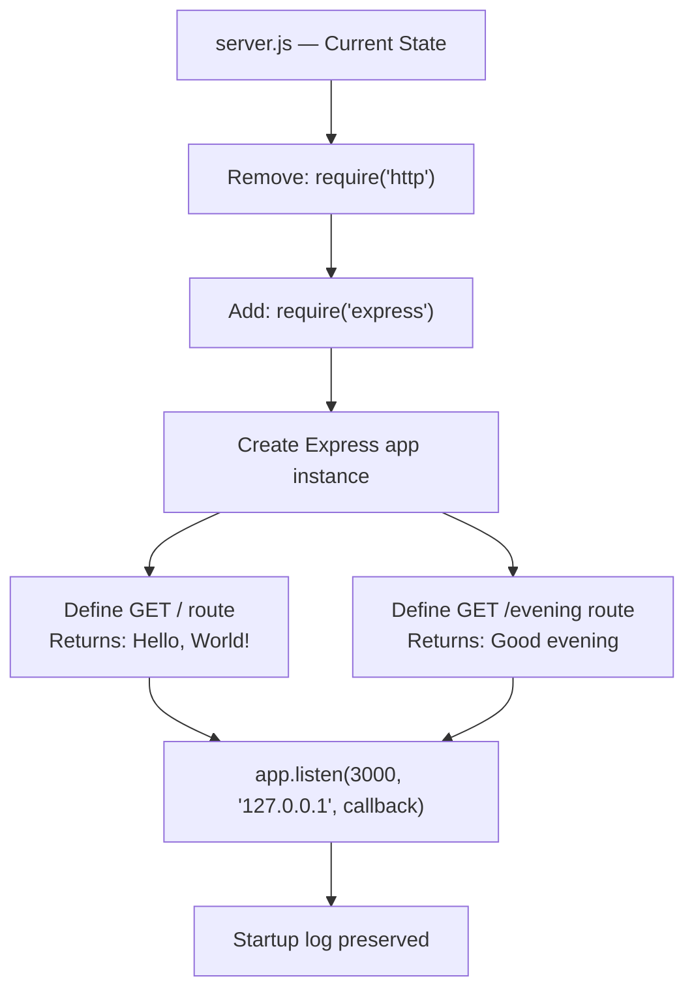

# Technical Specification

# 0. Agent Action Plan

## 0.1 Intent Clarification

### 0.1.1 Core Feature Objective

Based on the prompt, the Blitzy platform understands that the new feature requirement is to introduce Express.js as a web framework into an existing minimal Node.js HTTP server project and extend it with an additional HTTP endpoint. Specifically:

- **Add Express.js framework dependency:** The existing project (`hello_world` v1.0.0) currently uses the raw Node.js built-in `http` module with zero external dependencies. The user requests that Express.js be integrated into the project, replacing the native HTTP server pattern with Express.js's routing and request-handling infrastructure.
- **Preserve the existing "Hello World" endpoint:** The current `server.js` serves a static `Hello, World!\n` response (HTTP 200, `text/plain`) for all inbound requests. This behavior must be preserved as a discrete, route-specific endpoint (GET `/`) rather than a catch-all handler.
- **Add a new "Good evening" endpoint:** A second HTTP endpoint must be created that returns the response `Good evening` when accessed. The user did not specify a URL path; based on convention and the tutorial context, this endpoint will be mapped to `GET /evening`.
- **Maintain tutorial-level simplicity:** The user explicitly characterized the project as a tutorial. The implementation should remain straightforward, readable, and educational — consistent with the project's existing minimalist design philosophy.

Implicit requirements detected:
- The `server.js` file must be refactored from `http.createServer()` to `express()` application pattern, introducing URL-based routing where none previously existed.
- The `package.json` must be updated to declare `express` as a production dependency.
- The `package-lock.json` will be regenerated by npm to reflect the new dependency tree.
- The server should continue binding to port `3000` and remain locally accessible for consistency with the existing behavior documented in the codebase.

### 0.1.2 Special Instructions and Constraints

- **Minimal changes rule (user-specified):** "Confine all changes to the defined scope and nowhere else. Maintain all public interfaces, side effects, data flows, and dependencies unless the spec explicitly mandates adjustments. Do not refactor opportunistically. Avoid cascading changes, cross-file edits, or global updates. Changes must be minimal, isolated, and fully aligned with the scoped objective." This means only files directly required for the Express.js integration and new endpoint should be touched.
- **Maintain backward compatibility:** The existing behavior of returning `Hello, World!` on the root path must remain intact. The server startup log confirming readiness on port 3000 should continue to be emitted.
- **Follow repository conventions:** The project uses CommonJS module syntax (`require`/`module.exports`). The Express.js integration must use `require('express')` — not ES module `import` syntax — to maintain consistency with the existing `require('http')` pattern in `server.js`.
- **No architectural over-engineering:** No middleware stacks, no separate router files, no controller layers, and no configuration externalization. The Express.js integration should remain within the single `server.js` file, matching the project's established single-file design.

### 0.1.3 Technical Interpretation

These feature requirements translate to the following technical implementation strategy:

- To **integrate Express.js**, we will modify `server.js` to replace the `http.createServer()` pattern with an Express application instance (`const app = express()`), leveraging Express's built-in routing and response API.
- To **preserve the "Hello World" response**, we will define an Express route `app.get('/', ...)` that sends the same `Hello, World!\n` response currently returned by the raw HTTP handler.
- To **add the "Good evening" endpoint**, we will create a second Express route `app.get('/evening', ...)` that returns `Good evening` as a plain-text response.
- To **register Express.js as a dependency**, we will modify `package.json` to include `express` in the `dependencies` field, and the `package-lock.json` will be regenerated to capture the resolved dependency tree.
- To **maintain startup logging**, we will use Express's `app.listen()` method with a callback that emits the same startup confirmation message to stdout.

## 0.2 Repository Scope Discovery

### 0.2.1 Comprehensive File Analysis

The repository is a minimal, flat-structured Node.js project at the root level with exactly four files and no subdirectories (excluding `.git/`). Every file has been inspected and assessed for relevance to the Express.js integration.

**Existing Files Requiring Modification:**

| File | Current Purpose | Modification Required | Reason |
|---|---|---|---|
| `server.js` | 14-line HTTP server using `http.createServer()` with hardcoded static response | **MODIFY** — Full refactor of server logic | Replace `http` module usage with Express.js app; add route-based handlers for `/` and `/evening` |
| `package.json` | npm manifest with zero dependencies, placeholder test script | **MODIFY** — Add `express` to `dependencies` | Express.js must be declared as a production dependency |
| `package-lock.json` | Lockfile with empty dependency graph (lockfileVersion 3) | **AUTO-UPDATED** — Regenerated by npm | Running `npm install express` will populate the resolved dependency tree |

**Existing Files NOT Requiring Modification:**

| File | Current Purpose | Reason for Exclusion |
|---|---|---|
| `README.md` | Project identity (`hao-backprop-test`) and governance policy ("Do not touch!") | Not directly related to Express.js integration; minimal changes rule applies |

**Integration Point Discovery:**

- **API endpoints connecting to the feature:** The current `server.js` has no routing — all requests hit a single universal handler at `server.js` lines 6–10. The Express.js migration introduces route-specific endpoints (`GET /` and `GET /evening`), which are created within the same `server.js` file.
- **Database models/migrations:** None — the project has no data layer and no migration is needed.
- **Service classes requiring updates:** None — the project has no service layer; all logic resides in `server.js`.
- **Controllers/handlers to modify:** The sole handler in `server.js` (the `http.createServer` callback) will be replaced by Express route handler functions.
- **Middleware/interceptors impacted:** None exist in the current project, and none are being added per the minimal changes rule.

### 0.2.2 Web Search Research Conducted

- **Express.js latest stable version:** Confirmed via npm registry lookup that Express.js `5.2.1` is the current latest version. Express 5.x requires Node.js >= 18, which is compatible with the project's Node.js v20.20.2 development environment.
- **Express.js basic routing patterns:** Express 5.x supports `app.get(path, handler)` for defining GET endpoints, with `res.send()` for sending string responses — the standard pattern for this tutorial-level implementation.
- **CommonJS compatibility:** Express.js 5.x fully supports CommonJS `require('express')` import syntax, consistent with the project's existing module system.

### 0.2.3 New File Requirements

No new source files, test files, or configuration files need to be created. The Express.js integration and new endpoint are fully contained within modifications to the existing `server.js` file, consistent with the project's single-file architecture and the user's minimal changes rule. The `package-lock.json` will be regenerated automatically by npm and does not constitute a manually created file.

## 0.3 Dependency Inventory

### 0.3.1 Private and Public Packages

The project currently has zero external dependencies. The Express.js integration introduces the first and only external package.

| Package Registry | Package Name | Version | Purpose | Status |
|---|---|---|---|---|
| npm | `express` | `5.2.1` | Web framework providing HTTP routing, request/response API, and server lifecycle management | **To be added** |

- The version `5.2.1` is the current latest stable release confirmed via direct npm registry query (`npm info express version`).
- Express.js 5.x declares an engine requirement of `node >= 18`. The project's runtime environment (Node.js v20.20.2) satisfies this constraint.
- Express.js will bring its own transitive dependency tree (including packages such as `body-parser`, `path-to-regexp`, `accepts`, `content-type`, `cookie`, `debug`, `send`, `serve-static`, and others). These are managed automatically by npm and do not require manual declaration.

**Existing Runtime Dependencies (unchanged):**

| Module | Type | Import | Usage |
|---|---|---|---|
| `http` | Node.js built-in | `require('http')` | **Will be removed** from `server.js` — replaced by Express.js's internal HTTP handling |
| `console` | Node.js global | Implicit | Retained — used for startup logging in `app.listen()` callback |

### 0.3.2 Dependency Updates

**Import Updates:**

The only file requiring import changes is `server.js`:

| File | Current Import | New Import | Reason |
|---|---|---|---|
| `server.js` | `const http = require('http');` | `const express = require('express');` | Express.js replaces the raw `http` module as the server framework |

**External Reference Updates:**

| File | Update Type | Detail |
|---|---|---|
| `package.json` | Add `dependencies` field | `"dependencies": { "express": "^5.2.1" }` |
| `package-lock.json` | Regenerated | Full dependency tree resolved by `npm install` |

No other configuration files, documentation files, build files, or CI/CD files exist in the repository, so no additional external reference updates are needed.

## 0.4 Integration Analysis

### 0.4.1 Existing Code Touchpoints

**Direct Modifications Required:**

- **`server.js` (lines 1–14, entire file):** The complete server logic must be refactored from the native `http.createServer()` pattern to an Express.js application. Specific changes include:
  - **Line 1:** Replace `const http = require('http');` with `const express = require('express');`
  - **Lines 3–4:** The `hostname` and `port` constants may be simplified. Express's `app.listen(port)` binds to all interfaces by default, but to preserve the existing `127.0.0.1`-only binding behavior, `hostname` should be retained and passed to `app.listen(port, hostname, callback)`.
  - **Lines 6–10:** Remove the universal `http.createServer` callback. Replace with two Express route definitions:
    - `app.get('/', (req, res) => { ... })` — returns `Hello, World!\n`
    - `app.get('/evening', (req, res) => { ... })` — returns `Good evening`
  - **Lines 12–14:** Replace `server.listen()` with `app.listen(port, hostname, callback)` while preserving the identical startup log message: `Server running at http://${hostname}:${port}/`

- **`package.json` (line 2–11):** Add a `dependencies` block containing `"express": "^5.2.1"`. No other fields require changes — the existing `name`, `version`, `description`, `main`, `scripts`, `author`, and `license` fields remain untouched per the minimal changes rule.

**Dependency Injections:**

- None — the project has no dependency injection container, no service registry, and no configuration wiring. Express.js is instantiated directly in `server.js` via `const app = express()`.

**Database/Schema Updates:**

- None — the project has no database, no migrations, and no schema. The new endpoint returns a static string and requires no data persistence.

**Behavioral Changes Summary:**

| Aspect | Before (raw `http`) | After (Express.js) |
|---|---|---|
| Server creation | `http.createServer(callback)` | `const app = express()` |
| Route: `GET /` | Catch-all handler returning `Hello, World!\n` | Explicit route `app.get('/')` returning `Hello, World!\n` |
| Route: `GET /evening` | Same catch-all response | New route `app.get('/evening')` returning `Good evening` |
| Unmatched routes | Returns `Hello, World!\n` (catch-all) | Express default 404 handling (standard behavior) |
| Startup binding | `server.listen(port, hostname, cb)` | `app.listen(port, hostname, cb)` |
| Startup log | `Server running at http://127.0.0.1:3000/` | Same message preserved |
| Port | 3000 | 3000 (unchanged) |
| Hostname | 127.0.0.1 | 127.0.0.1 (unchanged) |

## 0.5 Technical Implementation

### 0.5.1 File-by-File Execution Plan

Every file listed below MUST be created or modified as part of this feature addition. No other files in the repository are affected.

**Group 1 — Core Feature Files:**

- **MODIFY: `server.js`** — Refactor the entire 14-line server from native `http` module to Express.js. Replace the universal catch-all handler with two discrete route definitions: `GET /` returning `Hello, World!\n` and `GET /evening` returning `Good evening`. Preserve the startup log callback on `app.listen()`.

  Current structure (lines 1–14):
  ```javascript
  const http = require('http');
  // ... constants, createServer, listen
  ```

  Target structure:
  ```javascript
  const express = require('express');
  const app = express();
  // ... routes, app.listen
  ```

**Group 2 — Dependency Management Files:**

- **MODIFY: `package.json`** — Add a `dependencies` object with `"express": "^5.2.1"` to declare the Express.js production dependency. All other fields (`name`, `version`, `description`, `main`, `scripts`, `author`, `license`) remain unchanged.

- **AUTO-UPDATED: `package-lock.json`** — Regenerated automatically by `npm install` to capture the full resolved dependency tree for Express.js 5.2.1 and its transitive dependencies. No manual editing required.

### 0.5.2 Implementation Approach

The implementation follows a focused, minimal-change strategy that preserves the project's tutorial-level simplicity:

- **Establish Express.js foundation:** Replace the `http` module import with `express`, instantiate the application via `const app = express()`, and retain the existing `hostname` and `port` constants for binding configuration.
- **Define route for existing behavior:** Register `app.get('/')` with a handler that calls `res.send('Hello, World!\n')` to preserve the original response. Using `res.send()` instead of the raw `res.end()` leverages Express's built-in content-type negotiation while maintaining the same response body.
- **Define route for new behavior:** Register `app.get('/evening')` with a handler that calls `res.send('Good evening')` to deliver the new endpoint.
- **Preserve server lifecycle:** Call `app.listen(port, hostname, callback)` with the same startup log message to maintain behavioral parity with the current implementation.
- **Install dependency:** Run `npm install express` to populate `node_modules/`, update `package.json`, and regenerate `package-lock.json`.



## 0.6 Scope Boundaries

### 0.6.1 Exhaustively In Scope

All files and changes required for this feature addition are enumerated below. No wildcards are applicable given the flat, four-file repository structure.

**Source Files:**
- `server.js` — Full refactor from `http.createServer()` to Express.js application with two route handlers (`GET /` and `GET /evening`)

**Dependency Management:**
- `package.json` — Addition of `dependencies` field with `express: ^5.2.1`
- `package-lock.json` — Auto-regenerated by npm to reflect the full Express.js dependency tree

**Integration Points:**
- `server.js` line 1 — Import statement replacement (`http` → `express`)
- `server.js` lines 6–10 — Handler replacement (catch-all → two route-specific handlers)
- `server.js` lines 12–14 — Server binding method replacement (`server.listen` → `app.listen`)

**Runtime Artifacts:**
- `node_modules/` — Populated by `npm install express` (previously empty/non-existent)

### 0.6.2 Explicitly Out of Scope

The following items are deliberately excluded from this feature addition, consistent with the user's minimal changes rule and the project's tutorial scope:

- `README.md` — No updates to project documentation; the governance directive ("Do not touch!") and project description remain as-is
- **New file creation** — No new source files, test files, configuration files, or documentation files will be created
- **Middleware additions** — No logging middleware, error-handling middleware, body-parsing middleware, or CORS middleware
- **Test suite implementation** — The placeholder test script in `package.json` (`echo "Error: no test specified" && exit 1`) remains unchanged; no test framework or test files are added
- **Environment configuration** — No `.env` files, no environment variable support, no externalized configuration
- **TypeScript migration** — The project remains in plain JavaScript with CommonJS modules
- **Start script addition** — No `npm start` script is added to `package.json`; the server continues to be launched via `node server.js`
- **Entry point fix** — The known inconsistency `"main": "index.js"` (KI-002) is not addressed, as it is unrelated to the Express.js integration
- **Containerization, CI/CD, or deployment configuration** — No Docker, GitHub Actions, or other infrastructure files
- **Performance optimizations** — No clustering, compression, or caching mechanisms
- **Additional endpoints** — Only the specified `GET /evening` endpoint is added; no other routes or HTTP methods

## 0.7 Rules for Feature Addition

The following rules are explicitly emphasized by the user and must govern all implementation decisions:

- **Make minimal changes:** Confine all changes to the defined scope and nowhere else. Maintain all public interfaces, side effects, data flows, and dependencies unless the spec explicitly mandates adjustments. Do not refactor opportunistically. Avoid cascading changes, cross-file edits, or global updates. Changes must be minimal, isolated, and fully aligned with the scoped objective. In practice, this means:
  - Only `server.js` and `package.json` are modified manually; `package-lock.json` is auto-updated by npm
  - `README.md` is not touched
  - No new files are created
  - No existing behavior is altered beyond what is necessary for Express.js integration
  - The server port (3000), hostname (127.0.0.1), and startup log format remain identical
- **Preserve CommonJS module convention:** The project uses `require()` syntax exclusively. The Express.js import must follow this pattern (`const express = require('express')`) — no ES module `import` statements.
- **Maintain tutorial simplicity:** The project is characterized as a tutorial. All code must remain readable, self-contained within a single file, and free of unnecessary abstractions such as separate router modules, controller layers, or configuration files.
- **Retain existing response fidelity:** The `Hello, World!\n` response on the root path must be byte-identical to the original output to preserve backward compatibility for any consumers of this endpoint.

## 0.8 References

**Repository Files and Folders Searched:**

All files in the repository root were retrieved and analyzed to derive the conclusions in this Agent Action Plan:

| File Path | Type | Summary |
|---|---|---|
| `server.js` | Source file | 14-line Node.js HTTP server using `http.createServer()`, binding to `127.0.0.1:3000`, returning static `Hello, World!\n` for all requests |
| `package.json` | npm manifest | Declares package `hello_world` v1.0.0, author `hxu`, MIT license, `main: index.js`, placeholder test script, zero dependencies |
| `package-lock.json` | Lockfile | lockfileVersion 3, confirms empty dependency graph with only the root package entry |
| `README.md` | Documentation | Identifies project as `hao-backprop-test`, states purpose as "test project for backprop integration", includes "Do not touch!" governance directive |
| `.git/` | Version control | Git repository metadata (not inspected beyond confirming existence) |

**Technical Specification Sections Consulted:**

| Section | Key Information Extracted |
|---|---|
| 1.1 Executive Summary | Project purpose as deterministic test fixture; zero-dependency design philosophy |
| 1.3 Scope | In-scope capabilities (HTTP listener, static response, startup log); out-of-scope items (routing, middleware, configuration) |
| 2.1 Feature Catalog | Feature IDs F-001, F-002, F-003; implementation lines in `server.js` |
| 2.2 Functional Requirements | Detailed requirements for each feature; acceptance criteria |
| 3.1 Programming Languages | JavaScript/CommonJS; Node.js v20.20.0 development environment; lockfileVersion 3 implies Node.js v15+/npm v7+ |
| 3.2 Frameworks & Libraries | Deliberate absence of frameworks; sole use of `http` built-in module |
| 3.3 Open Source Dependencies | Zero-dependency architecture confirmed across `package.json` and `package-lock.json` |
| 5.1 High-Level Architecture | Monolithic single-file stateless HTTP server; hardcoded configuration; loopback-only binding |
| 5.2 Component Details | Detailed component breakdown of F-001, F-002, F-003; interaction diagram; state transitions |

**External Research Conducted:**

| Source | Information Retrieved |
|---|---|
| npm registry (`npm info express version`) | Express.js latest version: `5.2.1` |
| npm registry (`npm info express engines`) | Express.js 5.x engine requirement: `node >= 18` |
| Express.js GitHub releases (expressjs/express) | Express 5 is officially stable; dropped Node.js versions before v18; updated path-to-regexp for security |
| Express.js npm page (npmjs.com/package/express) | Latest version `5.2.1`; installation via `npm i express` |
| Express.js official blog (expressjs.com) | Express 5.1.0 is the default on npm since March 2025; LTS timeline established |

**Attachments:**

- No attachments were provided for this project.

