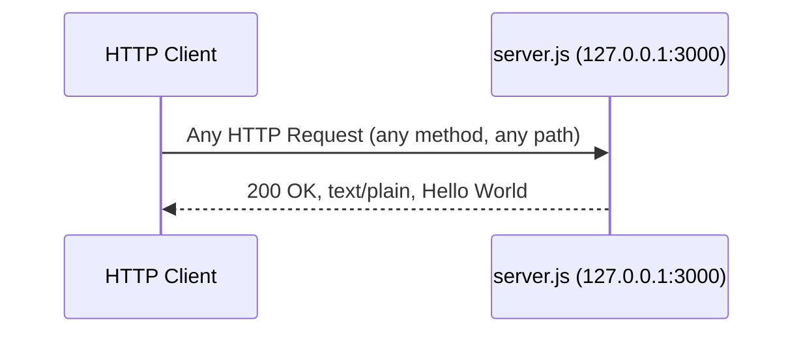
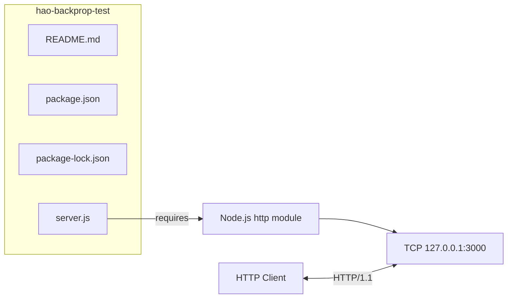

# Technical Specification

# 0. Agent Action Plan

## 0.1 Intent Clarification


### 0.1.1 Core Documentation Objective

Based on the provided requirements, the Blitzy platform understands that the documentation objective is to **transform an undocumented, minimal Node.js HTTP server into a fully documented project** by adding JSDoc annotations to all code constructs in `server.js`, replacing the existing placeholder `README.md` with a comprehensive project guide, and enriching the source code with inline explanations that make every line self-descriptive.

**Request Category:** Create new documentation | Update existing documentation

**Documentation Types Identified:**
- **Inline code documentation** — JSDoc comment blocks for all constants, functions, and the server callback in `server.js`
- **Project README** — A comprehensive `README.md` covering setup instructions, API documentation, and a deployment guide
- **Inline code explanations** — Descriptive inline comments within `server.js` explaining the purpose and behavior of each code statement

**Requirements Breakdown with Enhanced Clarity:**

- **R-001: JSDoc Comments for `server.js` Functions**
  - Add JSDoc block comments to every documentable element in `server.js`, including module-level documentation (`@module`), constant declarations (`@const`), the HTTP request handler callback (`@param`, `@returns`), and the `server.listen` callback
  - Tags to use: `@module`, `@const`, `@type`, `@param`, `@callback`, `@description`, `@see`, `@author`, `@license`, `@version`
  - Source: `server.js` lines 1–14

- **R-002: Comprehensive README with Setup Instructions**
  - Replace the current 2-line `README.md` with a full project guide
  - Include prerequisites (Node.js runtime), installation steps, and how to launch the server via `node server.js`
  - Document the known entry-point mismatch (`package.json` declares `main: index.js` but actual code resides in `server.js`)

- **R-003: API Documentation in README**
  - Document the single HTTP endpoint: `GET http://127.0.0.1:3000/` (and all other methods/paths)
  - Specify request/response contract: status `200`, `Content-Type: text/plain`, body `Hello, World!\n`
  - Include curl examples and expected output

- **R-004: Deployment Guide in README**
  - Provide guidance on running the server in production-like environments
  - Document process management considerations, port configuration limitations, and loopback-only binding behavior
  - Note that the server is designed as a local test fixture, not a production service

- **R-005: Inline Code Explanations**
  - Add single-line or multi-line comments throughout `server.js` explaining each statement's purpose
  - Cover: `require('http')` import, constant declarations, `createServer` invocation, response handler logic, and `server.listen` callback

**Inferred Documentation Needs:**
- The current `README.md` contains only a project name and a "Do not touch!" governance directive — it must be entirely rewritten
- The `package.json` declares `main: index.js` which does not exist; this inconsistency should be documented in the README as a known issue
- The naming discrepancy between repository name (`hao-backprop-test`) and npm package name (`hello_world`) requires documentation
- A project structure overview section is needed since the repository has no subdirectories

### 0.1.2 Special Instructions and Constraints

- No user-specified templates or style guides were provided — JSDoc standard conventions and Markdown best practices will be followed
- No design system or UI component library is relevant to this documentation task
- No Figma attachments or external design references were provided
- The project has **zero external dependencies**, which simplifies documentation scope
- The server uses **CommonJS** module syntax (`require`), which dictates JSDoc annotation patterns (use `@module` with CommonJS-specific documentation)
- All documentation must accurately reflect the **current codebase state** — no speculative or aspirational features

### 0.1.3 Technical Interpretation

These documentation requirements translate to the following technical documentation strategy:

- To **document server.js functions with JSDoc**, we will **update** `server.js` by adding JSDoc block comments (`/** ... */`) above the module declaration, each constant, the `createServer` callback, and the `server.listen` callback, using standard JSDoc tags (`@module`, `@const`, `@param`, `@callback`, `@description`, `@type`, `@author`, `@version`, `@license`, `@see`)
- To **create a comprehensive README**, we will **replace** the existing `README.md` with a structured Markdown document containing sections for project overview, prerequisites, installation, usage, API reference, project structure, deployment guidance, known issues, contributing guidelines, and license information
- To **add API documentation**, we will **create** an API reference section within `README.md` that documents the HTTP endpoint, request/response format, status codes, and includes runnable curl examples
- To **provide a deployment guide**, we will **create** a deployment section within `README.md` covering local execution, process management recommendations, and operational considerations
- To **add inline code explanations**, we will **update** `server.js` by inserting descriptive single-line comments (`//`) adjacent to each code statement explaining its purpose and behavior

### 0.1.4 Inferred Documentation Needs

- **Based on code analysis:** `server.js` contains a module-level import, two constant declarations, a server creation with an anonymous callback, and a listen invocation with a logging callback — all lack any documentation
- **Based on structure:** The entire runtime logic resides in a single 14-line file with no subdirectories — documentation should include a clear project structure section in the README
- **Based on dependencies:** The project uses only the Node.js built-in `http` module with zero external packages — the README should explicitly state the zero-dependency nature
- **Based on known inconsistencies:** Three documented inconsistencies (package name vs. repo name, entry point mismatch, description variance) should be captured in a "Known Issues" section of the README
- **Based on user journey:** A developer encountering this project needs a clear path from clone → install → run → verify, which the current README does not provide


## 0.2 Documentation Discovery and Analysis


### 0.2.1 Existing Documentation Infrastructure Assessment

Repository analysis reveals a **minimal documentation footprint with no documentation tooling infrastructure**. The project contains exactly one documentation file (`README.md`) with no documentation generator, no API documentation tools, no diagram rendering tools, and no documentation hosting configuration.

**Documentation File Inventory:**

| File | Status | Content | Lines |
|------|--------|---------|-------|
| `README.md` | Exists — placeholder only | Project name (`hao-backprop-test`) and governance note ("Do not touch!") | 2 |

**Search Patterns Executed:**
- Documentation files matching `README*`, `docs/**`, `*.md`, `*.mdx`, `*.rst`, `wiki/**` — **Found:** `README.md` only
- Documentation generator configs (`mkdocs.yml`, `docusaurus.config.js`, `sphinx.conf.py`, `.jsdoc.json`, `jsdoc.json`, `typedoc.json`) — **None found**
- Existing JSDoc comments in source files (`server.js`) — **None found**; the file contains zero comment lines
- Style guides or contribution guidelines (`CONTRIBUTING.md`, `STYLE_GUIDE.md`, `.editorconfig`) — **None found**
- Changelog files (`CHANGELOG.md`, `HISTORY.md`, `CHANGES.md`) — **None found**

**Documentation Tooling Assessment:**

| Tool Category | Status | Details |
|---------------|--------|---------|
| Documentation framework | Not present | No mkdocs, Docusaurus, Sphinx, or similar |
| API documentation generator | Not present | No JSDoc config, no Swagger/OpenAPI |
| Diagram tools | Not present | No Mermaid CLI, PlantUML, or similar |
| Documentation linting | Not present | No markdownlint, textlint, or similar |
| Documentation hosting | Not present | No GitHub Pages config, no Netlify/Vercel deployment |
| JSDoc configuration | Not present | No `.jsdoc.json` or `jsdoc.conf.json` |

### 0.2.2 Repository Code Analysis for Documentation

**Source Code Inspection for Documentable Elements:**

The sole runtime file `server.js` (14 lines) contains the following documentable constructs:

| Line(s) | Construct | Type | Current Documentation |
|----------|-----------|------|----------------------|
| 1 | `const http = require('http')` | Module import | None |
| 3 | `const hostname = '127.0.0.1'` | Constant declaration | None |
| 4 | `const port = 3000` | Constant declaration | None |
| 6–10 | `(req, res) => { ... }` | Anonymous callback (request handler) | None |
| 12–14 | `() => { console.log(...) }` | Anonymous callback (listen handler) | None |
| 6 | `http.createServer(callback)` | Server creation | None |
| 12 | `server.listen(port, hostname, callback)` | Server activation | None |

**Key Directories Examined:**
- Repository root (`/`) — Contains all 4 project files; no subdirectories exist
- No `src/`, `lib/`, `docs/`, `test/`, or `config/` directories present

**Related Documentation Found:**
- `package.json` — Contains metadata (name, version, description, author, license) useful for README generation
- `package-lock.json` — Confirms zero dependencies (lockfileVersion 3), relevant for dependency documentation
- Tech spec sections 1.1–1.3, 2.1, 3.1, 5.1 — Provide comprehensive project analysis for documentation content

### 0.2.3 Web Search Research Conducted

- **JSDoc best practices for Node.js CommonJS modules:** JSDoc standard tags (`@module`, `@const`, `@param`, `@callback`, `@returns`, `@type`) are appropriate for documenting CommonJS modules. The `@module` tag is the recommended way to document Node.js modules loaded via `require()`.
- **JSDoc latest stable version:** JSDoc v4.0.5 is the current latest release on npm, supporting Node.js 12.0.0 and later. It is compatible with the project's Node.js v20.20.0 runtime.
- **README best practices for Node.js projects:** A comprehensive Node.js README should include project title, description, prerequisites, installation, usage, API reference, project structure, deployment notes, known issues, contributing guidelines, and license.
- **Inline comment conventions:** Descriptive inline comments should explain *why* code exists (intent), not just *what* it does (behavior), while JSDoc block comments focus on the API contract (types, parameters, returns).


## 0.3 Documentation Scope Analysis


### 0.3.1 Code-to-Documentation Mapping

**Module: `server.js` (sole runtime file)**

- **Public APIs / Documentable Constructs:**
  - Module-level: `require('http')` import (line 1)
  - Constants: `hostname` (line 3), `port` (line 4)
  - Server instance: `server` created via `http.createServer()` (line 6)
  - Request handler callback: `(req, res) => { ... }` (lines 6–10)
  - Listen callback: `() => { console.log(...) }` (lines 12–14)
- **Current documentation:** None — zero JSDoc comments, zero inline comments
- **Documentation needed:**
  - JSDoc `@module` block for the file
  - JSDoc `@const` annotations for `hostname` and `port`
  - JSDoc `@callback` / `@param` / `@returns` for the request handler
  - JSDoc annotation for the server instance and listen callback
  - Inline comments for every executable statement

**Module: `package.json` (metadata file)**

- **Documentable metadata:** name, version, description, main, scripts, author, license
- **Current documentation:** Self-documenting JSON structure
- **Documentation needed:** Referenced and explained in the README (not modified directly)

**Configuration Options Requiring Documentation:**

| Configuration | File | Current State | Documentation Needed |
|---------------|------|---------------|---------------------|
| Hostname | `server.js` line 3 | Hardcoded `127.0.0.1` | Document in README API section |
| Port | `server.js` line 4 | Hardcoded `3000` | Document in README API section |
| Response body | `server.js` line 9 | Hardcoded `Hello, World!\n` | Document in README API section |
| Entry point | `package.json` | `main: index.js` (mismatch) | Document as known issue in README |
| Test script | `package.json` | Placeholder (always fails) | Document in README |

**Features Requiring User Guides:**

| Feature | Current Coverage | Gaps |
|---------|-----------------|------|
| HTTP server startup | None | Setup instructions, prerequisites, launch command |
| HTTP endpoint behavior | None | Request/response format, curl examples, all-paths behavior |
| Deployment | None | Process management, loopback binding, production considerations |
| Project structure | None | File inventory, purpose of each file |

### 0.3.2 Documentation Gap Analysis

Given the requirements and repository analysis, documentation gaps include:

**Undocumented Code Constructs (100% gap):**
- `server.js` line 1 — `require('http')`: no documentation explaining the CommonJS module import
- `server.js` line 3 — `hostname` constant: no documentation explaining loopback-only binding
- `server.js` line 4 — `port` constant: no documentation explaining port selection
- `server.js` lines 6–10 — Request handler callback: no JSDoc describing parameters (`req`, `res`), no documentation of the deterministic response behavior
- `server.js` lines 12–14 — Listen callback: no documentation explaining startup confirmation logging
- `server.js` line 6 — `server` variable: no documentation on the `http.Server` instance

**Missing Project Documentation (100% gap):**
- No setup or installation guide
- No API reference or endpoint documentation
- No project structure overview
- No deployment guidance
- No known issues documentation
- No contribution guidelines
- No prerequisites section

**Outdated or Incomplete Documentation:**
- `README.md` — Contains only project identity and "Do not touch!" governance note; does not serve as a project guide
- `package.json` description ("Hello world in Node.js") does not match `README.md` purpose ("test project for backprop integration")

**Documentation Coverage Summary:**

| Documentation Category | Items Needed | Currently Documented | Gap |
|------------------------|-------------|---------------------|-----|
| JSDoc annotations | 7 constructs | 0 | 100% |
| Inline code comments | 14 lines | 0 | 100% |
| README sections | 10+ sections | 1 (project name only) | ~95% |
| API documentation | 1 endpoint | 0 | 100% |
| Deployment guide | 1 guide | 0 | 100% |


## 0.4 Documentation Implementation Design


### 0.4.1 Documentation Structure Planning

Since this is a single-file project with no subdirectories, the documentation structure is flat and integrated directly into the existing repository root. No separate docs/ directory hierarchy is warranted for a 4-file project.

**Target documentation layout:**

```
/ (repository root)
├── README.md              (comprehensive project guide — REWRITE)
├── server.js              (JSDoc + inline comments — UPDATE)
├── package.json           (unchanged)
└── package-lock.json      (unchanged)
```

**README.md Planned Section Structure:**

```
# hello_world (hao-backprop-test)

#### Table of Contents

#### Overview

#### Prerequisites

#### Installation

#### Usage

#### Starting the Server
#### Verifying the Server

#### API Documentation

#### Endpoint Specification

#### Request/Response Examples
#### Project Structure

#### Deployment Guide

#### Local Development
#### Process Management

#### Network Considerations
#### Known Issues

#### Contributing

#### License

```

### 0.4.2 Content Generation Strategy

**Information Extraction Approach:**
- Extract API behavior from `server.js` lines 6–10 (request handler returns `200 OK`, `text/plain`, `Hello, World!\n`)
- Extract server configuration from `server.js` lines 3–4 (`hostname = '127.0.0.1'`, `port = 3000`)
- Extract package metadata from `package.json` (name, version, description, author, license)
- Extract known inconsistencies from tech spec section 1.3.3 (three documented discrepancies)
- Extract architecture overview from tech spec section 5.1 (monolithic single-file stateless server)

**JSDoc Annotation Strategy for server.js:**
- **File-level block:** `@module`, `@description`, `@author`, `@version`, `@license`, `@see` — placed at the top of the file before any code
- **Constants:** `@const`, `@type`, `@description` — placed above each `const` declaration
- **Request handler:** `@callback`, `@param {http.IncomingMessage}`, `@param {http.ServerResponse}` — placed above the `createServer` call
- **Server instance:** `@type {http.Server}`, `@description` — placed above the `server` variable
- **Listen callback:** `@description` — documented as part of the `server.listen` invocation

**Inline Comment Strategy for server.js:**
- Every executable statement receives a preceding or adjacent single-line comment (`//`)
- Comments explain intent (why) and behavior (what the statement accomplishes)
- Comments are concise, professional, and avoid redundancy with JSDoc blocks

### 0.4.3 Documentation Standards

- **Markdown formatting:** Standard GitHub Flavored Markdown (GFM) with proper heading hierarchy using #, ##, ###
- **Code examples:** Fenced code blocks with language identifiers such as bash, javascript, and json
- **Tables:** Used for structured data (endpoint specs, project structure, known issues)
- **Mermaid diagrams:** One architecture diagram in the README showing the request/response flow
- **Source citations:** JSDoc comments reference specific line numbers; README references source files by path
- **Consistent terminology:** Use "server" (not "app" or "application"), "request handler" (not "callback" or "listener"), and "loopback" (not "localhost" interchangeably)

### 0.4.4 Diagram and Visual Strategy

**Mermaid diagrams to include in README.md:**

- **Request/Response Flow Diagram:** A simple sequence diagram illustrating the HTTP client to server to response cycle



- **Project Architecture Diagram:** A component diagram showing the relationship between files




## 0.5 Documentation File Transformation Mapping


### 0.5.1 File-by-File Documentation Plan

The following table exhaustively maps every documentation file to be created, updated, or used as a reference. The target documentation file is listed first.

| Target Documentation File | Transformation | Source Code/Docs | Content/Changes |
|---------------------------|----------------|------------------|-----------------|
| `README.md` | UPDATE | `README.md`, `server.js`, `package.json` | Complete rewrite: replace 2-line placeholder with comprehensive project guide containing overview, prerequisites, installation, usage, API documentation, project structure, deployment guide, known issues, contributing section, and license information |
| `server.js` | UPDATE | `server.js` | Add JSDoc block comments for module declaration, all constants (`hostname`, `port`), the `http.createServer` callback (request handler), the `server` instance, and the `server.listen` callback; add inline `//` comments explaining each code statement |

### 0.5.2 New Documentation Content Detail (README.md Rewrite)

```
File: README.md
Type: Comprehensive Project Guide (rewrite of existing placeholder)
Source Code: server.js, package.json, package-lock.json
Sections:
    - Project Title and Badges (name, version, license)
    - Table of Contents (linked section navigation)
    - Overview (project purpose as backprop integration test fixture)
    - Prerequisites (Node.js v15+ required, implied by lockfileVersion 3)
    - Installation (git clone, npm install — effectively a no-op)
    - Usage — Starting the Server (node server.js command)
    - Usage — Verifying the Server (curl example and expected output)
    - API Documentation — Endpoint Specification (table: method, path, status, content-type, body)
    - API Documentation — Request/Response Examples (curl commands with output)
    - Project Structure (table of all 4 files with descriptions)
    - Architecture Diagram (Mermaid flowchart of request/response flow)
    - Deployment Guide — Local Development (single-command launch)
    - Deployment Guide — Process Management (background execution, pm2 note)
    - Deployment Guide — Network Considerations (loopback-only binding)
    - Known Issues (entry point mismatch, naming discrepancy, description variance)
    - Contributing (minimal project governance note)
    - License (MIT)
Diagrams:
    - Mermaid sequence diagram: HTTP request/response flow
    - Mermaid flowchart: project architecture and component relationships
Key Citations: server.js (lines 1-14), package.json, README.md (original)
```

### 0.5.3 Documentation Files to Update Detail (server.js JSDoc + Inline Comments)

```
File: server.js
Type: Source Code Documentation (JSDoc + inline comments)
Source Code: server.js (lines 1-14)
Changes:
    - Line 0 (new): Add file-level JSDoc block with @module, @description,
      @author, @version, @license tags
    - Line 1: Add inline comment explaining CommonJS http module import
    - Line 3: Add JSDoc @const block for hostname with @type {string}
    - Line 3: Add inline comment explaining loopback-only binding
    - Line 4: Add JSDoc @const block for port with @type {number}
    - Line 4: Add inline comment explaining port selection
    - Line 6: Add JSDoc block documenting the request handler callback
      with @param {http.IncomingMessage} req and
      @param {http.ServerResponse} res
    - Lines 7-9: Add inline comments for statusCode, setHeader, and
      res.end statements
    - Line 12: Add JSDoc block documenting the server.listen call
    - Line 13: Add inline comment for the console.log startup message
Key Citations: server.js (all lines), Node.js http module documentation
```

### 0.5.4 Documentation Configuration Updates

No documentation configuration files need to be created or updated because:
- No documentation generator framework is in use (no mkdocs.yml, docusaurus.config.js, etc.)
- No documentation build pipeline exists
- JSDoc annotations are embedded directly in source code and do not require a separate configuration file for this minimal project
- The README.md is a standalone Markdown file rendered natively by GitHub/GitLab

### 0.5.5 Cross-Documentation Dependencies

| Dependency | From | To | Relationship |
|------------|------|----|-------------|
| API behavior reference | `server.js` JSDoc on request handler | `README.md` API Documentation section | JSDoc documents the code contract; README documents the user-facing HTTP contract |
| Server configuration | `server.js` JSDoc on `hostname` and `port` constants | `README.md` Usage and API sections | JSDoc documents constant types; README documents how to connect |
| Package metadata | `package.json` | `README.md` Overview, License, Known Issues sections | Metadata from manifest populates README fields |
| Known inconsistencies | `package.json` and `README.md` (original) | `README.md` Known Issues section | Discrepancies between files documented as known issues |


## 0.6 Dependency Inventory


### 0.6.1 Documentation Dependencies

The project currently has **zero external dependencies** as confirmed by `package-lock.json` (lockfileVersion 3, empty dependency graph). The documentation task requires awareness of the following tools, though no new packages need to be installed for the scope of this task since JSDoc annotations are written directly in source code and the README is standalone Markdown.

| Registry | Package Name | Version | Purpose |
|----------|-------------|---------|---------|
| npm | jsdoc | 4.0.5 | API documentation generator for JavaScript — available for optional HTML documentation generation from JSDoc annotations. Not required for inline JSDoc comments but recommended if generated documentation output is desired in the future |
| Built-in | Node.js http module | (bundled with Node.js v20.20.0) | The sole runtime dependency; must be accurately documented in JSDoc annotations and README |
| Built-in | Node.js console | (bundled with Node.js v20.20.0) | Used for startup logging; referenced in documentation |

**Runtime Environment:**

| Component | Version | Source |
|-----------|---------|--------|
| Node.js | v20.20.0 | Development environment (tech spec section 3.1.2) |
| npm | 11.1.0 | Bundled with Node.js v20.20.0 |
| package-lock.json lockfileVersion | 3 | Implies minimum Node.js v15+ / npm v7+ |

**Note:** Since the documentation task involves adding JSDoc comments directly to `server.js` and rewriting `README.md` as standalone Markdown, no new npm packages are required to be installed. The `jsdoc` npm package (v4.0.5) is listed for reference only — it would be needed if the project later chooses to generate HTML documentation from the JSDoc annotations.

### 0.6.2 Documentation Reference Updates

No link updates are required because:
- The current `README.md` contains no links
- No cross-referencing documentation files exist
- The project has no documentation navigation structure

After the README rewrite, the following internal references will be established:

| Reference Type | Location | Target |
|----------------|----------|--------|
| Table of contents links | `README.md` (top) | All section headings within `README.md` |
| Source file references | `README.md` Project Structure section | `server.js`, `package.json`, `package-lock.json` |
| Node.js documentation link | `README.md` Prerequisites section | https://nodejs.org |
| JSDoc `@see` reference | `server.js` module-level JSDoc | Node.js http module documentation URL |


## 0.7 Coverage and Quality Targets


### 0.7.1 Documentation Coverage Metrics

**Current Coverage Analysis:**

| Category | Items Total | Items Documented | Coverage |
|----------|-------------|------------------|----------|
| JSDoc annotations on code constructs | 7 (module, 2 constants, server instance, request handler, listen call, listen callback) | 0 | 0% |
| Inline code comments | 10 executable statements in `server.js` | 0 | 0% |
| README sections (per best practice) | 12 sections (overview, prerequisites, install, usage, API, structure, deploy, known issues, contributing, license, TOC, diagrams) | 1 (project name only) | ~8% |
| Public API endpoints documented | 1 endpoint | 0 | 0% |
| Configuration options documented | 3 (hostname, port, response body) | 0 | 0% |

**Target Coverage:**

| Category | Target | Rationale |
|----------|--------|-----------|
| JSDoc annotations | 100% of documentable constructs | User explicitly requested JSDoc comments for server.js functions |
| Inline code comments | 100% of executable statements | User explicitly requested inline code explanations |
| README sections | 100% of planned sections | User explicitly requested comprehensive README |
| API endpoint documentation | 100% | User explicitly requested API documentation |
| Configuration documentation | 100% | Implicit requirement for comprehensive understanding |

**Coverage Gaps to Address:**

| Target | Current | Goal | Gap |
|--------|---------|------|-----|
| `server.js` JSDoc | 0% | 100% | Add 5–7 JSDoc blocks covering module, constants, callbacks, and server instance |
| `server.js` inline comments | 0% | 100% | Add 8–12 inline comments covering every statement |
| `README.md` content | ~8% | 100% | Rewrite from 2 lines to full project guide (~150–250 lines) |
| API documentation | 0% | 100% | Create endpoint specification table, request/response examples, curl demonstrations |
| Deployment guide | 0% | 100% | Create local development, process management, and network considerations sections |

### 0.7.2 Documentation Quality Criteria

**Completeness Requirements:**
- Every JSDoc block must include `@description` with a meaningful sentence explaining the construct's purpose
- Every constant must have `@const`, `@type`, and `@description` tags
- The request handler must have `@param` for both `req` and `res` with proper types from the `http` module
- The README must include working curl examples that can be copy-pasted and executed
- The README must include a project structure table describing every file in the repository
- The deployment guide must address the loopback-only binding limitation

**Accuracy Validation:**
- All JSDoc type annotations must match the actual Node.js `http` module types (`http.IncomingMessage`, `http.ServerResponse`, `http.Server`)
- All curl examples must produce the documented output when executed against a running server instance
- The hostname (`127.0.0.1`), port (`3000`), and response body (`Hello, World!\n`) must match `server.js` exactly
- Known issues must reference specific file paths and line numbers

**Clarity Standards:**
- JSDoc descriptions must be written in complete sentences with proper grammar
- Inline comments must be concise (one line each) and explain intent, not merely restate the code
- README sections must follow progressive disclosure — overview first, then details
- Terminology must be consistent: "server" (not "app"), "request handler" (not "route handler"), "loopback interface" (not just "localhost")

**Maintainability:**
- JSDoc annotations tied to specific source lines for traceability
- README structured with clear heading hierarchy for easy updates
- Known issues section designed to be updated as discrepancies are resolved

### 0.7.3 Example and Diagram Requirements

| Requirement | Count | Details |
|-------------|-------|---------|
| curl examples in README | 2 minimum | One basic GET request, one showing response headers |
| Mermaid diagrams in README | 2 | Request/response sequence diagram, project architecture flowchart |
| JSDoc code examples | 0 | Not applicable — JSDoc blocks are the documentation, not examples within documentation |
| API request/response table | 1 | Endpoint specification with method, path, status, content-type, body columns |


## 0.8 Scope Boundaries


### 0.8.1 Exhaustively In Scope

**Source code documentation updates:**
- `server.js` — Add JSDoc block comments to all documentable constructs (module, constants, callbacks, server instance)
- `server.js` — Add inline `//` comments explaining each executable statement

**Project documentation rewrite:**
- `README.md` — Complete rewrite from placeholder to comprehensive project guide

**README content sections (all in scope):**
- Project overview with title, description, and badges
- Table of contents with linked section navigation
- Prerequisites (Node.js runtime requirement)
- Installation instructions (clone, npm install)
- Usage guide (server startup, verification)
- API documentation (endpoint specification, request/response examples, curl demonstrations)
- Project structure (table of all 4 repository files)
- Architecture diagrams (Mermaid sequence and flowchart diagrams)
- Deployment guide (local development, process management, network considerations)
- Known issues (entry point mismatch, naming discrepancy, description variance)
- Contributing section (project governance note)
- License section (MIT)

**Documentation assets (in scope):**
- Mermaid diagram definitions embedded within `README.md`

### 0.8.2 Explicitly Out of Scope

- **Source code logic modifications** — No changes to the functional behavior of `server.js` (no new routes, no error handling, no configuration changes)
- **package.json modifications** — No updates to scripts, dependencies, entry point, or metadata fields
- **package-lock.json modifications** — No dependency changes
- **New file creation** — No new files beyond the two being modified (`README.md`, `server.js`)
- **Test files** — No test creation or modification (the placeholder test script in `package.json` is documented but not fixed)
- **Documentation generator setup** — No JSDoc config file, no mkdocs/docusaurus/sphinx setup, no HTML documentation generation pipeline
- **CI/CD configuration** — No pipeline files for documentation building or deployment
- **Containerization** — No Dockerfile or container orchestration for documentation serving
- **External documentation hosting** — No GitHub Pages, ReadTheDocs, or Netlify deployment
- **Fixing known inconsistencies** — The entry point mismatch (`main: index.js` vs `server.js`) and naming discrepancy are **documented** in the README but not **fixed** in the source files
- **Feature additions or code refactoring** — No new functionality or code restructuring
- **Dependencies installation** — No new npm packages are added to `package.json`


## 0.9 Execution Parameters


### 0.9.1 Documentation-Specific Instructions

| Parameter | Value | Rationale |
|-----------|-------|-----------|
| **Documentation build command** | Not applicable | No documentation generator framework is in use; README.md is standalone Markdown and JSDoc annotations are embedded in source |
| **Documentation preview command** | `npx jsdoc server.js -d out/` (optional) | Generates HTML from JSDoc annotations; only if HTML output is desired |
| **Diagram generation command** | Not applicable | Mermaid diagrams are embedded as fenced code blocks in README.md; GitHub renders them natively |
| **Documentation deployment command** | Not applicable | No documentation hosting is configured |
| **Default format** | Markdown (README.md) + JSDoc annotations (server.js) | Matches the project's zero-dependency philosophy |
| **Citation requirement** | Every JSDoc block must reference the documented construct's location; README must reference source file paths | Ensures traceability between documentation and code |
| **Style guide** | JSDoc standard conventions + GitHub Flavored Markdown (GFM) | No project-specific style guide exists |
| **Documentation validation** | Manual review — verify JSDoc tags parse correctly, verify curl examples produce expected output | No automated linting tools are configured |

### 0.9.2 Server Verification Commands

The following commands validate that the documented API behavior is accurate:

| Step | Command | Expected Result |
|------|---------|-----------------|
| Start server | `node server.js &` | stdout: `Server running at http://127.0.0.1:3000/` |
| Test basic request | `curl http://127.0.0.1:3000/` | stdout: `Hello, World!` |
| Test with headers | `curl -i http://127.0.0.1:3000/` | Headers include `Content-Type: text/plain`, status `200 OK` |
| Test arbitrary path | `curl http://127.0.0.1:3000/any/path` | stdout: `Hello, World!` (same response for all paths) |
| Stop server | `kill %1` | Server process terminates |


## 0.10 Rules for Documentation


The following rules govern all documentation changes in this task. These are derived from the user's requirements, the project's constraints, and documentation best practices.

**JSDoc Rules:**
- All JSDoc comments must use the multi-line block format (`/** ... */`) — single-line JSDoc is not acceptable for constructs with multiple tags
- Use standard JSDoc tags only: `@module`, `@description`, `@const`, `@type`, `@param`, `@callback`, `@returns`, `@author`, `@version`, `@license`, `@see`
- Type annotations must reference actual Node.js types: `http.IncomingMessage`, `http.ServerResponse`, `http.Server`, `string`, `number`
- The `@module` tag must appear in a file-level JSDoc block at the very top of `server.js`, before any `require` statements
- Every `@param` tag must include the type, parameter name, and a description

**Inline Comment Rules:**
- Inline comments use the single-line format (`// comment`) placed on the line immediately preceding or on the same line as the code they describe
- Comments must explain intent and purpose, not merely restate what the code does syntactically
- Comments must be concise — one line per comment, no multi-line inline comments
- Do not duplicate information already provided by adjacent JSDoc blocks; inline comments complement JSDoc, not repeat it

**README Rules:**
- The README must be written in GitHub Flavored Markdown (GFM)
- All code examples must be in fenced code blocks with appropriate language identifiers
- curl examples must be tested and produce the documented output
- Mermaid diagrams must use fenced code blocks with the `mermaid` language identifier
- The README must include a Table of Contents with anchor links to all major sections
- Known issues must reference specific file paths and describe the discrepancy clearly
- The deployment guide must explicitly state that the server is designed as a local test fixture, not a production service
- The project structure section must list all 4 repository files with descriptions

**General Documentation Rules:**
- All documentation must accurately reflect the current codebase state — no aspirational or speculative content
- Maintain consistent terminology throughout all documentation artifacts
- Source citations must reference specific files and line numbers where applicable
- Documentation must not modify the functional behavior of any code
- The "Do not touch!" governance note from the original README should be preserved in context within the new README (e.g., in the Contributing section) to maintain the project's original intent


## 0.11 References


### 0.11.1 Repository Files and Folders Searched

The following files and folders were examined during the analysis phase to derive the conclusions in this Agent Action Plan.

**Repository Root (all files — exhaustive):**

| File Path | Type | Purpose in Analysis |
|-----------|------|---------------------|
| `server.js` | Runtime source | Primary documentation target — analyzed all 14 lines to identify documentable constructs (module import, constants, request handler callback, server instance, listen callback); zero existing comments or JSDoc found |
| `README.md` | Documentation | Existing documentation assessed — found 2-line placeholder with project name and governance note; identified as requiring complete rewrite |
| `package.json` | NPM manifest | Metadata extraction — package name (`hello_world`), version (`1.0.0`), description, author (`hxu`), license (`MIT`), entry point mismatch (`main: index.js`), placeholder test script |
| `package-lock.json` | Dependency lock | Dependency verification — confirmed zero external dependencies, lockfileVersion 3 (implies Node.js v15+ / npm v7+) |

**Folders Searched:**
- Repository root (`/`) — Full contents retrieved; confirmed no subdirectories exist (no `src/`, `docs/`, `lib/`, `test/`, `config/`)

**Negative Search Results (not found):**
- No `.jsdoc.json`, `jsdoc.conf.json`, or `jsdoc.json` configuration files
- No `mkdocs.yml`, `docusaurus.config.js`, `sphinx.conf.py`, or `.readthedocs.yml`
- No `.editorconfig`, `CONTRIBUTING.md`, `CHANGELOG.md`, or `STYLE_GUIDE.md`
- No `.nvmrc` or `engines` field in `package.json`
- No `.blitzyignore` files anywhere in the repository

### 0.11.2 Technical Specification Sections Referenced

| Section | Content Used |
|---------|-------------|
| 1.1 Executive Summary | Project overview, core problem statement, stakeholders, value proposition |
| 1.2 System Overview | Project context, system constraints, high-level description, component inventory, success criteria |
| 1.3 Scope | In-scope features, out-of-scope exclusions, primary user workflow, known inconsistencies (3 documented discrepancies) |
| 2.1 Feature Catalog | Feature details for F-001 (HTTP Server Listener), F-002 (Static HTTP Response Handler), F-003 (Startup Logging) |
| 3.1 Programming Languages | JavaScript/CommonJS confirmation, Node.js runtime details, ES6+ syntax level, version compatibility |
| 5.1 High-Level Architecture | Monolithic single-file architecture, design principles, system boundaries, data flow, integration points |
| Node.js Version Compatibility | Recommended Node.js versions, resource requirements, build system status, dependency management, distribution metadata |

### 0.11.3 External Research Conducted

| Research Topic | Source | Key Finding |
|----------------|--------|-------------|
| JSDoc best practices for Node.js | jsdoc.app, pullrequest.com/blog, gomakethings.com | Standard tags (@module, @const, @param, @callback, @returns) appropriate for CommonJS modules; multi-line block comments required |
| JSDoc latest stable version | npmjs.com/package/jsdoc | v4.0.5 is the current latest release, supports Node.js 12.0.0+ |
| JavaScript documentation best practices 2024 | JetBrains WebStorm blog, dev.to | JSDoc enables editor hints, autocompletion, and type inference; inline comments should explain intent |
| README conventions for Node.js | GitHub best practices | Comprehensive README should include overview, prerequisites, installation, usage, API reference, structure, deployment, known issues, contributing, license |

### 0.11.4 Attachments and External Metadata

- **User attachments:** None provided (0 attachments)
- **Figma URLs:** None provided
- **Environment files:** None found in `/tmp/environments_files/`
- **Setup instructions:** None provided by user
- **Environment variables:** None configured
- **Secrets:** None configured


