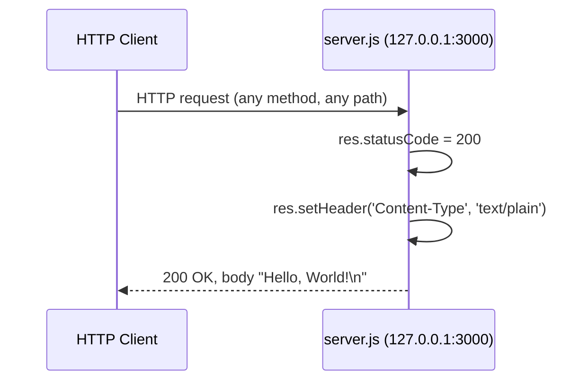

# Technical Specification

# 0. Agent Action Plan

## 0.1 Intent Clarification

### 0.1.1 Core Documentation Objective

Based on the provided requirements, the Blitzy platform understands that the documentation objective is to **transform the `hao-backprop-test` repository from a minimally documented Node.js test fixture into a fully documented project by (a) annotating every function and module-level construct in `server.js` with structured JSDoc comments, and (b) expanding the existing two-line `README.md` into a comprehensive project document covering setup instructions, API behavior, deployment guidance, and inline code explanations**.

**Request Categorization:** This is a hybrid documentation request that combines two distinct documentation transformation modes:

- **Update existing documentation** — `README.md` (currently 2 lines) will be substantially expanded into a comprehensive multi-section guide.
- **Create new documentation** — `server.js` will receive newly authored JSDoc annotation blocks at the file level, for each constant, and for each function/callback.

**Documentation Type Inventory:** The deliverable spans the following documentation categories simultaneously:

- **Inline API documentation** — JSDoc comment blocks above functions, callbacks, and constants in `server.js`
- **README files** — comprehensive top-level project README expansion
- **User guides** — setup and quick-start instructions embedded in the README
- **API documentation** — HTTP endpoint behavior, request/response contract, and status codes
- **Deployment guide** — local launch and operational guidance
- **Tutorial / inline code explanations** — annotated code walkthroughs that explain what each line of `server.js` does in narrative form within the README

### 0.1.2 Explicit Requirements (Verbatim from User)

The user's exact request is preserved here as the authoritative specification:

> **User Requirement:** "Add JSDoc comments to server.js functions, create a comprehensive README with setup instructions, API documentation, deployment guide, and inline code explanations."

This single sentence encodes six discrete deliverables:

| # | Deliverable | Target File | Type |
|---|-------------|-------------|------|
| 1 | JSDoc comments on `server.js` functions | `server.js` | Inline annotation |
| 2 | Comprehensive README — setup instructions | `README.md` | User guide section |
| 3 | Comprehensive README — API documentation | `README.md` | API reference section |
| 4 | Comprehensive README — deployment guide | `README.md` | Operational guide section |
| 5 | Comprehensive README — inline code explanations | `README.md` | Annotated walkthrough section |
| 6 | "Comprehensive" qualifier (implicit) | `README.md` | Coverage/depth standard |

### 0.1.3 Special Instructions and Constraints

- **CRITICAL — Override of Repository Governance Notice:** The current `README.md` contains the directive "Do not touch!" The user's explicit request to "create a comprehensive README" supersedes this directive for the purposes of this task. The new README content authored by the Blitzy platform will replace the existing two-line content.
- **Style Inheritance Constraint:** No external style guide, template, or documentation framework is provided by the user. Documentation must therefore follow widely accepted industry conventions: GitHub-Flavored Markdown for `README.md` and the official JSDoc 3 tag syntax (`@param`, `@returns`, `@callback`, `@type`, `@const`, `@file`, `@example`, etc.) for `server.js`.
- **Tooling Neutrality Constraint:** The user requested "JSDoc comments" — a syntactic annotation standard — not a JSDoc-generated documentation site. No HTML documentation generation step is required. The JSDoc syntax must be valid such that any future documentation generator (jsdoc, typedoc, or IDE IntelliSense) can consume it correctly without further modification.
- **Minimal Scope Constraint:** The user did not request modifications to runtime behavior. The `server.js` file's executable code must remain functionally unchanged; only comment blocks are added. No new files (other than implicit if needed) are required beyond updating the two existing files.
- **No User Examples Provided:** The user did not provide any example JSDoc blocks or README templates. The Blitzy platform must therefore generate idiomatic content that aligns with mainstream Node.js project conventions.
- **No User Templates Provided:** No user-supplied templates exist for either deliverable; standard idioms apply.

### 0.1.4 Technical Interpretation

These documentation requirements translate to the following technical documentation strategy:

- **To document `server.js` functions**, we will **insert JSDoc comment blocks (`/** ... */`)** immediately above each documentable construct. Specifically: a `@file` (file-level overview) comment block at the top, `@const` blocks for `hostname` and `port`, a parameterized comment block for the `http.createServer` request-handler callback documenting `req` (`http.IncomingMessage`) and `res` (`http.ServerResponse`), and a comment block for the `server.listen` ready callback. The `server` constant itself receives a `@type {http.Server}` annotation.
- **To create a comprehensive README**, we will **rewrite `README.md`** with a full top-level Markdown document containing the following sections (at minimum): Project Title and Badges-Optional Description, Table of Contents, Prerequisites, Installation, Configuration, Running the Server (Setup Instructions), API Reference (HTTP endpoint contract), Inline Code Explanation (annotated walkthrough of every line of `server.js`), Deployment Guide (local launch, port-conflict resolution, signal handling), Project Structure, Known Inconsistencies (KI-001 through KI-003 from Section 1.3.3), License, and Author.
- **To preserve the system's role as a deterministic test fixture**, we will **document the static-response contract explicitly** in the README's API section so that consumers understand the response is identical for every request, regardless of method, path, headers, or body.
- **To bridge the package vs. repository naming inconsistency** (KI-001), we will **note both names in the README** (`hao-backprop-test` as the repository identity, `hello_world` as the npm package identity) and **explain why this discrepancy exists** without modifying either file.

### 0.1.5 Inferred Documentation Needs

The user's request is concise; the following implicit needs are surfaced through repository analysis and made explicit here:

- **Based on code analysis of `server.js`:** The file contains two callback functions (the `createServer` request handler and the `listen` ready callback) and two top-level constants (`hostname`, `port`), plus a `server` instance binding. Each is a documentation target. The user said "functions" — we interpret this broadly to include callbacks and the implicit module-level construct.
- **Based on structure of `package.json`:** The `"main": "index.js"` declaration references a non-existent file (Known Inconsistency KI-002 per Section 1.3.3). The README must guide readers to launch via `node server.js` rather than `npm start` (no start script exists) or `require('hello_world')` (entry point fails). This is an implicit deployment-guide requirement.
- **Based on dependency manifest:** `package.json` declares zero `dependencies` and zero `devDependencies`, and `package-lock.json` confirms an empty dependency graph. The README's Installation section must therefore communicate that `npm install` is effectively a no-op while still documenting it for completeness.
- **Based on user journey:** A reader arriving at the repository must be able to (1) understand its purpose, (2) install prerequisites, (3) run the server, (4) verify it works (by sending an HTTP request), and (5) shut it down gracefully. Each of these steps requires a corresponding README section.
- **Based on the request's "deployment guide" qualifier:** Because no production deployment infrastructure exists (no Dockerfile, no CI/CD, no process manager — per Section 3.6), the deployment guide must be scoped to **local development deployment** with explicit notes that production deployment is out of scope and would require additional hardening.
- **Based on the request's "inline code explanations" qualifier:** The user wants a line-by-line or block-by-block narrative walkthrough of `server.js` inside the README itself, distinct from the JSDoc comments inside the file. This implies two parallel forms of code documentation: JSDoc (machine-readable, in-file) and inline explanations in Markdown (human-readable narrative, in README).


## 0.2 Documentation Discovery and Analysis

### 0.2.1 Existing Documentation Infrastructure Assessment

Repository analysis reveals a **near-empty documentation footprint** with only one explicit documentation artifact (`README.md`, 2 lines) and no documentation generation infrastructure. The full inventory of documentation-related artifacts is enumerated below.

**Search patterns employed (executed via repository inspection tools and bash search):**

- Documentation files matching `README*`, `*.md`, `*.mdx`, `*.rst`: only `README.md` exists at the repository root.
- Documentation directories (`docs/`, `doc/`, `documentation/`, `wiki/`): **none exist**.
- Documentation generator configurations (`mkdocs.yml`, `docusaurus.config.js`, `sphinx.conf.py`, `typedoc.json`, `jsdoc.json`, `jsdoc.conf.js`): **none exist**.
- Code-comment documentation: `server.js` contains **zero comments** (no `//`, no `/* */`, no `/** */` JSDoc blocks).
- Style guides or contribution guides (`CONTRIBUTING.md`, `STYLEGUIDE.md`, `.github/`): **none exist**.
- Changelogs (`CHANGELOG.md`, `HISTORY.md`): **none exist**.

**Findings summary:**

| Documentation Asset | Status | Location | Length / Coverage |
|---------------------|--------|----------|-------------------|
| Top-level README | Exists, minimal | `README.md` | 2 lines (title + "Do not touch!" notice) |
| In-file code comments | Absent | `server.js` | 0 comments across 14 lines |
| API documentation | Absent | — | None |
| User guides | Absent | — | None |
| Architecture docs | Absent | — | None |
| Documentation generator config | Absent | — | None |
| Documentation hosting setup | Absent | — | None |
| Diagram source files | Absent | — | None |
| Style guide / contribution guide | Absent | — | None |
| Changelog | Absent | — | None |

**Current documentation framework:** None. There is no documentation framework, generator, or theme in use. The repository relies exclusively on the single `README.md` file for human-readable project information.

**API documentation tooling in use:** None. JSDoc, TypeDoc, ESDoc, and Documentation.js are all absent from `package.json`.

**Diagram tooling detected:** None. No Mermaid, PlantUML, Graphviz, or image assets are present.

**Documentation hosting/deployment setup:** None. No GitHub Pages configuration, no Read the Docs file (`.readthedocs.yml`), and no static-site generator output directories exist.

### 0.2.2 Repository Code Analysis for Documentation

This task targets the entire runtime codebase, which consists of a single source file. The exhaustive code-analysis inventory follows.

**Search patterns employed for code targets to be documented:**

- Public APIs and exported functions: `server.js` (single file).
- Module entry points: `server.js` (the runtime entry; `package.json` `"main"` declares `index.js` which does not exist — Known Inconsistency KI-002).
- Configuration options: hardcoded in `server.js` (lines 3–4) — `hostname = '127.0.0.1'` and `port = 3000`. No external configuration files (no `.env`, `config/`, or `settings.*`).
- HTTP routes / endpoints: defined implicitly in `server.js` line 6 — a single anonymous request-handler callback that accepts all paths and methods.
- CLI commands: none.

**Key directories examined:**

- Repository root (`/`) — only directory with content; contains all four files.
- No subdirectories exist at any depth.

**Code constructs identified as documentation targets in `server.js`:**

| Line(s) | Construct | Type | Currently Documented? |
|---------|-----------|------|-----------------------|
| 1 | `const http = require('http');` | Module import | No |
| 3 | `const hostname = '127.0.0.1';` | Configuration constant | No |
| 4 | `const port = 3000;` | Configuration constant | No |
| 6 | `const server = http.createServer((req, res) => { ... });` | Server instance + request-handler callback | No |
| 6–10 | Request-handler callback `(req, res) => { ... }` | Anonymous arrow-function callback | No |
| 7 | `res.statusCode = 200;` | Response status assignment | No |
| 8 | `res.setHeader('Content-Type', 'text/plain');` | Response header assignment | No |
| 9 | `res.end('Hello, World!\n');` | Response body and stream termination | No |
| 12–14 | `server.listen(port, hostname, () => { ... });` | Listen invocation + ready callback | No |
| 13 | `console.log(...)` | Diagnostic emission | No |

**Related documentation found:** None within the repository. The Technical Specification document (this artifact) is external and serves as supplementary context but is not part of the runtime documentation deliverable.

### 0.2.3 Web Search Research Conducted

The Blitzy platform performed targeted web research to validate documentation tooling versions and best practices applicable to this task.

| Research Topic | Source | Finding |
|----------------|--------|---------|
| JSDoc latest stable major release | npm registry (`jsdoc`) | JSDoc 4.x is the current stable major; 4.0.5 is the latest 4.0.x patch release |
| JSDoc Node.js compatibility | jsdoc.app official docs | JSDoc 4.x supports Node.js 12.0.0 and later — fully compatible with the v22.x runtime detected on the development machine |
| JSDoc tag syntax for Node.js HTTP modules | jsdoc.app tag reference | Standard tags applicable: `@file`, `@const`, `@type`, `@param`, `@returns`, `@callback`, `@example`, `@see`, `@author`, `@license` |
| Markdown README structural conventions | Industry standard (GitHub guides, npm package guidance) | Recommended sections: Title, Description, Table of Contents, Prerequisites, Installation, Usage, API Reference, Examples, Deployment, Contributing, License |
| Mermaid diagrams in GitHub Markdown | GitHub Flavored Markdown spec | Mermaid is natively rendered in `.md` files on GitHub via fenced code blocks tagged `mermaid` |

**Best-practice conclusions applied to this task:**

- JSDoc tag syntax must be the JSDoc 4.x conformant variant; comments will be authored such that the file remains valid input for `jsdoc src/server.js` even though no documentation site is being generated as part of this task.
- README structural ordering will follow the conventional flow: identity → why → install → run → use → deploy → contribute → license, adapted to the project's nature as a test fixture.
- Mermaid diagrams will be embedded in the README using fenced code blocks for the request/response sequence and component layout, leveraging GitHub's native renderer without requiring any build dependency.


## 0.3 Documentation Scope Analysis

### 0.3.1 Code-to-Documentation Mapping

This section provides the comprehensive mapping between every documentable construct in the codebase and its target documentation artifact. Because the runtime codebase is a single file (`server.js`, 14 lines), the mapping is exhaustive rather than representative.

**Module-level documentation targets:**

- **Module:** `server.js`
  - **Public surface:** No `module.exports`; the module is executed for its side effect (starting an HTTP server). The "public surface" from a documentation standpoint is therefore the **HTTP contract** (one endpoint accepting all routes and methods, returning `200 OK` with `text/plain` body `Hello, World!\n`).
  - **Current documentation:** Missing.
  - **Documentation needed:** File-level JSDoc `@file` block describing module purpose; JSDoc blocks on each construct; README section explaining purpose; README API Reference describing the HTTP contract; README inline-explanation walkthrough of every line.

**Function and callback documentation targets:**

| Construct | Source Location | Documentation Needed |
|-----------|-----------------|----------------------|
| Request-handler callback `(req, res) => { ... }` | `server.js:6–10` | JSDoc with `@param {http.IncomingMessage} req`, `@param {http.ServerResponse} res`, `@returns {void}`, `@description` of the static-response behavior, `@example` showing a sample request/response |
| `server.listen` ready callback `() => { ... }` | `server.js:12–14` | JSDoc with `@callback` or function-level description, `@returns {void}`, narrative explaining that the callback fires on successful TCP bind |

**Constant and binding documentation targets:**

| Construct | Source Location | Documentation Needed |
|-----------|-----------------|----------------------|
| `http` module import | `server.js:1` | JSDoc `@const` with `@type {object}` and description of the imported module |
| `hostname` | `server.js:3` | JSDoc `@const {string}` describing loopback binding; rationale for hardcoded value |
| `port` | `server.js:4` | JSDoc `@const {number}` describing TCP port; rationale for hardcoded value |
| `server` | `server.js:6` | JSDoc `@const {http.Server}` describing the server instance |

**Configuration-option documentation targets (in README, since values are hardcoded):**

- **Hardcoded values:** `hostname` = `'127.0.0.1'`, `port` = `3000`.
- **Documented in:** README's API Reference and Configuration sections, including a note that the values are hardcoded in `server.js` (lines 3–4) and would require source modification to change.
- **Missing documentation:** Currently 0 of 2 hardcoded values are documented; target is 2 of 2.

**Feature documentation targets (per Tech Spec Section 2.1 Feature Catalog):**

| Feature ID | Feature Name | Source Location | README Coverage Required |
|-----------|--------------|-----------------|--------------------------|
| F-001 | HTTP Server Listener | `server.js:1–4, 12–14` | Setup section, Deployment section, Inline Code Explanation section |
| F-002 | Static HTTP Response Handler | `server.js:6–10` | API Reference section, Inline Code Explanation section |
| F-003 | Startup Logging | `server.js:12–14` | Deployment section, Inline Code Explanation section |

### 0.3.2 Documentation Gap Analysis

Given the requirements and repository analysis, documentation gaps include the following — every gap is in scope for closure by this task.

**Undocumented public APIs (in this case, the HTTP endpoint contract):**

- The HTTP contract — request-method-agnostic and path-agnostic acceptance returning a fixed `200 OK` `text/plain` `Hello, World!\n` response — is currently undocumented anywhere in the repository.
- Three response invariants are undocumented: status code (`200`), `Content-Type` header (`text/plain`), response body (`Hello, World!\n` with trailing newline).

**Missing user guides:**

- Setup guide: how to install Node.js, clone the repository, install dependencies (a no-op given zero deps), and start the server.
- Quick start: minimal commands to bring the system up and verify it.
- Verification guide: how to confirm the server is running (e.g., `curl http://127.0.0.1:3000/`).

**Missing operational documentation:**

- Deployment guide: how to launch locally (the only supported deployment), how to handle port conflicts (`EADDRINUSE`), how to gracefully terminate the process (`Ctrl+C`).
- Process lifecycle: startup sequence, shutdown sequence, and what each `console.log` line means.
- Troubleshooting: common errors and resolutions (port-in-use, Node.js version mismatches, permission issues if attempting to bind privileged ports).

**Missing in-file (JSDoc) documentation:**

- File-level (`@file`) overview block: missing.
- Constants documentation (`@const` with `@type` and description): missing for `hostname`, `port`, `server`, and the `http` import.
- Function/callback documentation (`@param`, `@returns`, `@description`): missing for both callbacks (request handler and listen-ready callback).

**Outdated documentation:**

- The existing `README.md` content (`# hao-backprop-test\ntest project for backprop integration. Do not touch!`) is not "outdated" in the sense of being incorrect, but it is **substantially incomplete** relative to the request and the comprehensive coverage target. It must be updated rather than deleted, preserving the project name and the `hao-backprop-test` identity.

**Incomplete architecture documentation:**

- The README does not currently describe the system architecture. A simple but complete architectural narrative will be added, accompanied by a Mermaid diagram showing the client → server → response flow.

**Missing project-meta documentation:**

- Author attribution (`hxu`) is in `package.json` but not in `README.md`.
- License (`MIT`) is in `package.json` but not in `README.md`.
- Version (`1.0.0`) is in `package.json` but not in `README.md`.
- Known inconsistencies (KI-001 package vs. repository name, KI-002 entry-point mismatch, KI-003 description variance) are documented in the Technical Specification but not surfaced to repository readers — these will be noted in the README.


## 0.4 Documentation Implementation Design

### 0.4.1 Documentation Structure Planning

The deliverable comprises modifications to two files at the repository root. No new directories or auxiliary documentation files are introduced, in keeping with the project's minimal-footprint design philosophy and the user's request, which scoped documentation to `server.js` and `README.md`.

**Final documentation hierarchy after this task:**

```text
/ (repository root)
├── README.md         (UPDATED — comprehensive project documentation)
├── server.js         (UPDATED — JSDoc comments added; runtime code unchanged)
├── package.json      (UNCHANGED)
└── package-lock.json (UNCHANGED)
```

**`README.md` section outline (in order of appearance):**

```text
# hao-backprop-test

1. Project Title and Description           (identity, purpose, role as test fixture)
2. Table of Contents                       (anchor links to all sections)
3. Project Overview                        (what it is, what it does, why it exists)
4. Architecture Diagram                    (Mermaid: client → server → response)
5. Prerequisites                           (Node.js version, npm version)
6. Installation                            (clone, npm install — note: no-op)
7. Configuration                           (hardcoded hostname/port; how to change)
8. Running the Server (Setup Instructions) (node server.js; expected output)
9. API Reference                           (HTTP contract: methods, paths, response)
10. Inline Code Explanation                (annotated walkthrough of server.js)
11. Deployment Guide                       (local deployment; production caveats)
12. Verification                           (curl examples; expected response)
13. Troubleshooting                        (port conflict, version mismatch, etc.)
14. Project Structure                      (file inventory with descriptions)
15. Known Inconsistencies                  (KI-001, KI-002, KI-003)
16. Author                                 (hxu)
17. License                                (MIT)
```

**`server.js` JSDoc block plan (in source-file order, no executable code modified):**

```text
1. File-level @file overview block        (above line 1)
2. @const block for `http` import         (above line 1's require)
3. @const block for `hostname`            (above line 3)
4. @const block for `port`                (above line 4)
5. @const block for `server` instance     (above line 6) — describes the http.Server
6. JSDoc block on the request-handler     (above line 6's createServer callback)
   callback documenting @param {http.IncomingMessage} req,
   @param {http.ServerResponse} res, @returns {void}
7. JSDoc block on the listen-ready        (above the listen callback inside line 12)
   callback documenting @returns {void}
```

### 0.4.2 Content Generation Strategy

#### Information Extraction Approach

- **For `server.js` JSDoc content:** Extract semantic intent directly from the existing source code. The 14 lines are fully introspectable; no additional source files are needed. For Node.js `http`-module type names (`http.IncomingMessage`, `http.ServerResponse`, `http.Server`), refer to the official Node.js documentation conventions.
- **For README setup instructions:** Extract from `package.json` (script declarations, package metadata) and from runtime behavior (the only working launch command is `node server.js`). Document the absence of `npm start` (no script defined) and the intentional failure of `npm test` (placeholder script).
- **For README API documentation:** Extract from `server.js:6–10`. The contract is fully expressible as four invariants: HTTP status code = 200, `Content-Type` = `text/plain`, response body = `Hello, World!\n`, behavior = identical for every method/path/header combination.
- **For README deployment guide:** Extract from runtime characteristics in `server.js:12–14` and from the absence of containerization / CI-CD infrastructure (Section 3.6 of the Technical Specification confirms no Dockerfile, no CI/CD, no process manager).
- **For README inline code explanations:** Map line-by-line over `server.js`, providing narrative explanations for each statement. The 14-line file allows complete coverage without abridgement.

#### Template Application

No user-supplied template exists for either deliverable. The Blitzy platform will apply standard idioms:

- **JSDoc:** Standard tag ordering — `@file` (or `@description`) first, then `@param` lines (in source order), then `@returns`, then `@example`, then `@see`. Each block uses the `/** ... */` delimiter style.
- **README:** Standard GitHub-Flavored Markdown structure with `#` for the title, `##` for top-level sections, `###` for sub-sections; fenced code blocks with language tags (` ```bash `, ` ```javascript `, ` ```http `, ` ```mermaid `); tables for parameter and response-field documentation.

#### Documentation Standards

- **Markdown formatting:** ATX-style headers (`#`, `##`, `###`); bullet lists with `-`; numbered lists for step-by-step instructions only; fenced code blocks with explicit language tags.
- **Mermaid diagram integration:** Diagrams enclosed in fenced code blocks tagged `mermaid`; never nested inside other code blocks; rendered natively by GitHub without build dependencies.
- **Code examples:** Real, working snippets only — no pseudocode. Each block has a language tag for syntax highlighting (`javascript`, `bash`, `http`).
- **Source citations:** Inline citations referencing source lines, formatted as `(server.js:LineNumber)` or `(server.js:StartLine–EndLine)`.
- **Tables:** Used for parameter descriptions, HTTP response fields, file inventory, and Known Inconsistencies; standard pipe-delimited Markdown table syntax with header separator rows.
- **Terminology consistency:** Use "request handler" (not "controller"), "ready callback" (not "listen handler"), "loopback interface" (not "localhost binding") consistently throughout. The HTTP contract is referred to as "static" because it does not vary by request input.

### 0.4.3 Diagram and Visual Strategy

**Mermaid diagrams to create in `README.md`:**

- **System Architecture Diagram (flowchart):** Shows the relationship between the HTTP client, the Node.js runtime, the `server.js` module, and the loopback TCP listener. Mirrors the diagram already present in Tech Spec Section 1.2.2 but is independently authored for the README.
- **Request/Response Sequence Diagram (sequenceDiagram):** Shows the lifecycle of a single HTTP request — client sends request, server receives via `createServer` callback, server sets status/header/body, server returns response, client receives response. Documents the deterministic nature of the contract.

**Diagram placement:**

- Architecture diagram: in the "Project Overview" / "Architecture Diagram" section near the top of the README, after the description and before Prerequisites.
- Sequence diagram: inside the "API Reference" section to illustrate the request-handling flow.

**Sample Mermaid block (illustrative — exact content authored in implementation):**



**Screenshot/image requirements:** None. The system has no UI; no screenshots are appropriate or required.

**Architecture diagram specifications:** The architecture diagram must include all four repository files (with their roles), the Node.js runtime, the built-in `http` module, the TCP listener at `127.0.0.1:3000`, and an external HTTP client. It must visually convey the zero-external-dependency property and the loopback-only binding.


## 0.5 Documentation File Transformation Mapping

### 0.5.1 File-by-File Documentation Plan

This section enumerates **every** file that will be touched by this documentation task. Because the user's request is precisely scoped to (a) JSDoc comments on `server.js` and (b) a comprehensive README, the transformation mapping is exhaustive — no file is left in a "pending" or "to-be-discovered" state.

**Documentation Transformation Modes used in the table below:**

- **CREATE** — Create a new documentation file (or new content within an existing file)
- **UPDATE** — Update an existing documentation file
- **DELETE** — Remove an obsolete documentation file
- **REFERENCE** — Use as an example/source for documentation style and structure (no modification)

| Target Documentation File | Transformation | Source Code/Docs | Content/Changes |
|---------------------------|----------------|------------------|-----------------|
| `README.md` | UPDATE | `server.js`, `package.json`, `package-lock.json`, existing `README.md` | Replace the current 2-line content with a comprehensive Markdown document containing: project description, table of contents, prerequisites, installation, configuration, running the server, API reference (HTTP contract), inline code explanation (line-by-line walkthrough of `server.js`), deployment guide (local-only, with production caveats), verification steps with `curl` examples, troubleshooting section, project structure, known inconsistencies (KI-001/KI-002/KI-003), author (`hxu`), and license (MIT). Includes Mermaid architecture and sequence diagrams. Preserves the `hao-backprop-test` repository identity from line 1 of the existing file. |
| `server.js` | UPDATE | `server.js` (in-place) | Add JSDoc comment blocks **only**; no executable code is modified. Insert: (1) `@file` header block at the top with module-level description, `@author hxu`, and `@license MIT`; (2) `@const` block above the `http` import; (3) `@const {string}` block above `hostname` describing loopback binding; (4) `@const {number}` block above `port` describing TCP port; (5) JSDoc block above the `createServer` request-handler callback documenting `@param {http.IncomingMessage} req`, `@param {http.ServerResponse} res`, `@returns {void}`, and the static-response semantics; (6) `@const {http.Server}` annotation on the `server` binding; (7) JSDoc block above the `server.listen` ready callback describing the startup-confirmation behavior. The existing 14 executable lines remain byte-identical in their executable semantics; only comment lines are inserted. |
| `package.json` | REFERENCE | — | Used as a source for project metadata (name, version, author, license, description) when authoring `README.md`. Not modified. |
| `package-lock.json` | REFERENCE | — | Used as a source for confirming the zero-dependency state when documenting installation in `README.md`. Not modified. |

**Wildcard patterns are not used** because the entire repository contains only four files at the root and no subdirectories. Explicit per-file mapping is preferable to wildcards in this minimal codebase.

### 0.5.2 New Documentation Files Detail

**No fully new documentation files** are created by this task — both target files (`README.md`, `server.js`) already exist and are being updated in place. However, the README update is so substantial relative to the existing 2-line content that the new content is described in the "create"-equivalent format below for completeness.

```text
File: README.md (substantial content addition replacing existing 2 lines)
Type: Comprehensive project README (top-level documentation)
Source Code Referenced: server.js, package.json, package-lock.json
Sections (in order):
    - Title and one-line description
    - Project Overview (project identity, role as test fixture, links to npm pkg vs. repo)
    - Architecture Diagram (Mermaid flowchart showing client → server → response)
    - Prerequisites (Node.js runtime, npm bundled with Node.js)
    - Installation (clone, npm install — explicitly noted as no-op due to empty dependency graph)
    - Configuration (hardcoded hostname '127.0.0.1' line 3, port 3000 line 4 — how to change)
    - Running the Server / Setup Instructions (node server.js; expected stdout output)
    - API Reference (single-endpoint contract: any method, any path → 200 OK text/plain "Hello, World!\n")
    - Inline Code Explanation (annotated line-by-line walkthrough of server.js)
    - Deployment Guide (local-only deployment; production caveats; signal handling; port-conflict resolution)
    - Verification (curl http://127.0.0.1:3000/ examples and expected output)
    - Troubleshooting (EADDRINUSE, Node.js version mismatch, missing main entry — KI-002)
    - Project Structure (table listing all four files with one-line descriptions)
    - Known Inconsistencies (KI-001 package vs. repo name, KI-002 missing index.js, KI-003 description variance)
    - Author (hxu)
    - License (MIT)
Diagrams:
    - Architecture flowchart (Mermaid) showing the four-file repository, Node.js runtime, http module, TCP listener, and external client
    - Request/Response sequence diagram (Mermaid) showing the deterministic response flow
Key Citations:
    - server.js (lines 1-14, all referenced inline)
    - package.json (name=hello_world, version=1.0.0, author=hxu, license=MIT, scripts.test placeholder, main=index.js)
    - package-lock.json (lockfileVersion: 3, packages graph empty)
```

### 0.5.3 Documentation Files to Update Detail

**`README.md` — UPDATE (replace existing 2 lines with comprehensive content):**

- **Existing content to preserve:** The repository name `hao-backprop-test` (from line 1) is preserved as the document's H1 title. The phrase "test project for backprop integration" is preserved as the project's stated purpose in the overview section.
- **Existing content to retire:** The "Do not touch!" directive is removed because the user has explicitly requested comprehensive documentation, which by definition involves editing the file. A neutral statement of the project's role as a test fixture replaces this directive.
- **New sections added:** All sections listed in 0.5.2 above (every section other than the title and a one-line description is new).
- **Updated examples:** Add `curl http://127.0.0.1:3000/` example with expected output; add `node server.js` example with expected stdout; add HTTP request/response examples in the API Reference.
- **New diagrams:** Mermaid architecture flowchart; Mermaid request/response sequence diagram.
- **Source citations:** Inline references of the form `server.js:LineNumber` and `package.json` field references throughout.

**`server.js` — UPDATE (add JSDoc; do not modify executable code):**

- **Executable code:** Untouched. Lines 1, 3, 4, 6, 7, 8, 9, 10, 12, 13, 14 (and any blank lines) remain byte-identical in their executable semantics. The file's runtime behavior is unchanged.
- **JSDoc comment blocks added:**
  - File-level `@file` block at the top (before line 1)
  - `@const` blocks above each constant declaration (`http`, `hostname`, `port`, `server`)
  - JSDoc with `@param`/`@returns`/`@description` above the `createServer` request-handler callback
  - JSDoc with `@returns`/`@description` above the `listen` ready callback
- **JSDoc tags employed:** `@file`, `@description`, `@author`, `@license`, `@const`, `@type`, `@param`, `@returns`, `@example`, `@see`
- **Source citations within JSDoc:** Where appropriate, `@see` tags will reference the README's API Reference section so that maintainers can navigate from the JSDoc to the human-readable docs.

### 0.5.4 Documentation Configuration Updates

**No documentation configuration files require changes**, because none currently exist and none are introduced by this task:

- `mkdocs.yml`: not present, not introduced.
- `docusaurus.config.js`: not present, not introduced.
- `.readthedocs.yml`: not present, not introduced.
- `jsdoc.json` / `jsdoc.conf.js`: not present, not introduced. (JSDoc syntactic comments do not require a config file; the comments are valid input to JSDoc tooling whenever a maintainer chooses to run it.)
- `package.json` documentation scripts: optionally, a `"docs"` script could be added (e.g., `"docs": "jsdoc server.js -d docs/"`) but this is **not** required by the user's request and is therefore out of scope. The Blitzy platform will not modify `package.json`.

### 0.5.5 Cross-Documentation Dependencies

- **Shared content/includes:** None. There is no `_includes/`, no partial-template directory, and no front-matter system. All content lives directly in the two target files.
- **Navigation links between documents:** The README references `server.js` line numbers throughout (e.g., "see `server.js:6–10` for the request handler"). The JSDoc in `server.js` cross-references the README via `@see` tags pointing to README anchors (e.g., `@see {@link README.md#api-reference}`).
- **Table of contents updates required:** The README itself contains a Table of Contents section listing all top-level headings; this TOC is authored as part of the README update.
- **Index/glossary updates needed:** None. The repository has no separate index, glossary, or wiki.


## 0.6 Dependency Inventory

### 0.6.1 Documentation Dependencies

The following dependency analysis applies the strict policy that **no new dependency is introduced unless the user's request explicitly requires it**. The user requested JSDoc-style **comments** (a syntactic standard) and a Markdown README — neither requires a runtime tool to be installed. Mermaid diagrams in `README.md` are rendered by GitHub natively and require no build dependency.

**Required dependencies for this documentation task:**

| Registry | Package Name | Version | Purpose |
|----------|--------------|---------|---------|
| — | (none required) | — | The user's request — JSDoc comments and Markdown README — produces no required additions to `package.json` or `package-lock.json`. JSDoc syntactic comments are inert text within the source file. Mermaid is natively rendered by GitHub's Markdown engine. |

**Already-present runtime dependencies (no change):**

| Registry | Package Name | Version | Purpose |
|----------|--------------|---------|---------|
| Node.js built-ins | `http` | Built-in (Node.js standard library) | Provides the HTTP server and request/response classes consumed by `server.js`; documented but not modified by this task. |

**Optional / informational dependencies (NOT installed by this task; listed for stakeholder awareness only):**

The following packages are **not** required by this task and **must not** be added to `package.json` as part of this work. They are listed solely so that maintainers know what tooling exists if they later choose to generate an HTML documentation site or validate JSDoc comments. These versions reflect the current stable releases at the time of writing.

| Registry | Package Name | Version | Purpose (Optional, NOT in scope for this task) |
|----------|--------------|---------|------------------------------------------------|
| npm | `jsdoc` | 4.0.5 | JSDoc HTML site generator. Could be invoked manually as `npx jsdoc server.js -d out/` to validate the JSDoc syntax authored in this task. Not added to `package.json`. |
| npm | `markdownlint-cli` | 0.45.0 | Optional README linting. Not added to `package.json`. |

**Runtime environment requirements (no change):**

| Component | Required Version | Source of Constraint |
|-----------|------------------|----------------------|
| Node.js | Any LTS (system uses v22.22.2; per Tech Spec Section 3.1.2 the system supports any Node.js where the `http` module exists, which is every released version). The README will recommend Node.js 22.x or 24.x LTS for new users. | Tech Spec Section 3.1.2 (Runtime Environment), `Node.js Version Compatibility` section |
| npm | Any version producing `lockfileVersion: 3` (npm 7+). System uses npm 11.1.0. | `package-lock.json` declares `lockfileVersion: 3` |

### 0.6.2 Documentation Reference Updates

This task updates the link surface within the repository as follows:

**Documentation files requiring link updates:**

- `README.md` — Internal anchor links to its own table-of-contents entries (intra-document links only).
- `server.js` — JSDoc `@see` tags optionally referencing README sections (in-source cross-references).

**Link transformation rules:**

- **Old (current `README.md` has no links):** N/A — the existing 2-line file contains no links.
- **New (post-update `README.md` link patterns):**
  - Intra-document anchor links — `[Section Title](#section-title)` for the Table of Contents.
  - Source-code line references — `server.js:LineNumber` formatted as inline-code text rather than as live links (because GitHub does not natively resolve line-number deep links from inline code).
  - Optional GitHub blob URLs (only if maintainers wish to add them later) — out of scope for this task.
- **Apply to:** `README.md` (all anchor links), `server.js` (only `@see` references in JSDoc, where applicable).

**Cross-file reference updates:**

- `server.js` JSDoc may include `@see {@link README.md#api-reference}` style references in JSDoc blocks where helpful.
- `README.md` may include `server.js:LineNumber` citations in the Inline Code Explanation and API Reference sections.

**No external link transformations** (e.g., replacing dead URLs) are required because the existing `README.md` contains no external URLs.


## 0.7 Coverage and Quality Targets

### 0.7.1 Documentation Coverage Metrics

**Current coverage analysis (pre-task baseline):**

| Coverage Dimension | Currently Documented | Total | Coverage % |
|--------------------|----------------------|-------|-----------|
| Source files with JSDoc / file-level comments | 0 | 1 (`server.js`) | 0% |
| Top-level constants with JSDoc | 0 | 4 (`http` import, `hostname`, `port`, `server`) | 0% |
| Functions/callbacks with JSDoc | 0 | 2 (request-handler callback, listen-ready callback) | 0% |
| HTTP endpoints documented | 0 | 1 (catch-all endpoint at `127.0.0.1:3000`) | 0% |
| Configuration options documented | 0 | 2 (`hostname`, `port`) | 0% |
| Project-level README sections present | 1 (title only) | 17 (per the 0.4.1 outline) | ~6% |
| User-facing features documented (per Tech Spec 2.1) | 0 | 3 (F-001, F-002, F-003) | 0% |

**Target coverage (post-task goal):**

| Coverage Dimension | Target | Rationale |
|--------------------|--------|-----------|
| Source files with JSDoc / file-level comments | 1 / 1 (100%) | User explicitly requested JSDoc on `server.js`; only one file exists |
| Top-level constants with JSDoc | 4 / 4 (100%) | All four constants are documentable; comprehensive coverage requested |
| Functions/callbacks with JSDoc | 2 / 2 (100%) | User explicitly requested JSDoc on `server.js` "functions" — both callbacks must be covered |
| HTTP endpoints documented | 1 / 1 (100%) | Single endpoint; full API documentation requested |
| Configuration options documented | 2 / 2 (100%) | All hardcoded configuration values must be documented |
| Project-level README sections present | 17 / 17 (100%) | Comprehensive README per user request |
| User-facing features documented (per Tech Spec 2.1) | 3 / 3 (100%) | All three features (F-001, F-002, F-003) covered in README |

**Coverage gaps to address:**

- **`server.js` (currently 0% JSDoc-covered):** All 4 constants, both callbacks, and the file-level overview must be annotated. Focus areas: parameter types using Node.js `http` module type names (`http.IncomingMessage`, `http.ServerResponse`, `http.Server`); return types (`void` for both callbacks); description of static-response semantics.
- **`README.md` (currently ~6% structural coverage):** All 16 missing sections must be authored. Focus areas: setup instructions (Prerequisites, Installation, Running the Server), API Reference (HTTP contract), Inline Code Explanation (line-by-line walkthrough), Deployment Guide, Verification, Troubleshooting.

### 0.7.2 Documentation Quality Criteria

**Completeness requirements:**

- **JSDoc completeness:** Every function/callback in `server.js` has a `@param` for each parameter, a `@returns` (even when the value is `void`), and a description sentence.
- **README completeness:** Every section in the 0.4.1 outline is present. The Inline Code Explanation covers every executable line of `server.js`, with no line skipped or summarized as "trivial."
- **API documentation completeness:** The API Reference documents the HTTP method coverage (all methods), the path coverage (all paths), the response status (`200`), the response headers (`Content-Type: text/plain`), and the response body (`Hello, World!\n`). All four invariants are explicitly stated.
- **User-guide completeness:** The setup section includes installing prerequisites, cloning the repository, installing dependencies (no-op note), and starting the server. The deployment section includes local-only deployment, port-conflict resolution, graceful shutdown, and explicit notation that production deployment is out of scope.

**Accuracy validation:**

- **Code examples must execute correctly:** The `node server.js` command, the `curl http://127.0.0.1:3000/` example, and the expected stdout output must all match the actual runtime behavior of the unmodified `server.js`.
- **JSDoc type annotations must match Node.js standard types:** Use `http.IncomingMessage`, `http.ServerResponse`, `http.Server` (the canonical Node.js type names) rather than ad-hoc names.
- **Configuration values must match source:** README references to `127.0.0.1` and `3000` must be byte-identical to `server.js:3` and `server.js:4`.
- **Line-number citations must be accurate:** All `server.js:LineNumber` citations in the README must point to the correct lines in the post-update `server.js` file (note: line numbers shift when JSDoc comments are added; the README must reference **post-update** line ranges or use anchor descriptions rather than absolute line numbers where possible).
- **Diagrams must reflect actual architecture:** The Mermaid architecture diagram must show only the four files actually present plus the Node.js runtime — no speculative components.

**Clarity standards:**

- **Technical accuracy with accessible language:** Use precise terminology (e.g., "TCP listener" not "web server thing") while explaining concepts with enough context that a developer new to Node.js can follow.
- **Progressive disclosure:** README ordering moves from high-level (overview, architecture) to mid-level (prerequisites, install, run) to low-level (inline code walkthrough). JSDoc descriptions begin with a one-line summary and follow with details.
- **Consistent terminology:** Maintain consistent terms throughout — "request handler" (not "controller" or "endpoint function"), "ready callback" (not "listen handler"), "loopback interface" (not "localhost-only mode" outside of explanatory phrases).

**Maintainability:**

- **Source citations for traceability:** Every claim about behavior in the README is accompanied by a citation to the relevant line(s) in `server.js`.
- **Update-resistance:** Documentation is structured so that future code changes (e.g., changing the port, adding a route) can be localized to specific README sections without rewriting the entire document.
- **Template-based consistency:** All JSDoc blocks follow the same internal ordering: description, `@param`s in source order, `@returns`, optional `@example`, optional `@see`.

### 0.7.3 Example and Diagram Requirements

**Minimum examples:**

- **Per HTTP endpoint:** The single endpoint must have at least one request example (`curl` or raw HTTP) and one response example (showing status, headers, body).
- **Per JSDoc'd function:** Each callback's JSDoc must include at least an `@example` block showing how Node.js invokes the callback (illustrative, not literal user code) where doing so adds clarity. For trivial callbacks like the `listen` ready callback, an example is optional.
- **Setup section:** At least one `bash` example showing `node server.js` and the expected `Server running at http://127.0.0.1:3000/` stdout line.
- **Verification section:** At least one `bash` example using `curl` and one showing the expected response body.

**Diagram types required:**

- One **architecture flowchart** (Mermaid `flowchart` or `graph`) showing the four-file repository layout and runtime relationships.
- One **request/response sequence diagram** (Mermaid `sequenceDiagram`) showing the deterministic-response flow.

**Code example testing:**

- All `bash` examples will be transcribed exactly as a developer would run them. The Blitzy platform's implementation phase verifies these by inspection against the actual `server.js` behavior; no automated test harness is required (no test infrastructure exists per Section 3.6.5).

**Visual content freshness:**

- Diagrams reflect the codebase as of the time this task is executed. Future updates to `server.js` (which are unlikely given the project's "test fixture" role) would necessitate a corresponding diagram update; no automated freshness-check tooling is in scope.


## 0.8 Scope Boundaries

### 0.8.1 Exhaustively In Scope

The following changes are explicitly authorized by the user's request and are within scope for this task:

**Documentation file updates (target file paths are exhaustive — no wildcards needed because the repository is entirely flat with four files):**

- `README.md` — full rewrite of content while preserving the project name `hao-backprop-test` and the project-purpose narrative. Includes sections for: Project Overview, Architecture Diagram, Prerequisites, Installation, Configuration, Running the Server, API Reference, Inline Code Explanation, Deployment Guide, Verification, Troubleshooting, Project Structure, Known Inconsistencies, Author, License.

**In-source documentation comments (in `server.js` only):**

- `server.js` — addition of JSDoc comment blocks (`/** ... */`) for the file header, all four constants (`http`, `hostname`, `port`, `server`), and both callback functions (request handler, listen-ready callback). **Executable lines are not modified**; only comment lines are inserted.

**Documentation assets:**

- Mermaid diagrams embedded directly in `README.md` (architecture flowchart and request/response sequence diagram). No separate diagram source files (e.g., `.mmd`, `.puml`, `.drawio`) are introduced.
- Inline code blocks within `README.md` showing `bash`, `javascript`, and `http` examples.

**Documentation configuration:**

- None. No documentation generator config files are added or modified.

**Documentation generation:**

- None. The user did not request a generated documentation site.

### 0.8.2 Explicitly Out of Scope

The following changes are **not** authorized by the user's request and are explicitly excluded from this task. Any such change is prohibited unless a future, separate request authorizes it.

**Source code modifications (excluded — only documentation comments are permitted in `server.js`):**

- No changes to executable statements in `server.js`. The file's runtime behavior must be byte-identical pre- and post-task in terms of: HTTP listener address (`127.0.0.1`), port (`3000`), response status (`200`), response `Content-Type` (`text/plain`), response body (`Hello, World!\n`), and stdout startup message (`Server running at http://127.0.0.1:3000/`).
- No refactoring (e.g., extracting the request handler into a named function, moving `hostname`/`port` into a config object).
- No new error handling, no graceful shutdown logic, no signal handlers — even though the README will document the **absence** of these, no code is added to introduce them.
- No introduction of TypeScript, no `.d.ts` type declaration files.
- No modification of `package.json` (no new scripts, no new `dependencies`/`devDependencies`, no `engines` field, no `description` change, no `main` field correction).
- No modification of `package-lock.json`.

**Test file modifications:**

- No test files exist; none are created. The `package.json` `"test"` script remains the placeholder `echo "Error: no test specified" && exit 1` per Tech Spec Section 3.6.5.

**Feature additions or code refactoring:**

- No new features. No routing layer. No middleware. No environment-variable support. No multi-environment configuration.

**Deployment configuration changes:**

- No `Dockerfile` is added. No `.dockerignore`. No `docker-compose.yml`. No Kubernetes manifests. No CI/CD workflows (no `.github/workflows/`, no `Jenkinsfile`, no `.gitlab-ci.yml`).
- No process-manager configurations (no `pm2.config.js`, no `ecosystem.config.js`, no systemd unit files).
- No `.env`, `.env.example`, or `config/` directory.

**Documentation outside the user's specified targets:**

- No `CONTRIBUTING.md`, `CHANGELOG.md`, `CODE_OF_CONDUCT.md`, `SECURITY.md`, `STYLEGUIDE.md`, or any other top-level documentation file is created.
- No `docs/` directory and no nested documentation hierarchy. All documentation lives in the single `README.md` and the JSDoc comments inside `server.js`.
- No GitHub issue or pull-request templates (no `.github/ISSUE_TEMPLATE.md`, no `.github/PULL_REQUEST_TEMPLATE.md`).
- No wiki content.

**Documentation tooling additions:**

- JSDoc tooling (`jsdoc`, `typedoc`, `documentation`) is **not** installed. JSDoc syntactic comments are valid in their inert text form without any tool present.
- No Markdown linters added (`markdownlint-cli`, `remark-cli`).
- No diagram-generation CLIs added (`mermaid-cli`, `plantuml`).

**Repository structure changes:**

- No new directories created.
- No files renamed.
- No files deleted (the existing `README.md` is updated in place, not deleted and recreated).
- The Known Inconsistencies (KI-001 package name vs. repo name; KI-002 missing `index.js`; KI-003 description variance per Tech Spec Section 1.3.3) are **documented but not corrected**. Correcting them would constitute a code/manifest change outside the documentation-only scope.


## 0.9 Execution Parameters

### 0.9.1 Documentation-Specific Instructions

The following execution parameters apply during the implementation phase and govern how the documentation deliverable is produced and verified.

**Documentation build command:** None — no build step is required. Markdown is rendered directly by GitHub when the repository is browsed; JSDoc comments are inert text inside `server.js`.

**Documentation preview command:** None required during authoring. For local Markdown preview, a developer may optionally use any Markdown viewer (e.g., `grip`, `markserv`, VS Code's built-in preview); these are developer-side tools and are not added to the project.

**Diagram generation command:** None — Mermaid diagrams are rendered natively by GitHub from fenced code blocks tagged ` ```mermaid `. No CLI invocation is needed.

**Documentation deployment command:** None — the README is consumed directly from the GitHub repository view; no deployment pipeline exists or is introduced.

**Default format:** GitHub-Flavored Markdown for `README.md` with embedded Mermaid diagrams. JSDoc 4.x-compliant comment syntax for `server.js`.

**Citation requirement:** Every behavioral or technical claim in the README is cited inline using one of these formats:

- `(server.js:LineNumber)` — for single-line references
- `(server.js:StartLine–EndLine)` — for multi-line references
- `(package.json)` — for manifest-derived facts
- `(package-lock.json)` — for dependency-graph claims

JSDoc blocks may include `@see` tags pointing to README anchors where useful (e.g., `@see {@link README.md#api-reference}`).

**Style guide to follow:** No repository-specific style guide exists. The Blitzy platform applies industry-standard idioms:

- Markdown: GitHub-Flavored Markdown with ATX-style headers (`#`, `##`, `###`).
- JSDoc: JSDoc 4.x tag syntax per the official `jsdoc.app` documentation.
- Code-fenced blocks: explicit language tag for every fence (` ```bash `, ` ```javascript `, ` ```http `, ` ```mermaid `, ` ```text `).

**Documentation validation:** Manual inspection during authoring; no automated linter or link checker is invoked because none exists in the repository and the task scope precludes adding one. Mermaid diagram correctness is verified by visual inspection of the rendered output on GitHub or in any Mermaid live editor.

### 0.9.2 Implementation Sequence (for the downstream code-generation agent)

The Blitzy platform recommends the following implementation order to minimize risk of mid-task inconsistency. This is sequence guidance, not a temporal schedule.

- **Step A — Annotate `server.js` with JSDoc:** Insert all JSDoc blocks above their respective constructs without altering any executable line. Verify that line counts shift only by the number of inserted comment lines.
- **Step B — Author `README.md`:** Replace the existing 2-line content with the complete comprehensive document. When citing line numbers from `server.js` in the Inline Code Explanation, use the **post-Step-A** line numbers (i.e., line numbers after JSDoc insertion).
- **Step C — Internal consistency pass:** Verify that `README.md`'s line-number citations match `server.js`'s post-update line numbers; verify Mermaid diagrams render; verify that all anchor links in the Table of Contents resolve to actual section headers.
- **Step D — Functional non-regression check:** Run `node server.js` and confirm stdout still emits exactly `Server running at http://127.0.0.1:3000/`. Run `curl http://127.0.0.1:3000/` and confirm the response body is exactly `Hello, World!\n` with status `200` and `Content-Type: text/plain`. These are the four invariants of F-001/F-002/F-003 per Tech Spec Section 2.1.

### 0.9.3 Validation Criteria for Implementation Completion

The implementation is considered complete when **all** of the following are simultaneously true:

- `server.js` contains a `@file` block at the top, a JSDoc block above each of `hostname`, `port`, and `server` (and the `http` import), a JSDoc block on the `createServer` callback with `@param` for `req` and `res` and `@returns {void}`, and a JSDoc block on the `listen` ready callback.
- `server.js` produces byte-identical runtime behavior — verified by `node server.js` printing `Server running at http://127.0.0.1:3000/` and a subsequent `curl http://127.0.0.1:3000/` returning `200 OK` with `Content-Type: text/plain` and body `Hello, World!\n`.
- `README.md` contains every section listed in 0.4.1 (project description, table of contents, prerequisites, installation, configuration, running the server, API reference, inline code explanation, deployment guide, verification, troubleshooting, project structure, known inconsistencies, author, license, plus diagrams).
- `README.md`'s Mermaid diagrams render without syntax errors when previewed in GitHub or any standards-compliant Mermaid renderer.
- All `server.js:LineNumber` citations in `README.md` resolve to the correct lines in the updated `server.js`.
- `package.json` and `package-lock.json` are byte-identical to their pre-task contents.


## 0.10 Rules for Documentation

### 0.10.1 User-Specified Documentation Rules

The user did not provide explicit, named rules in the input. The user's free-text instruction — *"Add JSDoc comments to server.js functions, create a comprehensive README with setup instructions, API documentation, deployment guide, and inline code explanations"* — is the sole authoritative directive and is decomposed into the following operational rules:

- **Rule R-DOC-1 — JSDoc-on-Functions:** Every function-like construct in `server.js` (the `createServer` request-handler callback and the `listen` ready callback) **must** receive a JSDoc comment block. A function-like construct without JSDoc is a violation.
- **Rule R-DOC-2 — Comprehensive README:** The `README.md` produced by this task **must** be "comprehensive." The Blitzy platform interprets "comprehensive" as covering, at minimum: (a) Setup Instructions, (b) API Documentation, (c) Deployment Guide, and (d) Inline Code Explanations. A README missing any one of these four user-specified elements is a violation.
- **Rule R-DOC-3 — Setup Instructions Required:** The README **must** include actionable setup steps: prerequisites, install command(s), and run command. Setup instructions that do not enable a reader to launch the server are a violation.
- **Rule R-DOC-4 — API Documentation Required:** The README **must** describe the HTTP contract: status code, headers, and body. Behavioral invariants must be stated explicitly (any method, any path → identical response).
- **Rule R-DOC-5 — Deployment Guide Required:** The README **must** include a Deployment Guide. Given the absence of production deployment infrastructure, the Deployment Guide covers local deployment with explicit notes about what would be required for production.
- **Rule R-DOC-6 — Inline Code Explanations Required:** The README **must** include an inline, narrative explanation of `server.js` covering every executable line. This is a separate deliverable from the JSDoc comments and lives in the README, not in `server.js`.

### 0.10.2 Inferred Operational Rules (applied by the Blitzy platform)

These rules are not stated by the user but are necessary corollaries of the request and the repository state. They are applied uniformly during implementation:

- **Rule R-DOC-7 — Documentation-Only Modification Discipline:** Source code in `server.js` (executable lines) **must not** be modified beyond the addition of JSDoc comment blocks. Any change that alters runtime semantics is forbidden.
- **Rule R-DOC-8 — Manifest Preservation:** `package.json` and `package-lock.json` **must not** be modified by this task. (No new scripts, no new dependencies, no metadata edits.)
- **Rule R-DOC-9 — Identity Preservation:** The repository name `hao-backprop-test` **must** remain the H1 title of `README.md`. The npm package name `hello_world` is documented separately within the README under the Project Structure or Known Inconsistencies sections, not used as the document title.
- **Rule R-DOC-10 — Citation Discipline:** Every behavioral claim in `README.md` **must** be backed by a citation to the relevant `server.js` line(s) or to the relevant `package.json` field. Speculative or aspirational claims are forbidden.
- **Rule R-DOC-11 — Known-Inconsistency Disclosure:** The Known Inconsistencies (KI-001 package vs. repo name; KI-002 missing `index.js`; KI-003 description variance per Tech Spec Section 1.3.3) **must** be disclosed in `README.md` so that readers are not surprised when `npm start` fails or when `require('hello_world')` does not resolve. They are documented but not corrected.
- **Rule R-DOC-12 — Out-of-Scope Disclosure:** The README's Deployment Guide **must** explicitly disclose what is **not** present (no Dockerfile, no CI/CD, no process manager, no environment-variable configuration), so that readers do not infer capabilities that do not exist.
- **Rule R-DOC-13 — Diagram-Native Rendering:** Mermaid diagrams **must** be authored such that GitHub's native renderer displays them without any external tooling. No diagram pre-rendering step is permitted.
- **Rule R-DOC-14 — JSDoc Tooling Independence:** JSDoc comments **must** be syntactically valid input for the JSDoc 4.x parser, even though the JSDoc tool is not installed. This ensures that any future maintainer who installs JSDoc can generate documentation without first fixing comment syntax.
- **Rule R-DOC-15 — Terminology Consistency:** Across `README.md` and `server.js` JSDoc, the same terminology is used for the same concept. Specifically: "request handler" (the `createServer` callback), "ready callback" (the `listen` callback), "loopback interface" (`127.0.0.1`), "static response" (the deterministic-output property).


## 0.11 References

### 0.11.1 Repository Files Searched and Inspected

The following files were retrieved and analyzed in full to construct this Agent Action Plan. The repository is shallow (single-level, four files), so this list is exhaustive.

| Path | Type | Lines | Used For |
|------|------|-------|----------|
| `/` (root) | Folder | — | Folder-level enumeration via `get_source_folder_contents`; confirmed exactly four files exist; confirmed no subdirectories |
| `server.js` | File | 14 | Identifying documentation targets: file-level overview, `http` import, `hostname` constant, `port` constant, `server` instance, request-handler callback (lines 6–10), listen-ready callback (lines 12–14) |
| `README.md` | File | 2 | Identifying existing content to preserve (`hao-backprop-test` repository name) and content to retire (`Do not touch!` directive) |
| `package.json` | File | 11 | Extracting package metadata: name (`hello_world`), version (`1.0.0`), description, author (`hxu`), license (`MIT`), scripts (`test` placeholder), main (`index.js` — non-existent per KI-002) |
| `package-lock.json` | File | 13 | Confirming zero-dependency state (lockfileVersion 3, packages graph contains only the root package) |

### 0.11.2 Repository Folders Searched

| Path | Type | Notes |
|------|------|-------|
| `/` (root) | Folder | Only directory in the repository; contains all four files; no subdirectories exist |

### 0.11.3 Technical Specification Sections Retrieved

The following Technical Specification sections were retrieved via `get_tech_spec_section` and used to validate facts cited in this Agent Action Plan. They are not modified by this task; they are referenced for context only.

- **Section 1.1 Executive Summary** — Project overview, stakeholders, value proposition, and the project's role as a deterministic test fixture.
- **Section 1.2 System Overview** — System context, high-level description with system architecture diagram, component inventory, success criteria.
- **Section 1.3 Scope** — In-scope and out-of-scope features, primary user workflow, Known Inconsistencies (KI-001 through KI-003) cited throughout this Action Plan.
- **Section 2.1 Feature Catalog** — Feature definitions for F-001 (HTTP Server Listener), F-002 (Static HTTP Response Handler), F-003 (Startup Logging) — each documented in the README per Rule R-DOC-4.
- **Section 3.1 Programming Languages** — JavaScript / CommonJS module system; Node.js runtime; minimum implied version (Node.js v15+ per `lockfileVersion: 3`).
- **Section 3.6 Development & Deployment** — Development tools (none), build system (none), containerization (none), CI/CD (none), automated testing (none), version control (Git). Used to bound the Deployment Guide's scope to local-only deployment.
- **Section "Node.js Version Compatibility"** — LTS landscape (Node.js 24.x Active LTS, 22.x Maintenance LTS, 20.x Maintenance LTS) used to select the recommended Node.js version range for the README's Prerequisites section.
- **Section 9.4 Document Conventions** — Identifier-naming conventions (F-, KI-) consumed to ensure consistent referencing of features and known inconsistencies.

### 0.11.4 External Research Sources

The following external sources were consulted via web search to validate documentation tooling versions and best practices.

| Topic | Authoritative Source | Finding Applied |
|-------|----------------------|-----------------|
| JSDoc current stable version | npm registry — `jsdoc` package page | JSDoc 4.x (latest 4.0.5) is the current stable release. Used to confirm the JSDoc syntax variant authored in `server.js` will be compatible with current tooling. |
| JSDoc Node.js compatibility | jsdoc.app official documentation | JSDoc 4.x supports Node.js 12.0.0+, fully compatible with this project's runtime requirements. |
| JSDoc tag reference | jsdoc.app official documentation | Tag set used in `server.js`: `@file`, `@description`, `@author`, `@license`, `@const`, `@type`, `@param`, `@returns`, `@example`, `@see`. |
| GitHub-Flavored Markdown specification | GitHub documentation | Mermaid diagrams render natively in Markdown files via fenced code blocks using the `mermaid` language identifier. |
| README structural conventions | Industry-standard guidance for npm packages and open-source repositories | Section ordering applied: Title → Description → TOC → Prerequisites → Installation → Configuration → Usage → API → Deployment → Verification → Troubleshooting → Project Structure → License. |

### 0.11.5 User-Provided Attachments

| Attachment | Status |
|------------|--------|
| Files in `/tmp/environments_files` | None — directory does not exist in the environment |
| Figma URLs / Frames | None provided |
| Setup instructions | None provided |
| Custom environment variables | None provided |
| Custom secrets | None provided |
| Implementation rules array | Empty (no user-specified rules) |

### 0.11.6 User Input (Verbatim)

The user's exact instruction is preserved here for unambiguous reference by downstream agents:

> *"Add JSDoc comments to server.js functions, create a comprehensive README with setup instructions, API documentation, deployment guide, and inline code explanations."*

This single sentence is the sole authoritative source of user intent for this task. All Action Plan sub-sections above derive from, and remain consistent with, this instruction.


